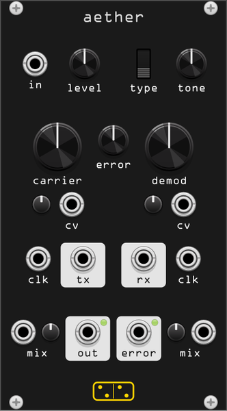

# aether



**A transmission line with something wrong with it: audio is converted to a
pulse train by one clock and recovered by a phase-locked loop running on
another, and the disagreement between the two clocks is the sound.**

*aether* is the upper air, the medium a signal was once thought to need in
order to travel. This module is after Schlappi Engineering's **Interstellar
Radio** (Eric Schlappi, 2018), a 14 HP analogue module described by its own
manual as "a faulty transmission line ... like a voltage controlled radio
transceiver designed for poor reception".

There is no schematic in the public domain, but the manual and the *Sound On
Sound* review describe the architecture precisely enough to rebuild it from
its parts rather than imitate its output, and the parts are textbook: a
synchronous voltage-to-frequency converter and a phase-locked loop. Read
[fidelity](#fidelity) before assuming any particular number here matches the
hardware.

## What it does

The signal is transmitted and then received:

- **Transmit.** A *synchronous charge-balance V/F converter* turns the input
  into a stream of pulses. Its clock is the **carrier**, and its pulse rate
  is `(1 + v_in)/4 × f_carrier` — a first-order delta-sigma modulator whose
  sample rate is a knob. Turning **carrier** down is turning the sample rate
  down, with everything that implies.
- **Receive.** A phase-locked loop chases that pulse rate with a converter of
  its own, clocked by the **demodulator**. The loop's control voltage is
  whatever makes the two rates equal, and that control voltage is the audio
  output.

Which makes the whole module one equation. At lock,

```
v_out = R × (1 + v_in) − 1,        R = f_carrier / f_demod
```

- **R = 1** (clocks matched): the signal comes back. This is the manual's own
  claim, and it holds — see [how clean it gets](#how-clean-it-gets).
- **R < 1** (demodulator faster): the signal comes back quieter and offset
  downwards. The offset is removed by the output coupling; the loss of level
  is not.
- **R > 1** (demodulator slower): the loop is asked for a control voltage past
  its rails. It cannot lock, and the output collapses — the manual's "if this
  is set too low no output will be produced". At 16:1 apart, what leaks
  through is about a fifth of what a locked loop hands back, and it is not
  the signal any more.

Everything else follows from those two blocks: aliasing when the carrier is
low, breakup when the ratio moves, dropouts when the loop slips, and a
standalone oscillator when nothing is patched at all.

## Controls

| control | function |
|---------|----------|
| **level** | attenuator on **in**. With nothing patched it attenuates a +5 V DC bias instead, which is what makes the module an oscillator — see [nothing patched](#nothing-patched) |
| **carrier** | the transmitter's clock, 20 Hz – 328 kHz, fourteen octaves. Noon is 2.5 kHz |
| **demod** | the receiver's clock, same range |
| **error** | comparator threshold for the **error** output, ±5 V |
| **tone** | one passive pole, 60 Hz – 12 kHz. It sits in the PLL loop *and* on the output, so it is a tracking control as much as a tone control |

| trimpot | function |
|---------|----------|
| **cv** (left) | attenuator for the carrier's CV input |
| **cv** (right) | attenuator for the demodulator's CV input |
| **mix** (left) | dry/wet for **out**, wet by default — see [the two mixes](#the-two-mixes) |
| **mix** (right) | dry/wet for **error**, the same |

| switch | function |
|--------|----------|
| **type** | which phase comparator the loop runs on — see [the three loops](#the-three-loops) |

| jack | |
|------|--|
| **in** | signal in. Unpatched, it is a +5 V bias |
| **cv** ×2 | exponential CV over each clock, 1 V/oct at a fully open attenuator. **Unpatched, each is fed the signal itself**, so its attenuator becomes audio-rate FM depth |
| **clk** ×2 | external clock in. Any signal crossing zero replaces that side's internal clock, and that side's CV stops doing anything |
| **cv** ×2 (bottom, outermost) | CV over the **mix** trimmer they share a label with. Patched, that trimmer becomes its attenuator: 0–10 V is dry to wet |
| **out** | the recovered signal, with a level LED |
| **error** | a comparator across input and output, with a level LED |
| **tx** | the carrier clock, a wide-range square. Not 1 V/oct |
| **rx** | the demodulator clock, the same |

**tx** and **rx** keep running when something is patched into the **clk**
input beside them: the external clock takes over the converter's ticks, not
the oscillator.

## The three loops

**type** selects the phase comparator, and the three behave the way the three
classic CD4046 comparators do — which is how the review describes the
hardware's three positions.

| type | comparator | character |
|------|-----------|-----------|
| **1** | exclusive-or | always outputs something, locked or not. Locks to harmonics, so it re-modulates as readily as it demodulates. Needs a loop wide enough to capture: with **tone** low it will not pull in at all, and the output goes quiet |
| **2** | phase-frequency detector | the reliable one. Locks over the widest range and tracks the input best; when it loses lock it rails, which is silence rather than noise |
| **3** | set-reset latch | between the two. Locks, slips, and false-locks at simple ratios — 2/3 of the input turns up often enough to be a feature |

Measured with the clocks matched and a DC input, type 2 returns the input to
four decimal places over most of the range and compresses over the top tenth
of it. Types 1 and 3 return it exactly where they lock and somewhere else
where they do not, which is the point of having them.

## Nothing patched

With **in** empty the jack supplies a +5 V bias, so the transmitter emits a
steady pulse rate — an oscillator whose pitch is set by **carrier** and
**level** together — and the receiver chases it. If the receiver can lock,
the output is a DC the coupling removes: silence. If it cannot, the loop
beats against the transmitter and that beat *is* the output. This is the
broken-radio mode, and types 1 and 3 are the ones to use for it.

**level** is a pitch control here, not a volume control.

## How clean it gets

Matched clocks, a 220 Hz sine at 4 V, **type 2**, measured through a 20 kHz
band limit (so this is what reaches the audio band, not the ultrasonic loop
ripple):

| carrier = demod | gain | residual |
|-----------------|------|----------|
| 6 kHz | ×0.59 | +3 dB |
| 24 kHz | ×0.98 | −4 dB |
| 96 kHz | ×0.92 | −11 dB |
| 328 kHz | ×0.91 | −14 dB |

A first-order converter at these rates gives an oversampling ratio in the
tens, and a first-order converter at an oversampling ratio in the tens is
worth about fifteen dB. **The clean setting is 15 dB down.** That is not a
shortcut in the model, it is what the architecture is worth, and it is why
the hardware is sold as a destruction box rather than a codec.

**tone** is the other half of it, because the loop filter and the output
filter are the same pole:

| tone | −3 dB |
|------|-------|
| 0 | 60 Hz |
| noon | ~700 Hz |
| 1 | ~3 kHz |

Low **tone** is a narrow loop: dark, slow to track, and — on type 1 — unable
to capture at all. High **tone** is a wide loop: brighter, better tracking,
and it passes more of the loop's own ripple.

## The two mixes

Each signal output has its own dry/wet against the signal at the **in** jack,
so aether can sit in an effect send with nothing else beside it. The dry side
is the jack itself, before **level**: it is the path that does nothing.

There is no attenuverter. Unpatched, the **mix** trimmer is the amount.
Patched, it becomes the attenuator for the **cv** jack beside it, so 0–10 V
sweeps dry to wet at a trimmer left wherever it already was, and the two
behaviours agree with the trimmer fully clockwise. Negative volts do not push
past dry.

They are trimmers rather than knobs because the whole mix is one row —
**cv**, trimmer, **out**, **error**, trimmer, **cv** — and six full-sized
controls do not fit across 14 HP: a knob apiece leaves a fifth of a
millimetre at each panel edge. Each trimmer and its jack share one **mix**
label between them, as the clock **cv** clusters above do.

Both default to fully wet, and with nothing in **in** the dry side is silence
— the broken radio only speaks at the wet end of the knob.

## The error output

A comparator across the input and the recovered output, thresholded by the
**error** knob. Centred it is at its noisiest, and it is the closest thing
here to a ring modulator; wound to either extreme it squares up whichever
signal has the bigger excursions, which is why the manual describes it as a
wet/dry control made of square waves. It is the output to take for drums.

## Patches

- **Broken radio.** Nothing patched. Type 1 or 3, **tone** up, then move
  **carrier** and **demod** against each other slowly.
- **Modem melodies.** A melodic sequence into **in**, the same pitch CV into
  the carrier's **cv**, something slower into the demodulator's **cv**.
- **Glitch distortion.** Audio in, listen to **error**, both clocks low, and
  use the **error** knob as the wet/dry — or the **mix** trimmer beside that
  output, which is one against the dry signal itself.
- **Playing the clock.** A 1 V/oct oscillator into the carrier's **clk** with
  nothing in **in**: you are now playing the transmitter's clock rate, and
  the demodulator's **cv** is the timbre.
- **Rungler.** **tx** into a shift register's data, **rx** into its clock,
  its CV outputs back into the two **cv** inputs.

The first, third and fifth come from the hardware's own manual, which is
worth reading for the rest of them.

## CPU and oversampling

The clocks are scheduled in continuous time and the loop filter is integrated
between the ticks, so nothing here is quantised to the sample grid: the same
patch measures the same at 88.2 kHz through 384 kHz, and the aliasing you
hear is the modelled carrier's rather than the host's. What oversampling buys
is only the filtering of the outputs, which is why 4× is the default and 1×
is usable.

Cost is around 1.2 % of a core at 4×, rising to 1.4 % with both clocks at the
top of their range — the engine does work per clock tick, so a 328 kHz
carrier costs more than a 328 Hz one.

## Fidelity

What is documented, and modelled from the documentation: the block
architecture, the normalling (signal to both CV inputs, bias to the input
jack), what each control does, the fact that the clocks are not 1 V/oct, that
matched clocks return the signal, that too slow a demodulator produces
nothing, that **tone** sits in the loop as well as on the output, and that
the three loop types divide into "always outputs, locks to harmonics" (1, 3)
and "outputs when locked" (2).

What is inference, and should be treated as such:

- **The chips.** The manual says "synchronous V/F converter", and the
  designer has described the receiver as the same converter inside a PLL. The
  canonical synchronous VFC is the AD652, whose data sheet carries the
  phase-locked-loop F/V application this is built on, and the three loop
  types map exactly onto the CD4046's three phase comparators. Neither part
  is confirmed by anything published.
- **The divide-by-two.** The pulse trains are halved before the phase
  comparator. Without it they are narrow pulses, exclusive-or degenerates
  into or, and the loop runs away from lock instead of towards it. Any 4046
  design with a duty cycle it does not control does something equivalent, but
  no one has said this one does.
- **Every frequency range.** The clock span (20 Hz – 328 kHz), the **tone**
  span (60 Hz – 12 kHz), the CV depth (1 V/oct at a fully open attenuator)
  and the comparator's hysteresis are chosen so the useful settings sit in
  the middle of the travel. The manual gives no numbers at all. Wrong values
  move the sweet spots around the knobs; they do not change the class of
  sound.

What is added, and is not on the hardware at all: the two **mix** trimmers and
their CV inputs. The hardware has no dry/wet — a rack patches one — but in
Rack the module is as likely to sit in an effect send as in a voice, and a
crossfade there costs a knob rather than a mixer channel. Fully clockwise,
where they start, they are not in the signal path.

What is not modelled: nothing in the analogue path outside the two blocks —
no converter nonlinearity beyond its saturation, no supply sag, no
temperature drift, and no component tolerance between the two halves. The
integrator windup, the pulse-rate ceiling at half the clock and the loop's
rail limits are modelled, because those are what the module runs into.

`test/aether_probe` measures all of it: the converter's pulse-rate law, lock
and capture per comparator, the ratio law, bandwidth against **tone**, the
standalone oscillator, where the carrier folds the input, invariance across
sample rates, and CPU. `test/smoke_aether` covers the module around it.

## Sources

- Schlappi Engineering, *Interstellar Radio* manual (2018) — the architecture
  and the control descriptions
  <https://analoguehaven.com/schlappi-engineering/interstellar-radio/manual.pdf>
- *Sound On Sound*, review of the Interstellar Radio — the three loop types
  and what each sounds like
  <https://www.soundonsound.com/reviews/schlappi-engineering-interstellar-radio>
- Analog Devices, **AD652** *Monolithic Synchronous Voltage-to-Frequency
  Converter* data sheet — the charge-balance transfer law
  (`f_out = V_in/V_fs × f_clock/2`, bipolar zero at `f_clock/4`) and the
  phase-locked-loop F/V application
  <https://www.analog.com/en/products/ad652.html>
- Texas Instruments, **CD4046B** data sheet — the three phase comparators and
  their lock behaviour
