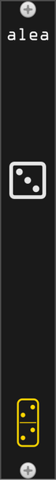

# alea

*alea* adds a single random module to your rack, chosen from your entire library. Inspired by [WhatTheRack from korfuri](https://github.com/korfuri/WhatTheRack).

## How to use

Click the ⚂ (die) button. A module is picked at random from all models available in your library and added to the rack next to *alea*. Ctrl+Z removes it again.

Models their maker has hidden - deprecated ones, kept loadable so old patches still open - are never drawn.

## Context menu

**Even odds per brand** (default off) draws a brand first and a module inside it second. With it off, every model in the library is one ticket, so a maker shipping a hundred modules comes up a hundred times as often as a maker shipping one, and the die keeps rolling the same few names. With it on, each maker comes up equally often whatever the size of their library.

**Excluded tags** leaves out any model carrying one of the ticked tags:

| tag | default |
|-----|---------|
| Blank | excluded |
| Controller | in the pool |
| Expander | excluded |
| External | excluded |
| MIDI | excluded |
| Utility | in the pool |
| Visual | in the pool |

The four excluded by default are the draws that are never a module you can play on its own: a MIDI interface, an expander with nothing beside it, a bridge to outboard hardware, a blank panel.

Both settings are saved with the patch.
