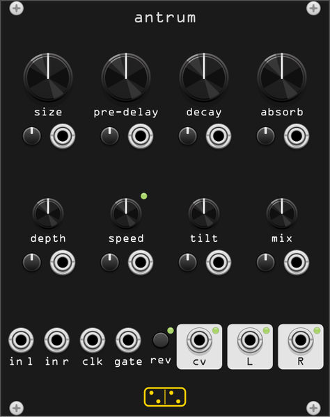

# antrum



**Feedback delay network reverb, from a coffin to the heavens, all of it modulatable.**

*antrum* is Latin for "cave, grotto". The module is built after the **Make
Noise / SoundHack Erbe-Verb**, Tom Erbe's reverb for Eurorack: not a room
you park a signal in, but a resonant space you *play*, where every
parameter takes voltage and the size control runs continuously from
unrealistically small to unrealistically large without ever changing
algorithm.

The topology follows Erbe's ICMC 2015 paper, *Building the Erbe-Verb:
Extending the Feedback Delay Network Reverb for Modular Synthesizer Use*:

```
in ─> pre-delay (forward or reversed) ──────────────┐
                                                    │
     ┌── 4 delay lines ──┐                          │
     │                   v                          │
     │  read plain, sine-modulated, or as grains    │
     │                   v                          │
     │  Chebyshev saturation, driven by the         │
     │    network's own energy                      │
     │                   v                          │
     │  x decay   (the gain of the loop alone)      │
     │                   v                          v
     │  unitary (Hadamard) matrix <──────────── (input)
     │                   v
     │  DC block ─> absorb lowpass
     │                   v
     └─ allpass diffuser

     network out + early reflection taps
                   v
             tilt ─> dry/wet mix ─> l, r
```

A four-line feedback delay network with a unitary matrix is lossless: at
a feedback gain of exactly 1.0 it sustains forever, below it decays
exponentially, and above it (the **decay** knob goes to 120%) it pumps
energy in until the saturation stages catch it. That is why **decay** and
**absorb** interact so strongly - the saturation adds harmonics and the
absorption filters take them away, and where the two balance is where the
infinite reverbs live.

The four delay times are kept mutually prime and all scale together from
the single **size** control, so sweeping size is a mass of coordinated
doppler shifts rather than a switch between presets. Slowly it sounds
like the walls moving; quickly it is percussive; at audio rate it is FM.

## Controls

Every knob has its own attenuverter and CV input directly below it.

| knob | function |
|------|----------|
| **size** | 1–500 ms of network delay: coffin (full CCW), room (noon), plate, hall, heaven (full CW). Also scales the early reflections |
| **pre-delay** | 7–500 ms before the first reflections, independent of size. Under a clock (see **clk**) it becomes a ratio of the clock instead |
| **decay** | reflection gain, 0–120%. It sets how *long* the tail is, not how much reverb there is: the loop gain alone, never the level of the signal going in. Past ~100% the tail stops decaying and starts feeding on itself. At 0 the network still passes one diffused pass plus the early reflections, which is the gated-ambience end of the knob |
| **absorb** | diffusion *and* damping in one knob: full CCW = no diffusion, no damping; ~10:00 = full diffusion, no damping; full CW = full diffusion, full damping (a dark, dead space) |
| **depth** | bipolar modulation depth *and type*. Noon is no modulation. CCW is **cyclic**: a multiphase sine vibrato in the four delay lines, from subtle chorusing to extreme doppler swirl. CW is **ergodic**: raised-cosine grains scattering the room dimensions at random, granular at high depth. The last stretch CW fades in **shimmer**, an octave-up voice folded back into the network |
| **speed** | 0.5–256 Hz, the rate of whichever modulation **depth** selected (LFO rate for cyclic, grain rate for ergodic). Under a clock it is a ratio of the clock. With depth at noon it does nothing |
| **tilt** | bipolar output tone: CCW cuts highs and boosts lows heavily, CW the opposite, flat at noon. It sits after the network, so it never touches the feedback |
| **mix** | equal-power dry/wet blend |
| **rev** | button, toggles reverse: the pre-delay buffer plays backwards, with a short crossfade so it does not click. The **pre-delay** control sets the reverse buffer length |

## Inputs and outputs

| jack | function |
|------|----------|
| **in l / in r** | stereo audio in; **in r** is normalled to **in l** for mono use |
| **clk** | clock input. While patched, **pre-delay** and **speed** snap to ratios of the clock (1/12, 1/8, 1/6, 1/4, 1/3, 1/2, 2/3, 1/1, 3/2, 2, 3, 4, 6, 8, 12 - 1/1 at noon). CCW of noon is longer/slower, CW is shorter/faster |
| **gate** | momentary reverse: high engages the reverse buffer, releasing it returns to forward |
| **cv** (out) | the network's own energy as 0–10 V, from an envelope follower on the reverb. Patch it back into **decay** through an inverting attenuverter and the reverb reins itself in like a compressor; patch it to **size** for a space that swells with what you play |
| **l / r** | stereo output |

Every CV input is ±5 V for the full range of its parameter, scaled by its
attenuverter.

## Context menu

| item | function |
|------|----------|
| **Shimmer** | *Folded into depth* (default) is the hardware behaviour: the octave-up voice rides the top fifth of the **depth** knob, so it always arrives with maximum grain scatter. *Off* keeps it out of the way entirely, and *25% / 50% / 100%* unlink it - a fixed amount of shimmer at any depth setting, including none, which is the only way to get a clean octave-up wash over an unmodulated room |

At full shimmer the octave-up voice *replaces* the direct injection into
the network: what you hear reverberating is the transposed signal, and
because the shimmer line is fed the network output too, the octaves stack
as the tail develops.

## Tips

- The starting point for a normal reverb is size at noon, pre-delay low,
  decay around 60%, absorb at noon, depth at noon, mix around 11:00.
  From the manual of the original: *coffin* size full CCW / decay 9:00,
  *room* both at noon, *plate* size 1:00 / pre-delay full CCW, *hall*
  size 3:00 / pre-delay 11:00, *heaven* everything full CW.
- **size** is the parameter to modulate. Slow ramps morph one space into
  another; fast ones turn the reverb into a resonator. It is the one knob
  worth an attenuverter and an envelope before anything else.
- Push **decay** to full and ride **absorb**: the reverb sustains forever
  while absorb decides how bright and how long "forever" is.
- Reverse plus a long pre-delay plus full wet gives the classic reverse
  reverb, and it syncs to the patch through **clk**.
- Depth full CW with a slow **speed** and infinite decay is the ghost
  choir: shimmer feeding a network that never lets go.
- The manual's two patch ideas port straight over: *gated reverb* is an
  envelope into **mix** CV (the knob then attenuates it), and *decay hell*
  is a pressure or envelope into **decay** CV with the attenuverter open,
  pushing an already-long tail into infinite feedback and letting it fall
  back when you release.

## Factory presets

The Erbe-Verb manual's *Emulating typical reverb rooms* table, transcribed
into eight presets (right-click → Preset). Clock positions map the usual
way: full CCW, 12:00 at the middle of the sweep, full CW.

| preset | manual's recipe |
|--------|-----------------|
| **coffin** | size full CCW, pre-delay full CCW, decay 9:00, absorb 9:00 (the manual's "low-cost oak"; 2:00 is the luxury lining) |
| **room** | size 12:00, pre-delay 12:00, decay 12:00, depth 12:00, absorb 2:00 |
| **plate** | size 1:00, pre-delay full CCW, decay 1:00, depth 12:00, absorb 10:00 |
| **hall** | size 3:00, pre-delay 11:00, decay 1:00, depth 1:00, speed 11:00, absorb 11:00 |
| **heaven** | size, pre-delay and decay all full CW |
| **ambient** | size 4:00, pre-delay 11:00, decay 2:00, depth 2:00-3:00, speed 12:00-3:00 (the ranges land in the middle) |
| **reverse** | mix full CW, size full CCW, pre-delay 3:00-full CW, decay full CCW, absorb full CCW, depth 12:00, reverse on |
| **shimmer** | size 4:00, pre-delay 11:00, decay 2:00, depth full CW, speed 12:00-3:00 |

Controls the table does not mention are left where the manual's *Getting
started* puts them: mix at 11:00, depth centred, tilt flat, no
attenuversion. They are starting points, not destinations - the manual is
explicit that "many spaces in between are possible by taking any control
out of its comfort zone".

## Differences from the hardware

- Stereo in (the hardware is mono in, stereo out), and every parameter
  gets an attenuverter, not just size, depth, decay and tilt.
- Shimmer can be unlinked from **depth** in the context menu. The
  hardware only has it at the top of the depth range, which is the
  default here too.
- Clock-synced pre-delay reaches 4 s here; the hardware reaches 5.46 s.
- No input level control: patch a VCA or use the CV inputs.
- The internal modulation depth for ergodic grains scales with **size**
  (up to half the room), which the reference implementation caps at a
  fixed few milliseconds. Cyclic vibrato keeps the small fixed depth.
- **decay** is the loop gain only. The reference implementation applies it
  to the delay line write, where it also attenuates the signal entering
  the network, so decay at 0 with a full wet mix is silence and the knob
  doubles as a hidden wet-level control. Here the gain rides the taps
  instead, which is identical for the feedback loop (the matrix is
  linear) but leaves the input at unity: the wet level stays put while
  the knob shortens the tail, and the manual's own Reverse patch
  (mix full CW, decay full CCW) makes a sound.

## Attribution

The Erbe-Verb was designed by Tom Erbe (SoundHack) with hardware by Make
Noise (Tony Rolando, Matthew Sherwood). This module is an independent
implementation from Erbe's published paper and the module's manual, and
is not affiliated with Make Noise or SoundHack. The block layout, the
delay-time ratios, the early reflection taps and the analog tilt filter
model follow **dm-Reverb** by Dave Mollen
([davemollen/dm-Reverb](https://github.com/davemollen/dm-Reverb)),
GPL-3.0, the same license as this plugin.
