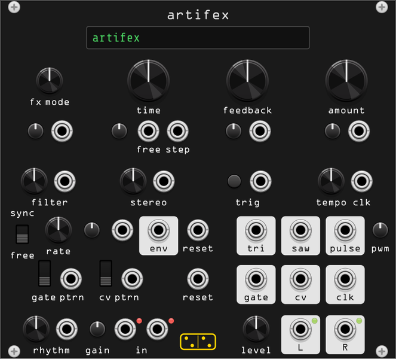

# artifex



**Nine stereo effects that share one feedback loop: a delay, a flanger, a
freezer, a panner, a crusher, a slicer and three ways of moving pitch — with
a pattern generator and an LFO wired to every parameter that matters.**

*artifex* is Latin for the maker, the contriver — the craftsman who works a
material rather than choosing from a catalogue. The module is built after the
Bastl Instruments *Citadel FX Wizard*, the other face of the hardware
[vates](vates.md) is built after, and it keeps that machine's idea: you do
not step through presets, you take three knobs that mean something different
in every mode and modulate them until the effect becomes an instrument.

The hardware folds three functions onto most knobs behind a SHIFT button.
Here they are unpacked into real controls, for the same reason as in vates:
holding one thing while turning another is a gesture a mouse does badly.

artifex and vates are built to sit next to each other. Their bottom halves
are the same instrument — the same tempo generator, the same 32 rhythms, the
same pattern generator with its two switches, the same LFO — because on the
hardware they are one circuit board with two panels.

## The FX core

Every mode is a variation on one signal path:

```
  L/R in ──▶ gain ──▶( + )──▶ [ mode ]──┬──▶ amount ──▶ level ──▶ L/R out
                       ▲                │
                       │                ▼
                       └── feedback ◀── filter
```

Three knobs drive it, and they keep their meaning across all nine modes even
though the mode decides what they act on:

- **time** is always the mode's rate: how fast it repeats, modulates, chops
  or scans. Clockwise is always faster, whatever "faster" means there.
- **feedback** is the loop above — the module's own output, filtered, folded
  back into its input. It is not a repeat count. It interacts with what you
  are feeding in, so the level at the input changes the character of the
  feedback, which is why there is an input gain.
- **amount** is how much effect you get. Fully left is the dry signal.

Two more knobs shape the loop rather than the mode:

- **filter** sits *in the feedback path*, open at the centre, a lowpass to
  the left and a highpass to the right. It darkens or brightens the tail
  without touching the dry signal.
- **stereo** detunes the mode's own time parameter between left and right.
  At zero the two channels are identical; turned up they drift apart, and in
  most modes that is the whole stereo image.

**trig** aligns the mode to a beat. What it does depends on the mode — reset,
freeze, fill, dip — and it is listed per mode below. The button beside the
jack does the same thing by hand.

## The nine modes

| # | mode | time | amount | feedback | stereo | trig |
|---|------|------|--------|----------|--------|------|
| 1 | **delay** | delay time, 1.15 s → 2 ms | dry/wet | repeats | L/R delay detune | snap to clock divisions |
| 2 | **flanger** | modulator frequency | sweep depth + wet | resonance | L/R modulator detune | reset the modulator |
| 3 | **freezer** | repeat length | wet, and refreezes | feeds new audio in | L/R repeat detune | freeze a new chunk |
| 4 | **panner** | pan frequency, up to audio rate | sine → square | global | L/R pan detune | reset, and flip the direction |
| 5 | **crusher** | sample rate | crush depth, then XOR | distorted backdrop | L/R rate detune | dip the rate |
| 6 | **slicer** | which rhythm chops | decay + wet | chance of an inverted step | a different rhythm per channel | fire the envelope |
| 7 | **pitcher** | window size | shift amount + wet | global | L/R window detune | enlarge the window |
| 8 | **replayer** | tape speed and direction | record/lock | feedback into the tape | L/R speed detune | fill the tape |
| 9 | **shifter** | shift, down below centre and up above | dry/wet | global | a different shift per channel | resync both channels |

### 1. delay (green)

A clean stereo delay, 1.15 s at the far left down to 2 ms at the far right.
Feedback is taken *before* the filter, as on the hardware, so the filter
colours the loop rather than gating it.

With a clock at **clk** the time knob snaps to the nearest division of the
tempo — 1/256 through 32 bars, whichever of them fall inside the delay's own
range — and the display says which. Short times turn the delay into a comb
filter, and with feedback up it becomes a tuned resonator you can play from
the time knob.

### 2. flanger (cyan)

A delay whose time is swept by a sine. **amount** sets how far it sweeps and
how much of it you hear: around the middle, with no feedback, it is a stereo
chorus; with feedback it is a flanger; at the extremes the sweep is deep
enough to be pitch modulation. **stereo** detunes the two modulators, which
is what opens the image.

### 3. freezer (blue)

Captures a chunk of audio and loops it. Three things freeze a new chunk:
arriving in the mode, moving **amount** away from zero, and a **trig**.

**time** sets the chunk length: to the left it is a division of the tempo, so
the freeze is rhythmic; to the right it shrinks until the loop is short
enough to be a pitch, and you are freezing the timbre rather than the bar.
**feedback** here does not run the global loop — it lets new audio bleed into
the frozen buffer, thickening it.

### 4. panner (white)

Amplitude modulation in opposite phase on the two channels. Slow, it is an
autopanner. Fast, it crosses into audio rate and becomes stereo ring
modulation. **amount** clips the modulating sine towards a square, so the pan
goes from a sway to a hard alternation. **trig** resets the modulator and
flips which side it moves to next, which is how you get triggered stereo
throws.

### 5. crusher (yellow)

Downsampling and bit mangling. **time** is the sample rate it decimates to,
**amount** deepens the effect and then folds in an XOR of the sample with
itself towards the top, which is where it stops sounding like a bitcrusher
and starts sounding broken. Feedback adds a distorted tonal bed under
everything.

### 6. slicer (light green)

The pattern generator, applied to the amplitude of the signal. **time**
chooses which of the 32 rhythms does the chopping — the same table the
**rhythm** knob reads — and each hit fires a decay envelope whose length is
**amount**. Left is a long decay that only breathes; right is a short one
that turns a drone into a rhythm part. **feedback** adds a chance of any step
inverting, so the pattern keeps changing, and **stereo** gives the two
channels different rhythms.

### 7. pitcher (red)

Pitch shifting up by sweeping a delay tap with a ramp — crude on purpose,
with the transient duplication that goes with it. **time** is the window
size: long, and it chops rhythmically; short, and it turns into formant
shift. **amount** is how far the ramp sweeps, which is the shift interval,
and also the dry/wet. **trig** briefly stretches the window.

### 8. replayer (orange)

A tape loop. **time** is the speed of the tape and the sign of it: backwards
to the left of centre, forwards to the right, for recording and playback
alike. **amount** decides what the tape is: fully right locks the buffer and
you hear the loop as it stands, and as you go dry more new signal is recorded
over it until the old audio is gone. **feedback** applies to the incoming
signal only, not to the output. **trig** fills the whole tape with new audio
at once.

### 9. shifter (pink)

The other pitch shifter — a crossfaded pair of taps, which avoids the
pitcher's stuttering at the cost of its bite. **time** shifts down below the
centre and up above it, with unity in the middle. Feedback with a small shift
is where it earns its keep: each pass shifts again, so the tail walks away in
pitch. **stereo** gives the two channels different shifts, and a small
detune is a very wide unison.

## The panel

### fx mode

A knob with nine positions, a display that names the mode, and a CV input
with its own attenuverter. Right-click the display to jump to a mode.

CV covers the whole list over ten volts, and wraps: eleven volts is mode one
again. That is the same rule bank and sample follow in vates, and it means an
LFO or the pattern CV sweeps the whole machine without your having to trim
it. Set the attenuverter to a small value and the same CV picks between two
neighbouring modes instead.

Mode changes from CV **wait for the next step of the clock**, as on the
hardware, so a modulated mode change lands on the beat instead of chopping a
sample in half. The knob and the display picker change modes immediately.
The waiting can be turned off in the context menu.

### time, feedback, amount

Each is a big knob with a modulation input and an attenuverter, laid out as a
triangle underneath it. **time** has two inputs instead of one:

- **free** modulates the time parameter continuously, as any CV input would.
- **step** is sampled and held on each step of the clock, so modulation
  arrives quantized to the beat. Patch the pattern **cv** output here for
  stepped time changes locked to the rhythm.

Both share the one attenuverter, and both add to the knob.

### filter and stereo

Two knobs, each with a plain CV input. The filter is bipolar around an open
centre; stereo runs from mono at zero to as far apart as the mode allows.

### in, out and gain

**L** and **R** inputs, with **L** normalled to **R** so a mono source fills
both. The **gain** trimpot beside them runs to +12 dB, and it matters more
here than on most modules: the feedback loop reacts to how hard you drive it.
The two lamps go red when the input clips.

**level** sets the output, and **env** is an envelope follower on the input —
patch it to the feedback or amount modulation input for ducking, which is
what the hardware suggests and what it is best at.

### lfo

Triangle and pulse as on the hardware, plus a saw, and it is the same LFO
vates has. The switch chooses sync or free: synced, the rate knob picks a
division of the clock and the phase is locked to the pattern, so the saw is a
usable bar phasor; free, it runs 0.01–20 Hz.

**reset** restarts it. **mod** is an attenuverted rate input. Patching the
pulse output into the mod input reshapes the triangle, exactly as the
hardware's patch-programming tips describe.

### clock and pattern

**tempo** sets the internal clock in BPM; a signal at **clk** takes over, and
the module returns to its own clock two seconds after that signal stops.
**clk** out passes the running clock on.

The pattern generator runs sixteen steps of gate and CV, always on the clock.
**rhythm** chooses one of 32 patterns — sixteen classic ones and sixteen
euclidean distributions E(1..16, 16) — with a CV input that covers the whole
list over ten volts and wraps.

The two three-position switches edit the pattern as it plays:

| switch | up | middle | down |
|--------|----|--------|------|
| **gate ptrn** | randomize this step | leave it alone | invert this step |
| **cv ptrn** | randomize this level | leave it alone | invert this level around 5 V |

Each switch is normalled to the input below it: patch a gate or CV there and
it takes over, above 3.2 V for up and below 1.6 V for down. **They are
pencils, not filters** — a switch writes into the pattern one step at a time,
so returning it to the middle does not restore what was there. To get the
untouched rhythm back, select it again with the rhythm knob.

**reset** returns both sequences to step one.

### the displays

Two, above everything else. The left one names the mode and its number; the
right one reads the time parameter in whatever unit the mode uses — a delay
time in milliseconds, a clock division when it is synced, a frequency for the
panner, a rhythm number for the slicer, an interval for the shifter. Right-click
the left one to jump straight to a mode.

## Context menu

- **Buffer** — 1.15 s (the hardware's), 2.5 s or 5 s. It sets the longest
  delay, the longest freeze and the length of the replayer's tape.
- **Mode changes wait for the clock** — on by default, as on the hardware.
- **Input** — stereo, or sum to mono (the hardware's advanced settings).
- **Pattern inputs read a Rack voltage window** — 0 V neutral, above +1 V
  randomize, below −1 V invert. Off, it uses the hardware's 1.6 V/3.2 V
  window instead.
- **Honour the external clock** — off, the module ignores **clk** and stays
  on its own tempo.
- **Feedback safety** — a soft limiter in the loop, on by default. Off, the
  loop can run away, which is a legitimate thing to want.

## What was left behind

MIDI, in both its forms: the TRS jack and the USB port, with the note-per-mode
mapping, the CC table and the clock priority rules. Rack has its own MIDI
modules and its own clock, and none of that would have been the module.

The headphone output, the input jack detection, tap tempo (the tempo is a
knob you can see), the advanced settings mode, the memory reset and the test
mode — all of them exist to work around a panel with two buttons.

Kept, because nothing else in Rack does it quite this way: nine effects that
share one feedback loop, three knobs that change meaning without changing
their character, and a pattern generator wired into an effect rather than
into a voice.
