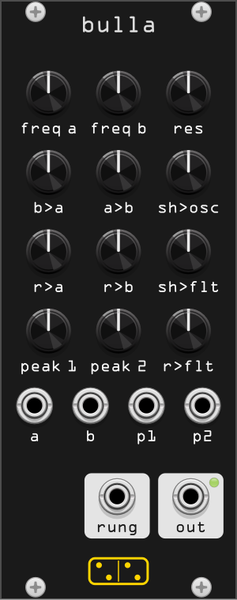

# bulla

**Inspired by Rob Hordijk's Blippoo Box: his other chaotic instrument, a
relative of his Benjolin but a different circuit.**

*bulla* is Latin for "bubble, blip" (and the amulet Roman children wore).
The module is inspired by the Blippoo Box, described by Rob Hordijk in "The
Blippoo Box: A Chaotic Electronic Music Instrument, Bent by Design"
(Leonardo Music Journal, 2009). The structure follows olaf's SuperCollider
realization ([sccode.org/1-5bB](https://sccode.org/1-5bB)), reimplemented
from scratch.

Two triangle oscillators cross-modulate each other and clock two
**runglers**: shift registers, each clocked by one oscillator and fed data
bits by the other, whose three newest bits drive a 3-bit DAC producing a
stepped pseudo-random CV (8 levels). Rungler 1 modulates osc A, rungler 2
modulates osc B (the loop that makes the thing chaotic), and their sum
modulates the two cutoffs of Hordijk's **twin-peak filter**: two resonant
lowpasses fed in opposite phase and
summed, leaving a resonant band between the two peaks. The filter's audio
input is the comparator square of the two triangles. A **sample & hold**
(osc A latched by osc B) adds a third modulation stream.

There is deliberately no pitch-and-gate way to "play a melody" here: no gate
input, no envelope, nothing to sequence notes into. The four CV inputs are
exponential (1V/oct) so they transpose predictably, but they are an addition
of this module, not a feature of the original, which has no inputs at all.
The Blippoo hovers between pattern and chaos: you steer it and it answers.

## Controls

| knob | function |
|------|----------|
| **freq a / freq b** | oscillator base frequencies, ~0.03 Hz to 11 kHz. One low + one audio-rate is the classic starting point |
| **res** | twin-peak resonance |
| **b>a / a>b** | triangle cross-FM depths |
| **sh>osc** | sample & hold to both oscillator frequencies |
| **r>a / r>b** | rungler to oscillator FM: the chaos feedback amount |
| **sh>flt** | sample & hold to the filter peaks (pushes them apart / together) |
| **peak 1 / peak 2** | twin-peak base cutoffs, 20 Hz–20 kHz |
| **r>flt** | rungler to both filter peaks |

## Inputs and outputs

| jack | function |
|------|----------|
| **a / b** | 1V/oct CV to the oscillator frequencies |
| **p1 / p2** | 1V/oct CV to the peak cutoffs |
| **rung** | rungler CV out, 0–10V stepped: the sum of both runglers, the Blippoo's pattern generator as a modulation source for the rest of the rack |
| **out** | twin-peak filter output |

## Tips

- Set **freq b** slow (below 9 o'clock) and **r>a** around noon: classic
  blippoo burbling.
- **r>a** and **b>a** at zero make it a well-behaved (if odd) filtered
  oscillator; every bit of rungler feedback adds pattern, then chaos.
- The **rung** output is a great melody-adjacent CV: quantize it.
- Because each rungler DAC reads only three bits, the system often falls into
  short loops: sit on the edge and nudge **freq a** to flip between them.

## Differences from the Blippoo Box

bulla reimplements the structure Hordijk published, by way of olaf's
SuperCollider realization. It is not a circuit emulation, and it departs from
the original in ways worth knowing:

- **CV inputs.** The Blippoo Box is a closed instrument, played entirely from
  its knobs. bulla adds four 1V/oct inputs (oscillator frequencies, peak
  cutoffs) because a Rack module that cannot be patched into is a waste of a
  rack.
- **One rungler jack.** There are two runglers internally, but a single
  **rung** output carrying their sum, rather than one jack per rungler and
  the stepped / smoothed / pulse / clock taps Hordijk's hardware exposes.
- **Three-bit registers.** The DAC reads the three most recent bits, as in
  the SuperCollider reference; older stages are never read, so the pattern
  memory is 3 bits deep.
- **Digital shortcuts.** Naive (non-bandlimited) triangles, a comparator of
  the two triangles as the filter's audio source, a Chamberlin state-variable
  pair for the twin peaks, and frequency folding rather than analog clipping
  at the modulation extremes.

## Attribution

Design by Rob Hordijk (1943–2022), from his published paper; SC reference by
olaf on sccode.org; this implementation is original code.
