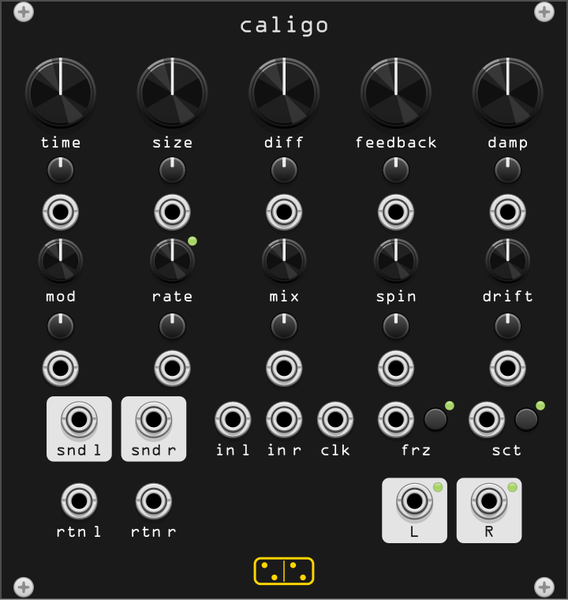

# caligo



**A long modulated echo inside a nested allpass diffuser: every repeat comes
back smeared further than the last.**

*caligo* is Latin for mist, fog, gloom, murk; as a verb, *to be dark, to
steam*. The module is a port of **Greyhole**, Julian Parker's 2013 algorithm
from the DEIND project, named after the Eventide effect of a similar name.

Greyhole is usually filed under "reverb" and that is the wrong shelf. It is a
**delay** — a delay long enough to hear as discrete repeats — with a dense
allpass diffusion network sitting in the *forward path of its feedback loop*.
Because the diffuser is inside the loop rather than after it, each pass is
scattered by the whole network again: the first repeat is a slightly blurred
copy, the fourth is a cloud, and the difference between them is the sound.

```
in ─┬──> (+) ──> diffuser stage 0   (4-deep nested allpass, g = +diff)
    │     ^      diffuser stage 1   (4-deep nested allpass, g = -diff)
    │     │      diffuser stage 2   (4-deep nested allpass, g = +diff)
    │     │            v
    │     │      damping one-pole ─────────────> wet, to the mix
    │     │            v
    │     │      quadrature-modulated short delay  (cos on l, sin on r)
    │     │            v
    │     │      long delay  (crossfading, or tape)
    │     │            v
    │     │      snd l / snd r  ->  rtn l / rtn r
    │     │            v
    │     └───── x feedback ─> saturator ─> DC block
    │
    └─────────────────────────────────────────> dry, to the mix
```

Three stages, each a **four-deep nested** allpass, each level holding one
fractional delay line per channel: 24 delay lines. Their lengths are prime
numbers indexed by `size * scale`, and the *index* glides with a 0.23 s
one-pole, so sweeping **size** slides through the prime table rather than
jumping between entries. The diffusion coefficient alternates sign across the
three stages, which is where the reversed-sounding build-up at medium **diff**
comes from.

The channel rotator between each level's nested block and its delay lines is
hardcoded to π/2 in the original — a hard channel swap at every one of the
twelve levels, which is where Greyhole's violently wide stereo image comes
from. Here it is the **spin** knob.

## What it is not

caligo is not [antrum](antrum.md), which is a real reverb. antrum's delays are
room-sized (1–500 ms) and its output is a decaying wash; caligo's are
echo-sized (tens of milliseconds to seconds) and its output is a *rhythm* that
dissolves. antrum's **absorb** is a diffusion-and-damping macro; caligo's
**diff** is a rotation angle inside a nested lattice that changes the *pattern*
of the echoes, not just how smeared they are. And caligo's feedback loop comes
out to jacks.

## Controls

Every knob has its own attenuverter and CV input directly below it. CV is ±5 V
for the full range of the parameter, scaled by the attenuverter.

| knob | function |
|------|----------|
| **time** | the long delay, 10 ms to 16 s, exponential. Under a clock (see **clk**) it becomes a ratio of the clock instead. This is the *loop* delay, not the whole loop: the diffuser adds about 70 ms of its own at **size** 1.0, so the shortest repeat interval you can actually reach is time + that (see *The diffuser has a length of its own*) |
| **size** | 0.5–4×, scaling all 24 diffuser delays together. Below 1 the network is short and metallic; above 2 the diffuser itself becomes an audible space that rings for a couple of hundred milliseconds. Sweeping it glides rather than steps, which is a large part of the character |
| **diff** | the allpass rotation angle. Full CCW is a plain delay line — literally: the diffuser collapses to 24 delays in series and there is silence between repeats. Around 9:00–11:00 is the reversed-sounding build-up. Noon and just past it is the classic smooth exponential smear. Past about 2:00 the *direct* path through each allpass takes over again and the diffusion narrows, so the densest setting is nearer 10:30 than full CW |
| **feedback** | loop gain, 0–120%. At 100% it sustains indefinitely; past that the loop pumps energy in and the saturator is what holds it, so the top fifth of the knob is a drive control |
| **damp** | a one-pole high-frequency loss per pass, 0 to 99%. Sample-rate compensated, so the damping *frequency* stays put across 44.1 and 192 kHz (the original's coefficient is raw and does not) |
| **mod** | depth of the quadrature modulation on the delay inside the feedback path — cosine on the left, sine on the right, ±2.5 ms at full. Small by design: it decorrelates the repeats rather than chorusing them |
| **rate** | its frequency, 0.02–10 Hz. The LED above the knob blinks at the rate. Optionally clock-syncable (context menu) |
| **mix** | equal-power dry/wet blend. The original is wet-only, which is preset 1 |
| **spin** | the channel rotator angle, 0 to π/2 (§ above). Full CCW: the two channels never meet, so you get two independent mono echoes on different prime lengths — wide and static. Full CW (the default, the original): the channels are hard-swapped at every level, so they continuously trade material — a boiling, moving image. Measured correlation runs 0.03 at full CCW to 0.25 at full CW; both are wide, but only one of them moves |
| **drift** | a slow bounded random walk on **size**, 0 at full CCW. At full CW size wanders ±45% over 0.5–4 s steps. Because size changes glide anyway, the walk is inherently smooth: it sounds like the room refusing to hold still, which is a completely different thing from vibrato in the delay line |
| **frz** | button, latches freeze: feedback goes to exactly 1.0, the input is shut out of the loop, damping is bypassed and the delay time is held. Crossfaded in over ~10 ms so it does not click |
| **sct** | button, reseeds the scattering network: new constants for the prime-index scales, so a different room reached through the same controls. It *slides* into the new configuration over ~0.23 s rather than jumping |

## Inputs and outputs

| jack | function |
|------|----------|
| **in l / in r** | stereo audio in; **in r** is normalled to **in l** for mono use |
| **clk** | clock input. While patched, **time** snaps to ratios of the clock (1/12, 1/8, 1/6, 1/4, 1/3, 1/2, 2/3, 1/1, 3/2, 2, 3, 4, 6, 8, 12 — 1/1 at noon, the same table antrum uses). A ratio change takes effect on the next clock edge, so it lands on the beat rather than mid-bar |
| **frz** | freeze gate: high freezes, releasing it thaws. Overrides the button while high |
| **sct** | scatter trigger: a rising edge reseeds |
| **snd l / snd r** | the feedback loop send, tapped after the long delay and before the feedback gain |
| **rtn l / rtn r** | the feedback loop return. Unpatched, each channel's send is fed straight through and the module behaves exactly as if the jacks were not there. **rtn r** is normalled to **rtn l** |
| **l / r** | stereo output, with a level LED on each |

### The send/return break

This is the reason to reach for caligo over a stock Greyhole. Whatever you
patch between **snd** and **rtn** is inside the loop, so it colours *every*
repeat and its effect compounds: a gentle filter becomes a long spectral
collapse, a pitch shifter becomes a spiral, a waveshaper degrades the cloud
one pass at a time. The break sits after the long delay and before the
feedback gain, so the ×feedback stage stays the last and most predictable
thing in the loop.

Two things to know. The break costs one sample of latency, which is inaudible
and is the same one sample the algorithm already has. And a gain stage in the
loop *can* run away — the loop saturator is what catches it, and it will,
but it is a saturator and not a limiter, so expect it to sound like one.

## Context menu

| item | options | default |
|------|---------|---------|
| **Time change** | *Dissolve* is the original: the long delay is an integer delay that crossfades between the old and the new length, so sweeping **time** produces no pitch change at all — it dissolves from one time into another. *Tape* gives it a fractional, slew-limited read pointer, so sweeping **time** Doppler-shifts the repeats the way a tape echo does | Dissolve |
| **Clock sync target** | *Time*, or *Time + rate* — the modulation LFO snapped to clock ratios as well | Time |
| **Freeze bypasses damping** | on: a frozen cloud stops getting darker. Off: it keeps closing down | on |
| **Input to loop when frozen** | *Muted* is a true freeze. *Open* keeps injecting, so you can play into a cloud that never lets go | Muted |
| **Reset scattering to the original** | puts the prime-index scales back to Greyhole's own constants (10 + 19i per stage, +13 per nesting level, +10 between channels) | — |

The scatter seed, the latched freeze state and all four settings are saved in
the patch, so a patch reopens sounding identical. The seed also walks
deterministically: five presses of **sct** from a given seed always land in
the same room.

## The diffuser has a length of its own

The 24 delay lines are in series, so at **size** 1.0 the diffuser is about
70 ms long before the long delay is counted at all. Three consequences:

- The **first** thing out of the module arrives 70 ms after the input, even
  with **time** at its minimum. caligo is not a short delay.
- The loop period is **time + 70 ms**, so the repeats at time = 400 ms land
  470 ms apart.
- To reach the comb/resonator region — where the loop is short enough to have
  a pitch — bring **size** down as well as **time**. At size 0.5 the
  diffuser is about 29 ms.

This is faithful: the original behaves identically, and the figure is
sample-rate independent here (measured at 70.56–70.57 ms across 44.1, 48, 96
and 192 kHz) because the prime lengths are rescaled with the sample rate.

## Tips

- The starting point is the **greyhole** preset: 200 ms, diff at 0.707,
  feedback 90%, no damping, fully wet. Everything else is a departure from
  there.
- **diff** is the knob to explore first, and it is not monotonic in
  "amount of blur": sweep it slowly from full CCW and listen for the point
  where discrete repeats turn into build-up (around 9:00) and then into
  smooth decay (around noon). Past 2:00 it thins out again.
- Under a clock, **time** plus a low **diff** is a diffused delay you can
  write parts against; the same setting with **diff** at noon is a wash that
  still breathes in time.
- **drift** at a quarter turn is the cheapest way to stop a long
  100%-feedback setting sounding like a loop. Nothing repeats exactly.
- **spin** full CCW with a small **size** is the "two rooms" preset: two
  metallic mono echoes that never mix. Useful under a mono source you want
  spread rather than smeared.
- **freeze** with **drift** up is the module's best trick: the cloud holds
  forever while the room it lives in keeps moving.
- Above about 4–6 seconds of **time** the repeats stop being a texture and
  become discrete diffused *events* — the diffuser only smears over tens to
  a couple of hundred milliseconds, so it blurs *within* a repeat, never
  between them. That stretch of the knob is for clock-sync multiples and slow
  drone work, not for the good sound.
- **diff** and **spin** are computed at control rate (every 16 samples), so
  audio-rate CV into them will step rather than modulate. **time**, **mod**,
  **feedback** and **mix** are per-sample and take anything.

## Factory presets

Right-click → Preset.

| preset | what it is |
|--------|------------|
| **greyhole** | the original's own defaults, fully wet: 200 ms, size 1, diff 0.707, feedback 90%, no damping, mod 0.1 at 2 Hz, spin at π/2 |
| **slapback lattice** | 90 ms, diff in the build-up region, feedback 50%: short, dense, and it arrives backwards |
| **cathedral** | size 3, diff high, damping up, 1.2 s at 100% feedback |
| **tape ghost** | tape mode, 700 ms, deep slow modulation, 95% feedback. Sweep **time** and it bends |
| **two rooms** | spin at zero, size 0.6: dual-mono, wide, metallic |
| **frozen** | freeze latched with drift up, fully wet |
| **comb** | 12 ms at 110% feedback with diff low: the resonator end of the knob |

## Differences from the original

Everything here is either off by default or neutral at the original's
settings, so preset 1 is the reference algorithm.

- **Delay time reaches 16 s** instead of 1.486 s. The original's published
  range of "0.1..60 sec" is wrong twice over: the real ceiling is 65533
  samples, which is 1.486 s at 44.1 kHz and 0.34 s at 192 kHz, and the "60"
  is a copy-paste of `jpverb`'s reverberation time from forty lines earlier
  in the same file. Greyhole's `dt` is not a reverberation time at all, it is
  the raw length of the long delay. So the extra reach here is a **new
  capability, not a restoration**. At sample rates above about 262 kHz the
  buffer caps below 16 s and the **time** tooltip says so.
- **Tape mode** for the delay time. The original only dissolves.
- **spin** and **drift** are new controls, both neutral at their defaults
  (π/2 and 0).
- **The prime delay lengths are rescaled by SR/44100 and rounded.** The
  original specifies them in *samples*, so a naive port halves the whole
  diffusion network's duration between 48 and 96 kHz and sounds materially
  different at each rate. They are not re-primified after rescaling:
  primeness was the method for picking mutually incommensurate ratios, and a
  uniform rescale preserves those ratios exactly, while snapping back to the
  nearest prime would throw away most of the correction (33.7 would land back
  on 31).
- **The loop has a soft saturator and a DC blocker.** The original has no
  non-linearity anywhere, which is why feedback above 1.0 is undefined there.
  With a patchable loop that is not acceptable. The saturator is bit-exact
  below ±5 V and asymptotes to ±9.5 V, so at nominal levels it does nothing
  at all.
- **The dissolve crossfade scales with the delay time** (a quarter of it,
  bounded to 5–250 ms) rather than sitting at a fixed 0.5 s. At 16 s a fixed
  crossfade takes forever to settle and at 10 ms it is unusable.
- **`diff` stops at 0.95 radians**, not the raw slider's 0.99. Four nested
  levels want the margin.
- **The scattering constants can be reseeded**, and the seed is saved in the
  patch.
- **Parameter smoothing** is proper one-pole, not the original's two-tap box
  smoother. That smoother is close to a no-op at any real block size — its
  only measurable effect is on the first sample after a parameter changes,
  which is exactly where an impulse test lands.

## Attribution

Greyhole was written by **Julian Parker** (2013) as part of the
[DEIND](https://doc.sccode.org/Overviews/DEIND.html) project, with bug fixes
and interface changes by **Till Bovermann**. It ships as a SuperCollider UGen
in [sc3-plugins](https://github.com/supercollider/sc3-plugins) (GPL-2.0-or-later)
and as `jp_gh_rev` / `re.greyhole` in
[faustlibraries](https://github.com/grame-cncm/faustlibraries)' `reverbs.lib`
(MIT). The name follows the Eventide effect of a similar name.

This module is an independent C++ implementation written from the published
algorithm — no machine-translated Faust output — and is verified against a
Faust build of `re.greyhole`: with the test impulse placed after the
reference's own parameter smoothers settle, the first diffuser pass is
sample-identical, and over four seconds of tail across four parameter sets the
RMS envelope and the spectral tilt both track the reference within 0.6 dB. It
is not affiliated with Eventide, with the DEIND authors, or with GRAME.
