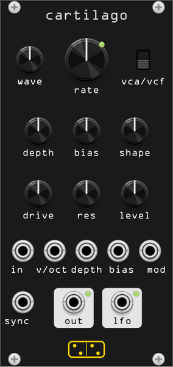

# cartilago

*cartilago* (Latin: gristle, cartilage) is a modulator in the manner of the
**Gristleizer** — the effects unit Roy Gwinn published in *Electronics Today
International* in the mid-1970s, which Chris Carter built, modified and turned
into one of the recognisable sounds of Throbbing Gristle.

One LFO, four shapes, and a choice of what it modulates: a FET attenuator
(tremolo, and at audio rate a ragged ring modulator) or a resonant filter. The
modulation is deliberately allowed to run past both ends of its range, and the
attenuator never quite closes.

12 HP. Polyphonic: one attenuator and one filter per channel, one LFO for all
of them, as it is one modulator in one box.

## Controls

| Control | Range | What it does |
|---|---|---|
| **wave** | 4 positions | triangle, ramp up, ramp down, pulse |
| **rate** | 1/64 Hz – 128 Hz | LFO frequency, exponential. **v/oct** takes it into the audio band and beyond |
| **vca/vcf** | switch | what the LFO modulates: the FET attenuator, or the filter |
| **depth** | 0 – 125 % | how much LFO reaches the control. Past 100 % the control flattens against its ends, which is where the tremolo starts to sound square |
| **bias** | ±100 % | where the modulation is centred. With **depth** at zero this is a manual gain (VCA) or cutoff (VCF) control |
| **shape** | 2 – 98 % | symmetry. On the triangle it slides the peak, so one knob runs from a falling ramp through a triangle to a rising one; on the pulse it is the duty cycle. Ignored by the two fixed ramps |
| **drive** | ±20 dB | level into the nonlinearity. The input saturates before the FET sees it |
| **res** | 0 – 100 % | filter resonance (VCF mode only) |
| **level** | 0 – 200 % | output gain |

## Ports

| Port | |
|---|---|
| **in** | audio in, polyphonic |
| **v/oct** | 1 V/oct on the rate, summed with the knob |
| **depth** | depth CV, 10 V = full scale |
| **bias** | bias CV, 5 V = full scale |
| **mod** | external modulation, summed with the LFO before **depth**. Patch anything here to drive the attenuator or the filter from outside |
| **sync** | resets the LFO phase on a rising edge |
| **out** | audio out, polyphonic |
| **lfo** | the raw LFO, ±5 V, before depth and bias |

The LED by the **rate** knob follows the LFO; the two by the output jacks
follow their levels.

## Context menu

- **Oversampling** — 1× to 16×, default 2×. Only matters once the LFO is in
  the audio band; see the measurements below.
- **Band-limited LFO shapes** — on by default. Turn it off for the raw
  aliasing of a naive digital oscillator, which is one way to be authentically
  unpleasant, but is not what the hardware does.
- **FET control feedthrough (tick)** — on by default; see below.
- **VCF mode is lowpass** — off by default, i.e. bandpass.

## What is modelled

The attenuator is a **JFET in a shunt divider**, not a multiplier: a series
resistor into a FET whose channel conductance goes to ground. Three things
follow from that, and all three are the point of the module.

**It never closes.** Gain bottoms out at `Ron/(R+Ron)`, about −26 dB here, not
at silence. A tremolo built this way keeps a thin, dirty version of the signal
alive in its troughs.

**It distorts, most in the middle of the sweep.** In the triode region a
JFET's channel conductance goes as `2(Vgs − Vth) − Vds`, so the drain swing —
the signal itself — modulates the gain within each cycle. The second harmonic
measures about −37 dB with the attenuator shut, peaks at −23 dB half way up
the sweep where the channel is both conducting and seeing a real voltage, and
vanishes at the top where the gate has pinched the channel off entirely
(`test/cartilago_probe fet`).

**It ticks.** Gate-drain capacitance injects the control edge straight into
the audio path. This is a real and well-known FET-VCA artefact, and on the
Gristleizer it is a feature: on the pulse setting, with nothing patched into
the input, the module clicks in time. The size of the tick is `tau · dV/dt`,
so it grows with rate and depth, and the finite bandwidth of the gate drive
(2 kHz here) is what bounds it and turns a click into a thump. Turn it off
in the context menu if you want a quiet module.

The control-to-gate law is the one thing shaped by taste rather than by the
circuit: conductance is linear in gate voltage, so a linear control would put
twenty of the attenuator's twenty-six dB into the top twentieth of the sweep.
Real gear hides that in its pot taper and its FET's threshold, neither of
which we have a number for, so cartilago uses a cube, giving roughly
−26, −19, −11, −2 dB across the four quarters of the control.

The filter mode is a zero-delay-feedback state-variable filter, bandpass by
default, swept by the same control over 45 Hz – 3.8 kHz.

## Aliasing

Running the LFO into the audio band is the reason this circuit is interesting,
and it is also where a naive implementation falls apart: a square wave
multiplied by audio produces sidebands forever. cartilago band-limits the LFO
shapes with polyBLEP (the two ramps and the pulse) and polyBLAMP (the
triangle's corners), and oversamples the attenuator and filter.

Measured as the spectral distance from the same patch rendered at 16×
(`test/cartilago_probe alias`), a 387 Hz carrier through a pulse LFO:

| LFO rate | 1× raw | 1× band-limited | 2× band-limited | 4× band-limited | 8× band-limited |
|---|---|---|---|---|---|
| 58.6 Hz | −36 dB | −43 dB | −49 dB | −49 dB | −55 dB |
| 1183.6 Hz | −22 dB | −27 dB | −36 dB | −43 dB | −53 dB |

The two mechanisms are independent and roughly additive: band-limiting buys
about 6 dB, each doubling of the sample rate another 6 to 7. The default 2× is
a compromise aimed at tremolo rates; raise it if you use the module as a ring
modulator.

The **lfo** output is decimated by taking the last oversampled value, which is
fine for a modulation source and will alias if you use it as an oscillator.

## Deviations from the hardware

- **mod** and **sync** inputs, which the pedal has no equivalent of.
- Band-limited shapes, switchable off.
- A lowpass option in filter mode; the replicas are usually described as
  bandpass, which is the default.
- Polyphony.
- Self-oscillation is not offered: **res** stops below it.

## What is not modelled

No schematic revision was measured and no unit was available, so this is
circuit-informed, not a transcription. The published replicas differ from each
other in component values, and the original ETI design, Chris Carter's
modified units and the later Eurorack recreations are not the same circuit.
The FET model is a triode-region approximation with no gate leakage, no
temperature drift and no device spread; the control path is one pole rather
than the real network; and the filter is a digital SVF, not the original's
topology.

## Patch ideas

- **Gated stutter**: pulse wave, **shape** low, **rate** around 8 Hz, depth
  full. The trough is not silent, so it stutters rather than chops.
- **Ring modulator**: **v/oct** from a sequencer, rate knob near the top, wave
  on triangle. Raise oversampling to 4× or 8×.
- **Sample-and-hold filter**: VCF mode, pulse wave, **res** high — each pulse
  parks the filter at one of two frequencies.
- **Outside control**: depth at zero, patch an envelope into **mod**, and the
  module is a FET VCA with the grit of one.
- **The tick alone**: nothing in **in**, pulse wave, feedthrough on. A clock
  you can hear.
