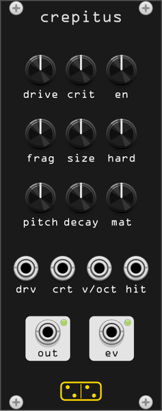

# crepitus



*crepitus* (Latin: a crackling, a rustling, a clattering) is **a material being
worked**. Paper squeezed in a fist, a sheet tearing, something giving way — but
not as three buttons. One point process, whose events are impacts on a resonant
object, and one knob that decides whether those events ignore each other or set
each other off.

That knob is **crit**, and it is the branching ratio of the process:

| crit | what it is | what it sounds like |
|---|---|---|
| below 1 | subcritical: events are independent | crumpling. Paper, gravel, rain on a roof |
| near 1 | critical: each event tends to make one more | tearing. Avalanches of every size, a crack front travelling along a line |
| above 1 | supercritical, self-limited | breaking. A cascade eats into the object, the rate collapses, the material recovers, it goes again |

10 HP. Monophonic. The same engine as [ruina](ruina.md), which puts a different
front end on it.

## Controls

| Control | Range | What it does |
|---|---|---|
| **drive** | 0.5 – 3000 events/s | how hard the material is being worked. Exponential |
| **crit** | 0 – 3 | the branching ratio: expected number of events each event sets off |
| **en** | 0.05 – 5 J | energy of the average event. Each one draws from an exponential around this, as the SDT does |
| **frag** | 0 – 100 % | spread of the fragment sizes. At 0 every event excites the same object; at 100 % they range over a factor of four |
| **size** | 3 – 100 % | fragment size of the intact object. Smaller fragments ring higher and shorter, which is the SDT's own scaling |
| **hard** | 10⁵ – 5·10⁹ | contact stiffness. Soft is a thud with a long contact time and only the low modes; hard is a click with everything in it |
| **pitch** | 30 Hz – 3 kHz | fundamental of the object |
| **decay** | 5 ms – 2 s | modal decay, before the material's own scaling |
| **mat** | rubber → wood → metal → glass | continuous morph across four sets of modal ratios, decays and gains |

## Ports

| Port | |
|---|---|
| **drv** | drive CV, 10 V = full scale |
| **crt** | criticality CV, 10 V = full range |
| **v/oct** | 1 V/oct on the object's pitch |
| **hit** | rising edge: one event five times the average energy, at the cost of five events' worth of the object |
| **out** | audio |
| **ev** | a 0.1 ms trigger per event |

**ev** fires at the process's own rate, which runs from under one a second to
over a thousand. At the slow end it is a sparse random clock; at the fast end
it is a pulse train whose density is the texture.

## Context menu

- **Output gain** — five steps, 0 dB default.
- **Output limiter** — a tanh on the way out, on by default. A point process
  has a crest factor around ten, so the peaks are well above the RMS.

## What is modelled

The event grain is the **Sound Design Toolkit** ([SkAT-VG/SDT](https://github.com/SkAT-VG/SDT),
GPL-3.0-or-later), ported in `src/sdt/`: each event's energy is the SDT's own
clipped exponential draw, each event's fragment size is its fragmentation rule,
and each event drives an `SDTImpact` between an inertial hammer and an
`SDTResonator`, wired exactly as the SDT's `crumpling~` and `breaking~` help
patches wire it — energy to the hammer's velocity, fragment size to the
fragment size of both bodies.

What is not the SDT is **when the events happen**. The toolkit ships the two
ends as separate models with nothing in between: `SDTCrumpling` is a stationary
Bernoulli process (paper being squeezed forever) and `SDTBreaking` is the same
process running down a finite energy budget (something coming apart, once).
Here they are one continuum, because the process is self-exciting:

```
lambda(t) = base + sum over past events of  a * exp(-(t - ti) / tau)
```

a Hawkes process, with `a` scaled so that the expected number of children per
event is exactly the **crit** knob whatever `tau` and the sample rate are. The
avalanche timescale `tau` is not a knob: it follows the drive at eight events'
worth of time, so a slow drive gives bursts long enough to hear as bursts and a
fast one gives a dense roar.

### Why the supercritical setting does not run away

The rate is also scaled by how much object is left, exactly as `SDTBreaking`
scales its event probability by its remaining energy. The effective branching
ratio is therefore `crit × integrity`, so a runaway cascade eats the object
down to `integrity = 1/crit` and stops there. The process drives itself onto
its own critical point, which is what a crack front does. `crepitus_probe`
measures it:

```
crit    ev/s     crest    integrity  1/crit
0.3     10       6.93     0.960      1.000
1.2     54       3.25     0.802      0.833
2.0     123      2.32     0.547      0.500
3.0     169      2.19     0.375      0.333
```

Between events the material knits itself back together at a rate proportional
to the drive — it is being worked continuously, after all — so **drive**
controls density rather than loudness.

### The refractory period

Half a millisecond after an event, nothing else can happen in the same object.
Without it a supercritical setting saturates at one event per sample, and since
an event sets the hammer's velocity, that *pins* the hammer instead of striking
with it: the module goes silent at exactly the setting that should be loudest.

## Measurements

`test/crepitus_probe` prints the event rate and level over the drive × crit
plane, the avalanche statistics above, the level against every other knob and
a CPU figure. At 48 kHz a dense setting costs about 1.2 % of a core.

## Patch ideas

- **crit** just under 1 with a slow **drive**: tearing that never quite
  finishes.
- **ev** into a sample-and-hold: a random clock whose density is audible in the
  same signal that drives it.
- **hit** from a sequencer with **drive** at zero: a fracture drum, with
  **size** and **mat** as the tuning.
- **drive** from an envelope: a single crush gesture with a tail.
