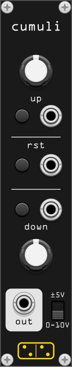

# cumuli

*cumuli* is an accumulator. The output value grows when the *up* gate is open, and decreases when the *down* gate is open, at the rates set by the respective knobs. When the *reset* gate is open, the output immediately returns to zero.

The output is clamped to **0V–10V** when the polarity selector is set to "0-10V", and to **±5V** when set to "±5V". The output holds its value when neither gate is open.

The *up* and *down* rate knobs are exponential, ranging from 0.01 V/s to 100 V/s (default 1 V/s). Each gate has a corresponding button for manual triggering.

## How to use

Connect two gate signals to the *up* and *down* inputs, then set the rates with the respective knobs and watch the output go up, down, or hold.

This module was imagined as a companion to MIDI controllers like the [Korg nanoPAD2](https://www.korg.com/us/products/computergear/nanopad2/), which has no faders — only buttons.
