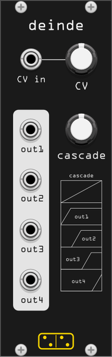

# deinde

*deinde* is a quad cascading addressable attack-hold envelope.

- **quad** — outputs four envelopes
- **cascading** — the four envelopes open one after the other
- **addressable** — the envelopes can be scanned with the *cascade* knob and CV
- **attack-hold** — each envelope has a linear attack ramp, then stays fully open

Inspired by [Doepfer A-144](http://www.doepfer.de/a144.htm), with one key difference: the A-144 uses attack-decay envelopes, while *deinde* uses attack-hold. This makes it well suited to controlling send effects in sequence — for example: volume ramp, then saturation, then distortion, then fuzz.

## How to use

Connect the four outputs to the controls of four effects or VCAs. Turn the *cascade* knob to open the four envelopes in sequence.

When a signal is patched into the *CV in* input, it scans the envelopes in place of the knob. In this mode the *CV* knob acts as an attenuator and the *cascade* knob as an offset.

All inputs and outputs are 0V–10V.
