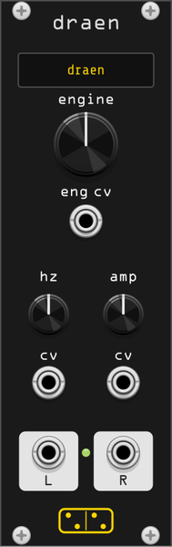

# dræn

*dræn* is a **drone synthesizer**: a bank of drone engines, each a small
self-contained voice, played from just two controls - a fundamental (**hz**) and
a level (**amp**) - with a third control that selects which engine is sounding.
Change the engine and dræn fades the current one down and the next one up, so the
drone shifts without a hard cut.

It is a port of [dronecaster](https://github.com/northern-information/dronecaster),
a [norns](https://monome.org/docs/norns/) instrument by
[@northern-information](https://github.com/northern-information) and contributors.
In dronecaster each drone is a little
[SuperCollider](https://supercollider.github.io/) graph of the form
`{ |hz, amp| ... }`; dræn reimplements those graphs in C++ and drives them the
same way the original's `SynthSocket` does - one engine sounding at a time, with
an amplitude fade on every switch.

The name breaks from the collection's Latin: **dræn** is Old English for *bee*,
the etymological root of the word *drone*.

## How it works

One engine sounds at a time. **hz** sets its fundamental frequency and **amp**
its level; both take CV. The **engine** knob (and its CV) choose the active
engine from the roster, and the display shows its name. When the selection
changes, the current engine fades out over the **fade time**, then the newly
selected engine fades in - a sequential cross-fade rather than two engines
overlapping. The fade time is set from the right-click menu (0.25 s to 8 s).
When a patch loads, dræn starts directly on the saved engine and fades it in
from silence.

Some engines are steady oscillators; others evolve on their own through internal
modulation. Because a fresh engine is (re)seeded when it becomes active, the
evolving ones start somewhere new each time you select them.

## Controls

| control | description |
|---------|-------------|
| **hz** | Fundamental frequency. Exponential, roughly 8 Hz–8 kHz; summed with the hz CV. |
| **amp** | Output level, 0–100%. Summed with the amp CV (10 V = full). |
| **engine** | Selects the active drone engine; the display shows its name. Summed with the engine CV (0–10 V spans the roster). |

## Inputs

| input | description |
|-------|-------------|
| **hz cv** | Frequency CV. By default **1V/oct**; the right-click menu can switch it to **linear** (100 Hz/V) added on top of the knob. |
| **amp cv** | Level CV (0.1 per volt, added to the knob). |
| **eng cv** | Engine-select CV. 0–10 V sweeps the whole roster; patch a sequencer or LFO to step or morph between drones. |

## Outputs

| output | description |
|--------|-------------|
| **l** / **r** | Stereo output, ±5 V nominal with a gentle soft-limiter on peaks. Many engines are genuinely stereo (e.g. supersaw spreads its voices). |

## Choosing an engine by name

The **engine** knob has 37 detents, which is a lot of turning when you
already know which drone you want. **Right-click the engine display** (the
name panel under the title) for the whole bank as a list, with the current
engine ticked; picking one moves the knob. The bank switch sits at the top
of the same menu, since it decides which 37 names are listed. The same list
is under **Engine** in the module's own right-click menu.

Selecting from the list is exactly like turning the knob to that detent:
the change fades in and out over the **Fade time**, and a patched **eng cv**
still offsets on top of it.

## Context menu

- **Engine** - the bank as a list, current engine ticked (see above).
- **Engine bank** - *dræn (dronecaster ports)* or *hyf (original instruments)*;
  see [The hyf bank](#the-hyf-bank) below. Switching banks fades like an
  engine change and is saved with the patch.
- **Hz CV input** - *1V/oct* (musical, tracks pitch) or *Linear (100 Hz/V)*.
- **Fade time** - duration of each fade-down / fade-up on an engine change.

## Engines

The full dronecaster roster - all 37 drones - is ported.

| engine | source | description |
|--------|--------|-------------|
| **sine** | @northern-information | Pure sine tone. |
| **square** | @taubaland | Band-limited square (50% pulse). |
| **triangle** | @taubaland | Triangle wave. |
| **supersaw** | @cfdrake | Five detuned, band-passed saws spread across the stereo field. |
| **harm's way** | @moonblind | Sixteen harmonics, each slowly amplitude-modulated; a shimmering additive drone. |
| **thx** | @infinitedigits | The THX "Deep Note": twelve saws sweep from a random cluster to a target chord. Here **amp doubles as the sweep position** (as in the original), so it shapes the sound rather than acting purely as a level. |
| **hecker** | @infinitedigits | Two stereo banks of sixteen filtered-noise voices, morphing between white and pink noise around the fundamental - a dense, evolving noise drone. |
| **coil** | @infinitedigits | Twelve Dust-triggered voices - a feedback sine crossfading with noise, band-limited, micro-delayed and panned by moving envelopes - poured into a long reverb. Slow and cavernous. |
| **sachiko** | @infinitedigits | Four DPW-pulse voices modulated by banks of very slow wandering triangles, resonant-lowpassed and comb-delayed, summed into a global Moog ladder and reverb. High, glassy, space-cutting. |
| **starlids** | @infinitedigits | A PWM sub-oscillator plus twelve sawtooth voices stepping through major-third/fourth/sixth intervals, chorus-delayed and swept by a global Moog ladder. Symphonic, radiant. |
| **mt. lion** | @license | Nine comb-resonated pulse voices, everything (pitch, width, delay, decay, pan, level) driven by slow sample-and-held noise. Roars through a twisting canyon. |
| **apparatus** | Josue Arias (after Zé Craum / Ruviaro / Mitchell) | Clipped triangle oscillators with vibrato and mains hum, plus a crackle/dust interference bed - old sinusoidal test-generators drifting. |
| **eliane** | @sixolet | Seven sine partials phase-modulating each other in a crosslinked feedback ring, with slow amplitude beatings. An homage to Éliane Radigue. |
| **unrelacc** | @zebra | Six Hénon-map chaotic oscillators tuned to intervals, panned and slowly faded in - a bristling, metallic drone. |
| **dreamcrusher** | @infinitedigits | A no-input-mixer feedback drone: a gated pulse driving a feedback loop of rotation, a modulated delay and soft-clip. Chaotic and strobey. |
| **rehberg** | @infinitedigits | A detuned tape-warble pulse pair, wave-folded and DFM1-filtered with an FM sine and resonant band, drenched in Freeverb. Dense, distorted, overwhelming. |
| **toshiya** | @infinitedigits | Twelve sine voices jumping through intervals, chorus-delayed and Moog-swept into a reverb, with a pink-noise-excited Klank resonator bank ringing underneath. |
| **magicicada** | @sixolet | A no-input-mixer drone: two crossfading banks of delays (three and four) inside a feedback loop, filtered and warped. Unsettling and organic. |
| **mt. zion** | @license | Five pulse-wave harmonics where pitch, width, pan and level all wander on lagged sample-and-hold noise; voices thin out and vanish as their pulse width crosses full. "Thee rusted satellites gather + sing." |
| **mika** | @infinitedigits | A chord-walking sine ping shot through a randomly re-timed allpass (the delay jumps *are* the beeps), over a slow pulse+noise bass. Hum and beeps. |
| **fieldsteel** | after Eli Fieldsteel | Three band-passed saws demand-picking notes from a four-note set, blended with a "marimba" of high-resonance bandpasses rung by slow ramps. From Tutorial 15, "Composing a Piece". |
| **malone** | @infinitedigits | Eight organ voices (pulse stack + sub triangle) stepping through a demand-sequenced chord table, tremolo'd after each change, into a Moog ladder. Thick, organ, stepped. |
| **gristle** | @infinitedigits | Three octave-stacked triangle-saws, noise-detuned and band-passed by a wandering filter, heard entirely through a Greyhole diffusion cloud. A primal sawtooth. |
| **grove** | @sixolet | Five pulsar-synthesis voices: slow sine "pulses" fire formant-period grains, self-gated by a fed-back guard window; washed in and out of Greyhole. There is no conductor. |
| **shields** | @infinitedigits | Six detuned, double-combed saw pairs recorded to a tape loop and read back slower (a slipping repitch), combed again, Moog-swept and drowned in a 32-comb reverb. Bendy, bloody, loud. |
| **eno** | @infinitedigits | Two low sines under eight chorused saws voicing a slow chord, a Klank ringing the chord tones, and a "piano" walking the actual Music-for-Airports note rows, through Freeverb. |
| **belong** | @infinitedigits | Ten chorused saws walking scrambled chord tones, enveloped differently per side, overdubbing themselves onto a 16-beat tape loop; push **amp** past 0.7 and a spaced-out kick appears. |
| **ruins** | @rplktr & @sixolet | Metallic 2/3-operator FM hits (after McCartney's "100 FM Synths") on a self-clocked trigger, drowned in a very long wash that warbles with tape wow and flutter, over a windy noise floor. |
| **sunno** | (uncredited) | Five "guitars" of Karplus-Strong string pairs (one negative-decay for the octave-under growl), re-plucked at random, crushed through crossover distortion and cascaded tanh+filter gain stages. Doom. |
| **nautilus** | @taubaland | A Lorenz attractor iterated at the fundamental drives six voices of overlapping sine grains with looping swells, into chaos-swept lowpasses. Dusty waves, chaotic undercurrent. |
| **drumm** | @infinitedigits | Two slowly crossfading layers - chaos-width pulse pairs with phase-modulated subs, and ten Moog-swept voices stepping interlocking rows - sine-shaped and drenched in pumping Freeverb. |
| **takita** | @sixolet | A self-clocked drum language: a beat gates a self-suppressing division window whose phasors flip tik/tok/tuk flip-flops, each firing resonant filtered clicks. Everything drifts on immensely slow sines. Rhythmic. |
| **twin pks** | (uncredited) | No oscillators: tape/vinyl noise (dust, crackle, a pink-driven whistle) compressed hard, band-passed at the fundamental, warbled through wow and flutter, saturated and bit-crushed. Retro stylings, timeless horror. |
| **unmemqua** | @zebra | Lagged dust and noise excite a 28-partial Klank bank whose ring times scale with 1/hz, torn by six slowly-breathing filters and smeared by ~4 s combs (one with negative feedback). |
| **uneablin** | @zebra | Six interval sine pairs phase-modulated by long saw-swept delays of each other, morphing through a ladder of cubic and inside-out waveshapes. Everything moves at multiples of 23 seconds. |
| **unwealne** | @zebra | Six wandering-width pulse voices through triple resonant lowpasses, the whole mix shifted an octave up through a 13-ratio filter bank, with ~3 s allpasses cross-feeding it back reversed. |
| **unreanth** | @zebra | A 64-step buffer sequencer read and written at mutually-prime rates fades ten just-ratio sine pairs in and out, over detuned saws, a diode ring-mod, and a 7–8 s pitch-smeared feedback delay. |

The **rehberg**, **eno**, **drumm** and **belong** engines use a faithful port
of Jezar's public-domain Freeverb.

Engines are loudness-normalized with a per-engine makeup gain so switching
between them doesn't jump levels; the quieter originals (which relied on norns'
master gain) are brought up to sit with the rest.

## The hyf bank

*hyf* is Old English for **hive** - where dræn's first bank ports the
dronecaster SynthDefs, the hyf bank is 37 original instruments built on the
same DSP layer, deliberately covering ground the dronecaster set doesn't:
binaural beating, Shepard tones, phase distortion, wavefolding, formant and
vocal drones, shimmer feedback, and environmental textures. Select it from the
right-click **Engine bank** menu; the engine knob, CV and display work exactly
as before.

| engine | description |
|--------|-------------|
| **beam** | Binaural beating: two pure sines a few Hz apart across the channels, over a soft sub. Meditative, headphone magic. |
| **root** | Sub-octave sines breathing slowly, a hint of a fifth. Deep and minimal. |
| **wall** | Eleven detuned saws into a ladder filter. A monolithic wall of sound. |
| **organelle** | Drawbar organ (1-2-3-4-6-8) with tremulant and a small chorus. |
| **choir** | A saw pair sung through three morphing vowel formants (A→O→U), with vibrato. |
| **breath** | Whispered vowels: pink noise through the formant space, barely pitched. |
| **glass** | Nine stretched partials (hz·n^1.13), each slowly breathing. Inharmonic glass sheen. |
| **bowl** | Singing bowl: four long inharmonic resonances continuously stroked, beating between channels. |
| **gong** | An inharmonic resonator bank struck softly every few seconds, shimmering between strikes. |
| **swarm** | Sixteen band-passed saws gliding between harmonics of the fundamental. Bees. |
| **hive** | Twelve feedback-sines with drifting growl, combed at the fundamental. The queen. |
| **fold** | West Coast: a sine pair through a slowly deepening wavefolder. |
| **phase** | CZ-style phase distortion, the knee swept slowly; the two channels mirror each other. |
| **aster** | Sustained two-operator FM with a wandering index, plus a quiet 3:2 sparkle pair. |
| **naiad** | Water-modulated FM: a bubbling comb resonance drives the modulation index. Burbling. |
| **lattice** | Golden-ratio sine pairs diode-ring-modulated, slowly rotating in the field. |
| **corona** | Odd harmonics through a breathing wavefolder, high-passed to a bright halo. |
| **shepard** | The ever-rising barberpole drone: eight windowed octaves, one octave per 50 s, forever. |
| **drift** | A six-voice cluster forever re-tuning itself in slow glides around the root, fifth and octave. |
| **saros** | An endless cadence: four gliding sine pairs cycling an eight-chord table, 16 s per chord. |
| **mirror** | Noise sustained inside two long combs tuned to the root and fifth. Ethereal tuned wash. |
| **wire** | A bowed string: a Karplus loop continuously excited by bow noise, occasionally flipping to harmonics. |
| **quill** | A slow harp: long-sustain plucks arpeggiating a harmonic set into a light reverb. |
| **rain** | Plucked droplets on a pentatonic set in a wet cave, over a soft triangle pad. |
| **pulsework** | Meshing tick trains through combs tuned to the root and fifth. Clockwork over a pad. |
| **halo** | A quiet sine regenerating through an octave-up pitch shifter and reverb. Shimmer. |
| **cavern** | Sparse harmonic blips lost in a vast reverb over a deep sub. |
| **loam** | Dark detuned triangle pad through a slow four-stage phaser. Soft and mossy. |
| **anthem** | Swelling brass: detuned saws into a ladder that opens itself, with ensemble chorus. |
| **pipe** | A hollow bore: negative-feedback comb sung by breath noise. Clarinet-adjacent. |
| **tide** | Ocean: swelling band-swept brown noise over a deep sub. |
| **ember** | Fire: crackle, flickering roar, sub rumble and occasional pops. |
| **veldt** | Insects at dusk: sparse trilling chirps over a warm low drone. |
| **frost** | High crystalline partial strikes over a near-silent root. Icy. |
| **sputter** | Granular haze: dust-triggered filtered saw grains blurring into texture. |
| **turbine** | Machine-room hum: sub square and a sweeping high whine through resonant peaks. |
| **eclipse** | A dark vowel of brown noise over a deep sub, morphing very slowly. |

The hyf bank is calibrated across the whole pitch range (octaves of 27.5 Hz up
to 3.5 kHz, measured by `test/draen_sweep`): outputs are DC-free, and engines
whose loudness naturally depends on the fundamental - formant voices, tracking
filters, pluck and comb resonators - carry an hz-dependent makeup gain so the
perceived level stays put as you sweep. Sparse percussive engines (gong, quill,
rain, frost) sit deliberately lower than the sustained drones.

## Fidelity notes

The ports follow the SynthDef graphs closely, but a few SuperCollider UGens
have no direct equivalent here and are approximated. For anyone A/B-ing
against the originals, the known deviations:

- **Filter/lag coefficients** update on 16-sample blocks. SC computes control
  signals on 64-sample blocks, so this is *finer*-grained than the original.
- **DFM1** (rehberg, nautilus, drumm) is approximated with a resonant biquad;
  its `noiselevel` input is modelled as added white noise. In nautilus the
  chaos-driven cutoff is smoothed over 5 ms (the real DFM1 tolerates
  audio-rate cutoff modulation; a biquad does not).
- **Greyhole** (gristle, grove) is approximated by two series modulated
  allpass diffusers per channel inside a damped cross-fed stereo delay loop,
  with the same control surface.
- **GVerb** (ruins) is approximated by eight damped feedback combs split
  odd/even to the two outputs, into two allpasses per side.
- **PitchShift** (unwealne, unreanth) is a two-tap granular shifter; the
  dispersion arguments are only loosely honoured.
- **Compander / Limiter** are simplified followers without lookahead delay.
- **VarLag(warp: \sine)** is a plain one-pole lag; **LFDNoise3** is LFNoise2;
  **SawDPW/PulseDPW** are MinBLEP band-limited equivalents; curved envelope
  segments are linear or sine where noted in the source.
- **mika**: the original's PMOsc has `mul: 0` (silent) and its Compander uses
  identity slopes; both are omitted. Its LPF cutoff is driven by
  `LFNoise0.kr(Dust.kr(1))`, which in practice never advances - kept as an
  effectively static random cutoff.
- **malone**: the original's second RLPF channel lands on output buses 3/4
  (inaudible on a stereo out); only the audible channel is ported.
- **ruins**: only the Select-ed instrument is rendered (in SC the other
  eleven run inaudibly); all envelopes share the global trigger, so switching
  mid-decay lands at the correct envelope phase. GVerb's early-reflection tap
  is folded into the tail.
- **nautilus**: the SinGrain cloud is an eight-slot grain pool per voice
  (oldest grain stolen); LorenzL is integrated in four Euler substeps with a
  divergence guard (plain Euler at SC's default h = 0.05 blows up).
- **uneablin**: SC writes all six feedback taps into *one* shared LocalBuf
  (overlapping writers); here each voice gets its own delay line.
- **unreanth**: the control-rate Phasor assumes a 689 Hz control rate; the
  original's `dst` waveshape array is computed but never mixed in (dead code)
  and is omitted.
- **unmemqua** uses an SC-exact (un-normalized) Ringz so the Klank bank's
  long partials ring louder, matching the original's -32 dB output stage;
  toshiya's Klank uses the normalized Ringz with its own level calibration.
- **mt. zion**: SC's Pulse treats width modulo 1, so voices vanish as their
  wandering width crosses an integer - reproduced by wrapping the width.

## Credits & license

Ported from **dronecaster** (© its authors, GPL-3.0). The per-engine author
credits above are carried over from the original SynthDefs. dræn, like the rest
of forsitan modulare, is licensed [GPL-3.0-or-later](../LICENSE).
