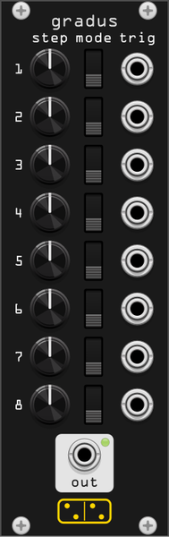

# gradus

**Eight steps into one CV. A trigger adds its knob to the output, subtracts
it, or jumps the output straight to it.**

*gradus* is Latin for a step, a stair, a rank. It is a discrete
[cumuli](cumuli.md): where cumuli ramps for as long as a gate is held open,
gradus moves only on an edge, and only by the amount dialled in. The output
walks a lattice of values you chose rather than sliding between them.

## The panel

Eight rows, numbered 1 at the top to 8 at the bottom. Each row is three
things:

| column | what it is |
|--------|-----------|
| **step** | the row's value, 0V to 10V. A step size in add and subtract, an absolute target in jump. |
| **mode** | what the row does when it fires: **add** (up), **jump** (middle), **subtract** (down). |
| **trig** | the row's trigger input. |

Below them, **out** carries the running value, with a lamp showing how high
it sits in its range.

Nothing else: no reset input, because a row in jump mode with its knob at
zero *is* a reset, and no clock, because gradus never moves on its own.

## What a trigger does

Triggers are edges, not levels. A gate held high is one step, not a stream
of them; to step again, the input has to fall and rise again. The threshold
is the usual 1V, with hysteresis down to 0.1V.

- **add** raises the output by the row's knob.
- **subtract** lowers it by the row's knob.
- **jump** sets the output to the row's knob, wherever it was before.

The output is clamped to its range and does not wrap. A step that would
overshoot lands on the rail instead, so eight adds of 3V from zero leave the
output at 10V, not at 4V.

## When several triggers arrive together

Rows that fire in the same sample are resolved by three rules, and they are
the reason gradus is a module rather than eight adders in a row.

**A jump beats every add and subtract in that sample.** The relative moves
are discarded, not applied around it. A row in jump mode names an absolute
value, and that is where the output goes.

**Among simultaneous jumps, the lowest row on the panel wins.** The rows are
read top to bottom and the last one seen is the one that lands, so the panel
is a priority order: row 8 overrides row 5, which overrides row 1. Put the
jump you want to be able to force at the bottom.

**With no jump in the sample, every add and subtract is applied.** Fire rows
2, 3 and 7 together and the output moves by their sum. Two rows of the same
size in opposite modes cancel, and the output holds.

"The same sample" is exactly that: one audio frame. Triggers from a common
clock divider or a logic module land together and are resolved by these
rules; triggers a millisecond apart are two separate events, and a jump then
simply overwrites what the adds just did.

## Range

The output is 0V to 10V. The right-click menu offers **bipolar output
(±5V)**, which subtracts 5V on the way out.

The value itself is always kept in 0-10V, so switching range never disturbs
where the output sits in its span: it moves the whole span down by 5V. A
step is still its knob in volts in either range, which is what keeps the
knobs meaning one thing. Only a jump target reads shifted, and the knob's
tooltip follows the mode switch next to it and says which it is showing.

The output value is saved with the patch and comes back where you left it.

## How to use

**A stepped voltage source.** Set every row to add with its knob at 1/12 V
(0.083) and you have a chromatic climber; at 1V, an octave per trigger. Two
rows in opposite modes with different sizes make a drunk walk that drifts
one way, and a jump row at the bottom snaps it home when the walk gets lost.

**A trigger-addressed sequence.** Eight rows in jump mode, eight triggers
from a sequencer's gate outputs, and gradus is an eight-value lookup table
addressed by whichever trigger fires. The precedence rule decides what
happens when two fire at once, which is where the character is: a run of
overlapping gates plays the lowest row, not a mixture.

**An accumulator with presets.** Mix the modes. Rows 1-6 add and subtract
various amounts, rows 7 and 8 jump to a floor and a ceiling. The patch
wanders, and a trigger on 7 or 8 puts it back on a known value in one
sample, without waiting for a ramp.

**Rhythm into pitch.** Feed the trig inputs from a drum pattern's outputs.
The CV output then tracks the pattern's *history* rather than its beat, and
because the steps are exact the pitches repeat exactly whenever the pattern
does.
