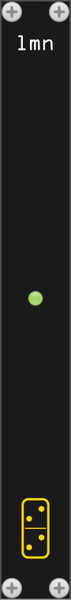

# limen



*limen* is a TCP+JSON control interface for VCV Rack. It exposes a simple newline-delimited JSON protocol over a local TCP socket, letting you query and control your patch from scripts, Emacs, or any other tool that can open a socket.

## Module UI

A green LED at the centre of the panel indicates that the server is listening. Right-click the module for options:

- **Server enabled** — toggle the TCP server on or off without removing the module. The LED goes dark when the server is stopped.
- **TCP port** — choose a preset port (7000, 7001, 7002, 7777, 8000) or type any value in the text field (1–65535) and press Enter.

The port and enabled state are saved with the patch.

## Use cases

**CLI control** — the included `limen` CLI lets you inspect and modify a live patch from the terminal. Useful for quick experiments, parameter sweeps, or integrating Rack into shell scripts.

**Alternative interfaces** — any tool that can open a TCP socket can drive Rack. An Emacs minor mode (coming soon) will let you interact with your patch directly from your editor: list modules, tweak parameters, connect cables, all without touching the mouse.

**LLM interfacing** — a language model can use limen as a tool to explore and build patches. `list_models` gives it the full module catalogue; `list_ports` tells it what each port does; `add_module` and `add_cable` let it act. The JSON protocol is easy for models to generate and parse.

**Automated patch testing** — load a known patch, query its topology with `list_modules` and `list_cables`, assert that parameters are in expected ranges with `list_params`. Useful for regression testing or verifying that a saved patch loads correctly.

**Live coding / generative patching** — drive patch changes from a REPL, a script, or a custom sequencer. Add and remove modules, reconnect cables, and automate parameter changes in real time without touching the Rack UI.

**Patch documentation and archiving** — dump the current patch state to JSON for later analysis or archiving. `list_modules`, `list_cables`, and `list_params` together give a complete snapshot of what is patched and how it is configured.

## Security

The server binds **loopback only** (`127.0.0.1`), so it is reachable only from the same machine. There is **no authentication** by design: anything that can open the local socket can control Rack (add/remove modules, set parameters, even quit). This is fine for local scripting and editor integration, but do **not** expose the port to an untrusted network (e.g. via port forwarding or a public bind) without adding your own access control in front of it.

## JSON protocol

The server listens on `localhost:7000` by default. It handles **one client at a time** by design; open a connection, send your requests, and close it. Send one JSON object per line; receive one JSON response line per request.

**Request:**
```json
{"cmd": "<command>", ...}
```

**Success response:**
```json
{"ok": true, "result": <value>}
```

**Error response:**
```json
{"ok": false, "error": "<message>"}
```

### Commands

#### Discovery

| cmd | extra fields | result | description |
|-----|-------------|--------|-------------|
| `hello` | — | `{protocol, commands}` | protocol version and the list of supported commands; call first to check compatibility |

#### Plugin and model registry

| cmd | extra fields | result | description |
|-----|-------------|--------|-------------|
| `list_plugins` | — | `[{slug, name, version}]` | all plugins loaded in Rack |
| `list_models` | `"plugin": "<slug>"` (opt.) | `[{plugin, slug, name, description}]` | all available models, optionally filtered by plugin |

#### Modules in the patch

| cmd | extra fields | result | description |
|-----|-------------|--------|-------------|
| `list_modules` | `"plugin": "<slug>"` (opt.) | `[{id, plugin, model, name, numParams, numInputs, numOutputs}]` | modules currently in the patch |
| `get_module` | `"id": <int>` | `{id, plugin, model, name, numParams, numInputs, numOutputs}` | detail for one module |
| `get_module_info` | `"id": <int>` | `{id, model: {slug, name, description, tags, manualUrl, modularGridUrl}, plugin: {slug, name, brand, version, license, author, authorUrl, pluginUrl, manualUrl, sourceUrl, donateUrl, changelogUrl}}` | the metadata Rack shows in a module's right-click Info menu |
| `list_ports` | `"id": <int>` | `{inputs: [{id, name}], outputs: [{id, name}]}` | input and output port names |
| `list_params` | `"id": <int>` | `[{id, value, name, min, max, unit}]` | params for a module |
| `get_param` | `"id": <int>`, `"param": <int>` | `{id, value, name, min, max, unit}` | one parameter's current value and metadata |
| `set_param` | `"id": <int>`, `"param": <int>`, `"value": <float>` | `null` | set a parameter value |
| `add_module` | `"plugin": "<slug>"`, `"model": "<slug>"` | `{id}` | add a module to the patch |
| `remove_module` | `"id": <int>` | `null` | remove a module from the patch |

#### Cables in the patch

| cmd | extra fields | result | description |
|-----|-------------|--------|-------------|
| `list_cables` | `"id": <int>` (opt.), `"verbose": true` (opt.) | `[{id, outputModule, outputPort, inputModule, inputPort, …}]` | cables in the patch; filter by module id; verbose adds `outputModuleName`, `outputPortName`, `inputModuleName`, `inputPortName` |
| `add_cable` | `"outputModule": <int>`, `"outputPort": <int>`, `"inputModule": <int>`, `"inputPort": <int>` | `{id}` | connect two ports |
| `remove_cable` | `"id": <int>` | `null` | remove a cable from the patch |

#### Application / view

These control the Rack window and view rather than the patch. Useful for
scripting screenshots (e.g. add modules, `set_fullscreen`, `zoom_to_modules`,
then capture the window with an external tool).

| cmd | extra fields | result | description |
|-----|-------------|--------|-------------|
| `set_fullscreen` | `"on": <bool>` | `{fullscreen}` | enter or leave fullscreen; result reflects the resulting state |
| `zoom_to_modules` | — | `null` | set offset and zoom to fit all modules to the view (the F4 action) |
| `quit` | — | `null` | quit VCV Rack (window closes after the current frame) |

`zoom_to_modules` fits to the **current** viewport, so call it *after* any
viewport change such as `set_fullscreen`. It returns immediately but the fit
settles over the next few frames, so allow a short pause before capturing a
screenshot.

### Examples

```bash
# list modules (with netcat)
echo '{"cmd":"list_modules"}' | nc localhost 7000

# list all models available from the Fundamental plugin
echo '{"cmd":"list_models","plugin":"Fundamental"}' | nc localhost 7000

# list port names for module 8518972980240757
echo '{"cmd":"list_ports","id":8518972980240757}' | nc localhost 7000

# list params for a module
echo '{"cmd":"list_params","id":8518972980240757}' | nc localhost 7000

# set param 0 of module 8518972980240757 to 0.5
echo '{"cmd":"set_param","id":8518972980240757,"param":0,"value":0.5}' | nc localhost 7000

# list cables with module names and port names
echo '{"cmd":"list_cables","verbose":true}' | nc localhost 7000
```

```python
# Python example
import socket, json
s = socket.create_connection(("127.0.0.1", 7000))
s.sendall(b'{"cmd":"list_modules"}\n')
print(json.loads(s.recv(65536)))
```

## CLI tool

Two clients live in the separate
[limen-tools](https://github.com/gosub/limen-tools) repository:

### C client (compiled, no runtime dependency)

Prebuilt binaries for Linux, Windows and macOS are attached to
[limen-tools releases](https://github.com/gosub/limen-tools/releases), or
build from source:

```bash
cd limen-cli && make
# optionally install to ~/.local/bin
make install
```

### Python client (no compilation needed)

```bash
python limen-cli/limen-cli.py <command> [args]
```

Requires Python 3.6+, no third-party packages.

**Usage:**
```
limen-cli [--port N] [--host H] [--json] <command> [args]
```

| command | description |
|---------|-------------|
| `plugins` | list all loaded plugins |
| `models [<plugin-slug>]` | list available models, optionally filtered by plugin |
| `modules [<plugin-slug>]` | list modules currently in the rack |
| `get <module-id>` | get detail for one module |
| `info <module-id>` | module info: description, tags, plugin, version, license, links |
| `ports <module-id>` | list input/output port names |
| `params <module-id>` | list params for a module |
| `set <module-id> <param-id> <value>` | set a parameter value |
| `cables [-v] [<module-id>]` | list cables; `-v` adds module and port names; optional module filter |
| `add <plugin-slug> <model-slug>` | add a module, prints its id |
| `rm <module-id>` | remove a module |
| `connect <out-mod>:<out-port> <in-mod>:<in-port>` | connect two ports, prints cable id |
| `disconnect <cable-id>` | remove a cable |

Module IDs and cable IDs can be given as unique prefixes instead of the full number.

**Options:**

| option | description |
|--------|-------------|
| `--port N` | TCP port (default: 7000) |
| `--host H` | host (default: 127.0.0.1) |
| `--json` | print raw JSON response (pipe to `jq`) |

**Examples:**

```bash
# list all modules in the rack
limen modules

# list all models available in the Fundamental plugin
limen models Fundamental

# get port names for a module
limen ports 8518972980240757

# add a VCO, capture its id
ID=$(limen add Fundamental VCO)

# connect VCO output 0 to VCA input 0
limen connect ${ID}:0 9876543210:0

# list cables with names (verbose)
limen cables -v

# disconnect a cable by prefix
limen disconnect 1234

# raw JSON output
limen --json modules | jq .
```
