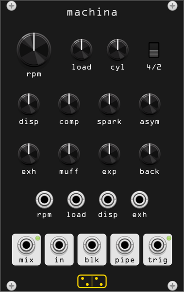

# machina



*machina* (Latin: machine, engine, contrivance) is an **internal combustion
engine**. Not a sample and not a sawtooth through a filter: up to twelve
cylinders on a shared crank, each with an intake pipe, a chamber whose length
breathes with the piston, and an extractor into a common exhaust, an expansion
chamber, a muffler bank and a tailpipe — all of it waveguides running at the
speed of sound.

It is here as a **rhythm source that is not a clock**. An engine at 12 Hz is a
pulse train with physics: **trig** fires once per crank cycle, the cylinders
are deliberately out of phase with each other, and **asym** says the crankshaft
is not evenly spaced either, so the firing is not evenly spaced. Rev it and the
tempo goes with it, but so does everything about the sound.

16 HP. Monophonic. The heaviest module in the plugin: 42 waveguides, about
6.5 % of a core at twelve cylinders and 1.1 % at one.

## Controls

| Control | Range | What it does |
|---|---|---|
| **rpm** | 200 – 12000 rpm | engine speed, exponential. The crank period, and so the whole rhythm |
| **load** | 0 – 100 % | throttle: how much is burning. The pistons pump whatever this is set to, so it changes the character (a firing transient once per cylinder) more than the level |
| **cyl** | 1 – 12 | cylinders. Each has its own intake, chamber and extractor, staggered around the nominal pipe length so they do not all resonate at once |
| **4/2** | switch | four stroke (fires once per two turns) or two stroke (once per turn) |
| **disp** | 20 – 3000 cc | displacement. The chamber length is the cube root of it, so this is the chamber resonance: roughly 6 kHz at the small end down to 1 kHz at the large |
| **comp** | 5:1 – 20:1 | compression ratio: how far the chamber shortens at top dead centre |
| **spark** | 0.2 – 10 % | how much of the cycle the combustion pulse occupies |
| **asym** | 0 – 100 % | crankshaft asymmetry. The cylinders stop being evenly spaced, so the engine develops a limp |
| **exh** | 0.05 – 5 m | exhaust length, and the intake, extractor, muffler and outlet lengths scale with it. One knob for "how much plumbing": eleven pipe lengths is the research instrument, not the module |
| **muff** | 0 – 100 % | how reflective the muffler is. At 100 % the tailpipe is silent, which is what a fully reflective termination means |
| **exp** | 0 – 100 % | expansion chamber: the reflection back down the extractors. At 100 % nothing reaches the pipe |
| **back** | 0 – 100 % | backfire. Only fires while the engine is revving *down*, as it should |

## Ports

| Port | |
|---|---|
| **rpm** | speed CV, 10 V = full scale, summed with the knob (so exponential too) |
| **load** | throttle CV, 10 V = full scale |
| **disp** | displacement CV |
| **exh** | plumbing length CV |
| **mix** | the three taps at the SDT help patch's balance, 0.3 / 0.6 / 1.0 |
| **in** | intake: what the engine sucks. The brightest of the three |
| **blk** | block vibrations: what the engine body radiates |
| **pipe** | tailpipe: what comes out the back, after the mufflers |
| **trig** | 1 ms trigger once per crank cycle |

Each tap has its own make-up gain, because the model produces them at very
different levels. At the default plumbing and load 0.5 all four land between
0.5 and 3 V RMS across the whole speed range.

## Context menu

- **Output gain** — five steps, 0 dB default.
- **Output limiter** — a tanh, on by default.
- **Body damping** — the lowpass on the intake air and the block radiation:
  200 Hz (muffled) to 8000 Hz (raw), default 2500 Hz. See below.

## What is modelled

A port of `SDTMotor` from the **Sound Design Toolkit**
([SkAT-VG/SDT](https://github.com/SkAT-VG/SDT), GPL-3.0-or-later), in
`src/sdt/sdt_motor.hpp`. The model is unchanged; the plumbing around it is:

- the waveguide bank is sized **per role** rather than one maximum delay for
  all 42 lines (the cylinders need half a metre, the exhaust six);
- pipe lengths are kept in **metres**, so a sample-rate change re-derives the
  delays. The C keeps them in samples and cannot;
- the noise stream and the sample rate are per object rather than global.

Each cylinder runs a four-stroke or two-stroke pressure cycle; the intake and
exhaust valve openings modulate the reflection coefficients between the chamber
and its pipes between a metal wall (0.9) and an open joint (0.1), so the
plumbing is coupled to the crank angle sample by sample. The chamber's own
delay length is modulated by the piston position through the compression ratio.
Nothing is a filter bank pretending: the exhaust note is a real pipe resonance.

### The damping default

`SDTMotor`'s nominal damping is 20 Hz, but nothing in the C ever applies it —
`SDTMotor_new` leaves the one-poles at pass-through and the DC blockers as
plain first differences, and only a host that sets the attributes calls
`SDTMotor_update`. Applied literally, 20 Hz lowpasses the intake hiss and the
block radiation down to nothing: the block tap loses 8 dB and everything above
the firing rate goes with it. The module picks 2500 Hz instead, and puts the
choice in the context menu.

## Measurements

`test/machina_probe` prints the firing rate against speed and cycle, the level
at each tap across the speed range, what the plumbing knobs do, a rev sweep
with every pipe length modulating at once, and CPU. The firing rate is exact:

```
knob   rpm      4-stroke trig/s (want)   2-stroke trig/s (want)
0.20   454      4.0        (3.8)         7.5        (7.6)
0.60   2333     19.5       (19.4)        39.0       (38.9)
1.00   12000    100.0      (100.0)       200.0      (200.0)
```

## Patch ideas

- **trig** as the clock for a sequencer, **rpm** from a slow envelope: the
  tempo and the timbre are the same gesture, and **asym** puts a limp in it.
- **rpm** high with **cyl** at 1 and **exh** short: not an engine any more, a
  reedy oscillator with a filthy formant.
- **pipe** into a reverb and **blk** dry: the engine is over there, the body is
  under your feet.
- **back** up with **rpm** on a sawtooth LFO: it backfires on every downstroke.
