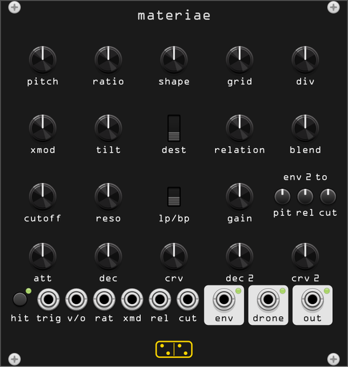

# materiae



**Two square waves, and everything that can happen between them. A percussion
voice whose complexity is entirely relational: nothing here is a complicated
oscillator.**

*materiae* is the genitive of *materia* — matter, timber, raw stuff. The two
sources are as primitive as an oscillator gets: naive squares, no wavetables,
no band limiting, no partials. What makes a sound is how they sit against each
other, how they modulate each other, which operator reads the pair, and how
that reading changes over the length of a hit.

## The signal path

```
trigger ─> phase reset
                 ┌──────────────────────────────────┐
                 v                                  │
   OSC A ────> [ cell A->B ] ──fm/am──> OSC B ──────┘
     ^                                    │
     └──────── [ cell B->A ] <────────────┘

   A, B ─> RELATION ─> BLEND ─> resonant filter ─> GAIN ─> saturator ─┬─> DRONE
                                                                      │
                                                             VCA (env 1) ─> OUT

   env 1 ─> amplitude
   env 2 ─> pitch, the relation itself, cutoff
```

The two oscillators, the cross-modulation and the operator make up the *logic
core*, and it runs on a clock of its own — see **grid** below. The filter and
the VCA run at the host sample rate, downstream and deliberately clean.

## Sources

| control | what it does |
|---------|-------------|
| **pitch** | osc A, −2 to +7 octaves from C1. **v/o** adds to it. |
| **ratio** | osc B as a ratio of osc A. Nineteen steps: the just ratios (1:2, 2:3, 3:4, 5:4, 4:3, 3:2, 5:3, 7:4, 2:1, 5:2, 3:1, 4:1), a 1:1 and a 1:1 detuned by 1%, and four irrationals — √2, e, π, and the 1:4 at the bottom. The context menu swaps the knob for a free 0.25× to 4× sweep. |
| **shape** | pulse-width skew. At centre both oscillators are square; turning it widens A and narrows B together. One knob, because what matters is the *difference* in duty, not either width on its own. |
| **grid** | the rate the logic core runs at, from 4× the host rate down to 250 Hz. |
| **div** | /1 /2 /4 /8 /16 on osc A. A flip-flop chain on A's rising edges: /1 passes it through with its own pulse width, and every other tap is a half-duty square a subharmonic below. |

### About ratio

The frequency relationship is the single largest control over the sound, which
is why it gets a table rather than a free sweep. On the just ratios the two
oscillators share a period and the operator output repeats: a stable, pitched
timbre. On √2, e or π they never share one, so the pulse pattern keeps
evolving for as long as the hit lasts — the same reason those four are there.
1:1 detuned gives a slow beat between the two, and under the logic operators
that beat is a rhythm rather than a tremolo.

### About div

The divider reads osc A everywhere A is read as a source: on the way into the
relationship operator, and inside the A→B modulation cell. The operator half is
the audible one — a divided A against an undivided B is not the same
relationship an octave down, it is a different relationship, and the two
stateful operators feel it hardest because they are then clocked at A/N against
a B running N times faster.

Only A is divided. Dividing both would drop the whole voice an octave, which is
what **pitch** is for; dividing one operand is what makes a new pattern.

One consequence worth knowing: above /1 the chain emits a half-duty square by
construction, so **shape** stops skewing A and only narrows B. That is what a
flip-flop does, and it is part of why division sounds digital rather than
merely lower.

### About grid

This is the module's digital character, made into a control instead of an
accident. Square waves and logic operations cannot be band limited — the
whole point of an operator like the latch is that it reads edges — so the core
is run at its own rate and decimated.

Turned down, the core rate falls below the host rate and the relationship
between the two oscillators is quantized onto a coarse time grid. Edges land
late, by an amount that changes every cycle, and the fold-down of those
displaced edges is what a listener hears as *digital*. Past the point where the
grid rate falls below twice the pitch the oscillators alias outright and what
survives is whatever is left of the relationship between two folded squares.
Turned up, the core runs at four times the host rate, the decimator does its
job, and the same patch comes out clean.

The range is 4× down to 250 Hz because that is where the change is. Measured as
spectral distance, the old top octave — 8× to 4× — was worth 0.063 out of about
1.9 for the whole sweep, while every octave below 1.5 kHz was still worth close
to 1.0 from one step to the next. So the top came down, which also halves what
the module costs at its cleanest, and the travel went to the bottom instead.

The whole sweep is continuous and stable; there is no setting at which the
module misbehaves, only settings at which it is dirtier.

## Cross-modulation

Each oscillator can modulate the other, and the two directions are
independent.

| control | what it does |
|---------|-------------|
| **xmod** | depth, 0 to 4 octaves of frequency modulation. |
| **tilt** | which way it goes. Centre is symmetric — both directions at full depth, which is where the feedback lives. Full left is A→B only, full right is B→A only. |
| **dest** | frequency, amplitude, or both. |

Between them, **xmod** and **tilt** cover the whole continuum the module is
built around: independent, one-way, cross-modulating, and then hard feedback
where the two oscillators are chasing each other. It stays bounded but it is
not tamed; that region is meant to be unstable.

**dest** on *amplitude* gates rather than ring-modulates: the modulator opens
and closes a VCA on its destination. Note that the two stateful operators
(**flip** and **noise**) read edges and not levels, so amplitude modulation
gates their output without disturbing the pattern underneath.

### The conditioning cell

Both directions run through the same three stages — attenuvert and bias,
divide, band-limit — and so does the module's own thinking about signals. Only
the depth (**xmod**/**tilt**) and the division (**div**) reach the panel. The
bias is zero on the modulation paths and the smoothing follows the source's
own frequency and division, so a divided square keeps its edges and an
undivided one at the top of the pitch range does not alias the modulator as
well as the carrier. Three panel copies of the full cell would have been
fifteen controls, most of them doing nothing most of the time.

## The relation

This is the centre of the module.

| control | what it does |
|---------|-------------|
| **relation** | which operator reads the pair, and it crossfades between neighbours rather than switching. |
| **blend** | osc A alone at one end, the operator at the other. |

Five operators, in knob order:

| | operator | what it is |
|---|---------|-----------|
| **and** | `min(A, B)` | high only when both are. Sparse, gated, and it carries a duty-cycle offset that reads as a transient. |
| **sum** | `(A + B) / 2` | the linear one, and three-valued: −1, 0, +1. The 0 exists only while the two disagree. |
| **ring** | `A × B` | metallic and inharmonic. For two bipolar squares this *is* exclusive-or — see below. |
| **flip** | set/reset latch | A sets it, B clears it, so it is high for exactly the interval by which A leads B. Its duty cycle is the phase difference between the two oscillators. |
| **noise** | shift register | an 8-bit register clocked by A and fed from its own top bit exclusive-or'd with B. Pseudo-noise, but deterministic and related to the pitch. |

Because **relation** crossfades, it is a continuous control and env 2 can sweep
it: the operator itself can change over the length of a single hit. That is the
one thing this module does that a pair of VCOs and a logic module cannot, and
it is worth building a patch around.

### Why five and not eight

The obvious operator list for two signals is longer than this — ring, XOR, AND,
OR, sum, difference, absolute difference — but for two *bipolar square waves*
most of it collapses. Writing A, B ∈ {−1, +1}:

- `A × B` is exactly `−(A xor B)`. Ring modulation and exclusive-or are the
  same operator, not two related ones.
- `|A − B|` is the same again, rescaled.
- `A − B` has the same magnitude spectrum as `A + B`: inverting a square is
  shifting it half a period.
- `min` and `max` — AND and OR — are mirror images. Same magnitude spectrum,
  opposite DC, and the output DC blocker removes the only difference.

What survives is min, mean and product, and after that an instantaneous
function of two two-valued signals has nothing left to offer. The last two
operators are therefore *stateful*: the latch and the shift register both
depend on the order of edges rather than the levels at an instant, which is
where the remaining room was. `test/materiae_probe ops` prints the pairwise
spectral distance the set was chosen on.

## Body

| control | what it does |
|---------|-------------|
| **cutoff** | 20 Hz to 12 kHz. Its CV jack is a straight volt per octave on top of the knob. |
| **reso** | up to a filter that rings for seconds, and a trigger pings it. |
| **lp/bp** | lowpass or bandpass. |
| **gain** | 0 to +24 dB into the output saturator. |

Squares are thin, and this module is supposed to sound heavy, so the filter is
not a tone control at the end of the chain — it is the body of the sound. Wound
up, it is a sine that the square strikes, which is where kicks and toms come
from: the exciter provides the transient, the filter provides the weight. The
context menu can make cutoff track pitch, which turns the whole voice into
something playable from **v/o**.

## Envelopes

Two, with different jobs.

**env 1** is amplitude: **att**, **dec**, **crv**. The curve runs from convex
(slow to leave the peak) through linear to concave (an exponential-looking
drop), and it is a real timbral control on a percussive sound, not a
cosmetic one. The decay reaches exactly zero, so a hit ends in silence even
with the filter ringing behind it.

**env 2** is the modulation envelope: instant attack, **dec 2**, **crv 2**,
and three bipolar trimpots routing it to **pit**, **rel** and **cut**. Bipolar
matters — from one envelope you get a pitch that falls or a pitch that rises, a
filter that opens or one that closes, an operator that walks up the list or
back down it. It also leaves the module at **env** for use elsewhere.

## Outputs

**out** is the voice: everything, through the VCA.

**drone** is the same signal taken before env 1 — the filter and the saturator,
held open. It ignores the amplitude envelope entirely, so the module becomes a
continuous voice rather than a percussion one and every control on the panel is
a timbre control on a drone. **relation** swept by hand across the five
operators is worth trying here; so is **grid** at the bottom of its range.

A trigger still does everything it normally does while the drone is running —
resets the phases, restarts env 2, pings the filter — so the drone output is
also the place to hear what a hit does to the *sound* with the envelope out of
the way.

The engine idles when nothing is sounding, so patching **drone** is what tells
it to keep running. Unpatched, it costs nothing.

**env** is env 2, 0–10 V.

## Triggering

**trig**, or the **hit** button. Both oscillators reset their phase on every
trigger, which is what makes a hit repeatable: with operators that read edges,
the output pattern is a function of the phase offset between A and B, so
free-running oscillators would make every strike of one patch a different
sound. The context menu offers free-running for exactly when you want that, and
a phase offset for osc B at reset.

Velocity comes from the height of the trigger: 5 V and above is full level, and
an attenuated trigger plays quieter. The usable range is 1.5 V to 5 V, because
1.5 V is where the trigger input fires at all. Turn it off in the menu if your
sequencer's gate heights are not deliberate.

**env 2 on retrigger** chooses whether a new hit restarts the modulation
envelope or lets the running one finish — the second keeps the amplitude clean
while modulation histories overlap.

A trigger that arrives while the voice is still sounding restarts the
oscillator phases, the latch and the shift register, and jumps the envelope
back to full: four discontinuities at once, landing on a tone that is already
there. So on a sounding voice the trigger does not take effect immediately. The
output fades down over 0.4 ms, everything resets at the bottom where nothing
can be heard, and it fades back up. A retrigger therefore sounds about
0.8 ms late, which no drum part will notice, and a trigger from silence skips
the whole thing.

Two simpler versions of this do not work, in case it looks over-engineered. A
minimum attack time does nothing, because the attack shares the **crv** knob
and a concave curve is at a quarter of full scale one sample in. Ramping the
VCA back up from zero fixes only half of it — arriving at zero instantly is
itself a step, and a large one.

## Context menu

| item | what it does |
|------|-------------|
| **Oscillator phase on trigger** | reset (repeatable hits) or free-running. |
| **Osc B phase offset** | 0, 90, 180 or 270 degrees at reset. |
| **Env 2 on retrigger** | retrigger, or let the running one finish. |
| **Ratio knob** | the 19-step table, or a free 0.25×–4× sweep. |
| **Cutoff tracks pitch** | the filter follows **v/o**. |
| **Velocity from trigger height** | on by default. |
| **Output level** | 5, 10 or 14 Vpp. |

## Factory presets

Twelve, written by `tools/presets/gen_materiae_presets.py`. The first eight are
named for what they are. The last four are named for what they are like — a
thread the module's own name started, since chaff, glint, vigil and slag are all
things made of matter — so here is what they actually do.

| | preset | what it is |
|---|--------|-----------|
| 1 | **kick** | the filter as the body, struck by the square |
| 2 | **tom** | the same, tuned up, with a longer pitch fall |
| 3 | **metal** | π against 1, into ring, band-passed |
| 4 | **digital** | AND on a coarse grid, divided |
| 5 | **click** | two milliseconds of high square |
| 6 | **cymbal** | the shift register, long and bright |
| 7 | **bass** | the latch drifting through its own phase difference |
| 8 | **strange** | asymmetric feedback, operator swept by env 2 |
| 9 | **chaff** | a snare — noise pulled back toward the latch, so the rattle keeps a pattern in it |
| 10 | **glint** | a hat — thirty-five milliseconds, where cymbal is nearly a second |
| 11 | **vigil** | a drone, meant for the **drone** jack: free-running, everything slow, nothing settling |
| 12 | **slag** | gain most of the way up and grid most of the way down, doing the damage between them |

`vigil` works from **out** as a very long hit, but it is written for **drone**,
where env 1 never closes and the only thing happening is the slow drift of two
oscillators against each other.

## Patch notes

Four of these are presets 1, 3, 4 and 8; the settings are worth knowing anyway.


**Kick.** Pitch low, ratio 1:1, **blend** about a third, **cutoff** near the
bottom with **reso** almost full, **env 2 → pit** hard negative and a short
**dec 2**. The filter is the body; the square is only the click on the front.

**Metallic.** Pitch up, ratio on π or √2, **relation** on **ring**, some
**xmod**, **lp/bp** on bandpass. Add **env 2 → rel** to have it start somewhere
else and arrive at ring.

**Digital.** **relation** on **and**, **div** at /4, **grid** turned well down,
short decay. The coarse grid and the subharmonic operand are doing the work
between them; **xmod** can stay at zero.

**Strange.** **xmod** near full with **tilt** off centre, **div** at /2,
**dest** on both, **relation** low with **env 2 → rel** wide open, long
decays. The operator moves across the whole list while the two oscillators
chase each other.

## Idle cost

A voice that is not sounding costs nothing: once env 1 has finished, the logic
core stops and the filter is cleared. Free-running is the exception, since the
phase relationship at the next trigger is the point of that mode.
