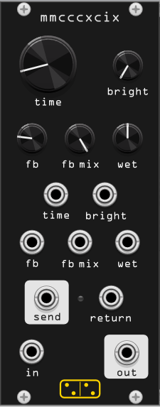

# MMCCCXCIX

*MMCCCXCIX* is a digital emulation of the PT2399 delay chip, a cheap BBD-style IC that gave countless guitar pedals their characteristic lo-fi echo. The model captures the chip's limited delay range, self-oscillation character, and tonal coloration, with an external feedback loop for inserting effects into the repeat path.

## Controls

| control | range | description |
|---------|-------|-------------|
| **time** | 35–1175 ms | Delay time. The knob uses a quadratic curve for finer control at short delays. |
| **bright** | 0–100% | Filter brightness. Lower values darken the repeats; higher values keep them crisp. |
| **fb** | 0–180% | Feedback amount. Above 100% the delay self-oscillates. |
| **fb mix** | 0–100% | Blend between internal feedback (0%) and the signal coming back from the return jack (100%). Has no effect when the return jack is unpatched. |
| **wet** | 0–100% | Dry/wet mix. |

## CV inputs

Each parameter has a dedicated CV input. The signal is added to the knob position and clamped to the valid range.

| input | scale |
|-------|-------|
| time CV | 10V = full range |
| bright CV | 10V = full range |
| fb CV | 10V = full range (0–1.8) |
| fb mix CV | 10V = full range |
| wet CV | 10V = full range |

## Feedback send / return loop

The **send** output carries the internal feedback signal - the wet delay after the feedback high-pass - at Eurorack level (±10V). Patch it through any processor - filter, distortion, wavefolder - and return the result to the **return** input.

- When the **return** jack is unpatched, the loop is bypassed and internal feedback is used regardless of the **fb mix** knob.
- When the **return** jack is patched, the green LED lights up and **fb mix** blends between internal feedback (0%) and the return signal (100%).

## Audio path

- **in** - audio input (±10V)
- **out** - processed output. A soft compressor on the wet signal limits self-oscillation amplitude.

The dry signal is taken directly from the input and mixed with the processed wet signal according to the **wet** knob.

## Context menu

- **Delta-sigma oversampling** (1× / 2× / 4× / 8× / 16×, default 8×) - how
  many bits the emulation simulates per RAM clock. CPU cost scales linearly
  with the factor and inversely with the delay time. 8× and 16× sound
  essentially identical; lower settings are cheaper and progressively closer
  to the raw chip's hiss and grit (1× is the chip's actual bit rate). Saved
  with the patch; changing it clears the delay line.
