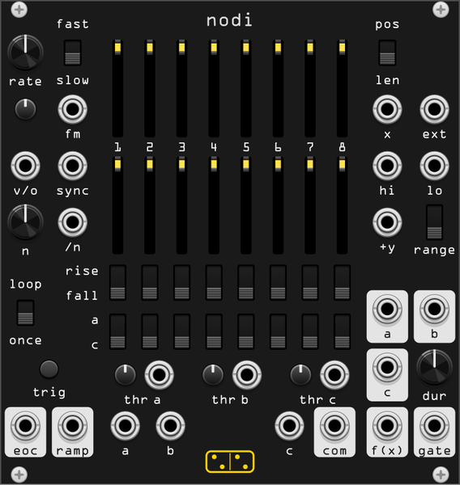

# nodi

**A continuous-time sequencer: eight thresholds on a moving voltage X pick
one of eight stages, and each stage puts out its own voltage. A Discrete Map
clone with its A / B / C Expander built in.**

*nodi* is Latin for "knots", plural of *nodus*. The hardware's manual opens
on Hegel's "nodal lines of measure relations": a quantity changes smoothly
until, at a node, it turns into a different quality. Eight thresholds are
eight such nodes. The module is a clone of New Systems Instruments'
**Discrete Map** and its **A / B / C Expander**, written from the hardware's
manual (the hardware is logic and analog circuits, with no firmware to
read). What differs, and why, is listed at the end and in
[doc/design/nodi.md](design/nodi.md).

Each stage has a threshold (the lower slider) and a direction (**rise**,
off, **fall**). A **rise** stage becomes active when X rises past its
threshold, a **fall** stage when X falls past it; crossing the other way does
nothing. One stage is active at a time, the last one tripped, and it stays
active until another trips. **f(X)** is the active stage's upper slider.

So the same X can give different outputs depending on where it came from,
and the stages play in whatever order X crosses them, not in panel order.

X is normalled to the internal **ramp**, -5 V to +5 V once a cycle. With the
ramp at X nodi is a step sequencer whose lower sliders say *when* each step
happens rather than which comes next. Patch anything else into X and the
steps follow that: an LFO, an envelope, a random voltage, a keyboard's
pitch, or audio.

## The panel

| area | contents |
|---|---|
| left | the clock: **rate** with **fast / slow**, **fm** (attenuator and jack), **v/o**, **sync**, **n** and its **/n** jack, **loop / once**, **trig**; **eoc** and **ramp** out |
| upper sliders | **f(X)** for stages 1 to 8, each lit while its stage is active |
| lower sliders | the thresholds, each glowing while X is above it and flashing as it fires |
| switches | per stage: **rise / off / fall**, and the group **a / b / c** |
| right | **pos / len**, **x**, **ext**, **hi**, **lo**, **+y**, **range**; outputs **gate a / b / c**, **dur**, **f(x)**, **gate** |
| bottom | per group a **thr** attenuator and CV jack; the switch inputs **a**, **b**, **c** and its **com** out |

## The clock

| control | function |
|---|---|
| **rate** | **slow**: 4 minutes a cycle to 9 Hz. **fast**: 4 Hz to 12 kHz. Its tooltip reads in seconds below 1 Hz, in hertz above |
| **v/o** | 1 V per octave on the rate: at sequencer speeds, an exact way to double or halve it, or to set it in musical ratios |
| **fm** | linear rate modulation, through its attenuator: +5 V at full doubles the rate, -5 V stops it. It stops rather than running backwards |
| **sync** | a rising edge (over 4 V, re-armed under 1 V) resets the ramp at once, and clears the **/n** count |
| **trig** | a button, the same as an edge at **sync**: it starts a ramp waiting in **once**, or cuts a running one short |
| **n**, **/n** | **/n** counts edges and resets the ramp on the n-th, 1 to 16 |
| **loop / once** | **once** runs the ramp to the top and waits there for a sync; back on **loop** it restarts at once |
| **eoc** | a 1 ms trigger when a cycle ends or a sync cuts one short (not when a waiting **once** ramp is restarted) |
| **ramp** | the ramp, normalled to **x** |

The reset is a falling sweep through the whole space, so every **fall** stage
fires on it, top to bottom, and the lowest is left active. That is why the
default sets stage 1 to **fall**: in **len** its threshold is at the bottom,
and the step plays on the reset. A **rise** stage at the very bottom plays
just after, since the reset dips a hair under -5 V.

## Thresholds

| control | function |
|---|---|
| **pos / len** | **pos**: each lower slider places its threshold, anywhere, in any order. **len**: stage 1 sits at the bottom and each slider is the *relative* length of the interval above its threshold, so the eight always fill the space and only their ratios matter |
| **hi**, **lo** | the top and bottom of the space, +5 V and -5 V unpatched. Per channel with a poly cable |
| **thr a / b / c** | CV added to the thresholds of that group's stages, in volts, through the attenuator, in either mode: steps move against each other, and one pushed past the end of the ramp never fires |

In **len**, an **off** stage keeps its length (the step before it lasts
longer); a slider at zero removes its stage. With every slider at zero all
eight thresholds sit in the middle.

## The map

| control | function |
|---|---|
| **f(X)** sliders | the active stage's voltage. **range** sets them to 0..2.5 V, 0..5 V or -5..+5 V; the tooltip reads in volts |
| **+y** | added to **f(x)**: a transposition, or another nodi's **f(x)** |
| **ext** | a rising edge cancels the active stage: **f(x)** drops to 0 V plus **+y**, and **gate** fires. Ignored for 8 samples after one of nodi's own steps |
| **dur** | the gate length, 6 us (one sample, in practice) to 2.8 s. A new step before the gate ends restarts it, so the gate carries over |
| **gate** | 10 V on every step, including a stage re-firing itself, and on **ext** |
| **gate a / b / c** | the gate, for the steps of that group's stages only |
| **a / b / c**, **com** | a sequential switch: **com** is **a**, **b** or **c** while a stage of that group is active, 0 V when none is |

## Polyphony

X is polyphonic, and each channel keeps its own active stage: a chord at X
comes out mapped note by note. The outputs follow the channels of **x** or
**+y**, whichever has more; every other input is read per channel, a mono
cable applying to all. The clock stays one ramp. The lights show channel 1.

## Context menu

- **Anti-aliasing**: at audio rate **f(x)**, **ramp** and **com** are
  stepped waves. nodi knows when each step falls inside a sample and can
  round it, which removes most of the aliasing, but a rounded step is not
  exactly a stage's voltage for a sample. **Auto** (the default) rounds only
  the steps that come within 2 ms of the one before, so an oscillator is
  clean and a sequence of notes stays exact where a sample-and-hold reads it.
  **Off** never rounds, **On** always does. Every output is one sample late
  either way, gates included, so a gate and its voltage arrive together.
- **Setups**: the hardware manual's quick-start patches, each setting the
  clock, the mode, the range and all four banks in one undo step.
  - *Variable-length sequencer*: the default, with a major scale.
  - *Variable-position sequencer*: the same in **pos**, on a diagonal.
  - *Quantizer: four notes, either direction*: four regions across the
    space, each entered from below through a **rise** stage and from above
    through a **fall** stage mapped to the same note (C, E, G, C), so a
    jumping X lands on the right note whichever way it jumped.
  - *Graphic VCO*: **fast** at 110 Hz, even lengths, all **rise**, a sine
    drawn on the upper sliders. Take **f(x)**.
  - *Waveshaper / bitcrusher*: the manual's two-bit crusher; audio into X.
  - *Temporal mixer*: three stages sharing each cycle at 110 Hz, one per
    group; audio into **a**, **b**, **c**, take **com**. The lower sliders
    1 to 3 are the faders.
- **f(X) sliders**: presets in the current range, on exact semitones (all at
  0 V, ramps up and down, chromatic, major, minor, both pentatonics, a triad
  and a minor-seventh arpeggio, octaves, random pentatonic, random), and
  transforms (reverse, rotate, mirror, transpose by a semitone or an octave,
  snap to semitones, shuffle, mutate: two stages move a semitone or two).
- **Threshold sliders**: rhythms (even, swing, 3-3-2, accelerando,
  ritardando, random), written as lengths or positions for the mode it is
  in; reverse, rotate, mutate; and **Convert**, which flips **pos / len** and
  rewrites the sliders so every threshold stays where it was. From **len**
  that is always exact. From **pos** it is exact when stage 1 is at the
  bottom and the others ascend; a stage below one before it lands on the
  next stage in order and is passed over.
- **Direction switches** and **Group switches**: presets and transforms for
  the two switch rows.

Each item is one undo step.

## Patches

- **Sixteen steps from two**, the manual's patch: **ramp** of the first
  into **x** of the second, **f(x)** of the first into **+y** of the second,
  each **gate** into the other's **ext**, 0 V into the first's **hi** and the
  second's **lo** (each takes half the space). Take **f(x)** and **gate**
  from the second. Keep **dur** shorter than a step.
- **A sequence of sequencers**: several nodi on **once**, each **eoc** into
  the next one's **sync**.
- **MIDI transport**: clock into **/n** with n set to the clock's pulses per
  cycle, start into **sync**, **once**.

## Differences from the hardware

- **One sample of latency.** Every output leaves a sample late, which is
  what lets a step be rounded on both sides; gates are delayed with it.
- **The EXT lockout** is 8 samples, not 12.5 us: in Rack every cable is a
  sample, and the round trip between two modules is four.
- **The handover in a sixteen-step chain** has both modules active for 4
  samples, until the cancel comes back through the cables; the hardware
  takes microseconds.
- **ABOVE and BELOW** are inputs, so joining two nodi's ladders is by
  patching voltages, not by the proportional join of the hardware's
  resistor ladders in **len**.
- **The switch** runs one way, **a / b / c** in and **com** out. Sending one
  signal to three places is the three group gates into three VCAs.
- **No top dead zone**, no slider mismatch: those are analog imperfections.
- **Hysteresis**: a stage fires exactly at its threshold and re-arms after X
  has been 5 mV past it the other way, so a noisy X on a threshold fires it
  once; a jump that lands 5 mV or more past it always fires.
- **Polyphony** and the context menu are nodi's own.
