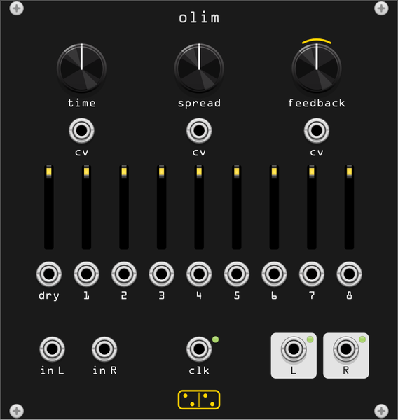

# olim

**An eight-head stereo delay over up to 150 seconds of memory: a Time
Machine clone with its VCA expander built in.**

*olim* is Latin for "once upon a time", and also for "someday": the same word
points both directions, which is what the heads are. The module is a clone of
Olivia Artz Modular's **Time Machine** and its VCA expander. Its behaviour,
signal flow and constants come from the hardware's manual and its published
firmware, which were studied for it; the code is written fresh (see
[doc/design/olim.md](design/olim.md)), and none of the firmware, which is
CC BY-NC-SA, is in it.

The input is written into a long buffer, one per channel. Eight read heads
play it back: **Time** puts the last head that far into the past, **Spread**
places the other seven between now and then, and nine sliders mix the dry
signal and the eight heads. **Feedback** writes the heads back into the
buffer, inverted on every pass.

A head never slides. Five times a second it crossfades from where it is to
where it should be, whether or not that has moved: turning **Time** re-grabs
the buffer in overlapping fifths of a second instead of bending pitch. That
is where the smear comes from when **Time** moves under a playing loop.

## The panel

| row | left to right |
|---|---|
| knobs | **Time**, **Spread**, **Feedback**, each with its CV jack underneath |
| sliders | **Dry**, then **Head 1** to **Head 8**, times rising left to right; each lit by its own level |
| under each slider | its VCA input |
| bottom | **In L**, **In R**, **Clk**, **Out L**, **Out R** |

The yellow arc over **Feedback** marks the stretch of its travel where the
loop gain is exactly 1.

## Controls

| control | function |
|---|---|
| **Time** | the last head's delay, 0 to 8 s, quadratic so the short end has room. With a clock patched, 1/64 to 64 clock periods in powers of two, one period at noon |
| **Spread** | where the other seven heads sit. At noon, evenly; to the left they crowd toward now, to the right toward **Time**. A flat stretch around noon is exactly even |
| **Feedback** | loop gain, 0 to 2. The arc is exactly 1, the sound-on-sound zone: with one head up, what is in the loop neither fades nor builds (with several, see below). Past it the loop runs hot, a compressor holds it under full scale, and each head's crossfade rate goes random, so the heads drift apart and the stereo image with them |
| **Dry** | the input on the output. Its light is the input's level |
| **Head 1-8** | each head's level, on the output and into the loop. Each light shows its head's level before the slider |

The sliders move in the heads' own steps: a slider pulled down reaches its new
level over the head's next crossfade, not at once.

The loop is divided by the sum of the head sliders, when that is over 1, so
its gain never passes **Feedback**'s however many heads are up. The output is
not: more heads up is louder, and the output limits at 5 V.

With several heads up the loop feeds back their sum, and since every pass
is written back inverted, the heads partly cancel each other: what holds or
builds depends on which heads are up, not on what is played. On the arc a
single head holds forever, and so do the odd heads alone. A full fan smears
into itself and fades within seconds at a long **Time**, even at 2x: that is
the hardware's loop, not a fault. At a short **Time** (a quarter of a second)
and high **Feedback** the fan breaks instead into a high hiss held under the
limit: the limiter works sample by sample, and the harmonics it adds are what
survives the cancellation. The howl belongs to a single head: at a **Time** of
a few milliseconds and high **Feedback** it rings at half the rate the delay
suggests (the inverted loop needs two passes a cycle), a buzz with odd
harmonics that **Time CV** plays at a volt per octave. To hold a phrase exactly, use
one head (Heads presets > Last head only) and bring the others in on the
output.

## Inputs and outputs

| jack | function |
|---|---|
| **In L / In R** | audio, +-5 V full scale. **In R** is normalled from **In L** |
| **Time CV** | +1 V halves **Time**, -1 V doubles it, over +-5 V (clocked: two power-of-two steps per volt). Bipolar, centred on the knob: a unipolar 0-10 V source only ever shortens **Time**, and past +5 V it holds at 1/32 of it |
| **Spread CV** | +-5 V sweeps the whole knob either way |
| **Feedback CV** | +5 V adds 1 to the loop gain, up to 3 in all |
| **Clk** | rising edges. The period is the mean of the last two intervals; with no edge for two seconds, or the cable pulled, **Time** is free again |
| **Dry / Head VCA** | linear, 0 to 5 V for silence to unity, clamped. Unpatched is unity; patched, the slider becomes the depth |
| **Out L / Out R** | audio, limited to +-5 V, as on the hardware. Rack's audio interface reads 10 V as full scale, so a howl at the limit shows as -6 dB there |

## Context menu

- **Heads presets**: sets the eight head sliders at once, where a hand would
  sweep them together. **Dry** is left alone, and one Ctrl+Z undoes the lot.
  Every preset but All 100% peaks at 50%, so the output stays near one
  head's level; **Heads transform** > Scale x2 takes it to full.

  | preset | heads 1 to 8 |
  |---|---|
  | All 100% / 50% / 0% | flat |
  | Odds 50%, Evens 50% | 1, 3, 5, 7 or 2, 4, 6, 8 |
  | Linear ascending / descending | 6% to 50% in equal steps, or back |
  | Exponential ascending / descending | doubling per head, 0.4% to 50%, or back |
  | Last head only | a plain delay at **Time** |
  | First head only | a single early repeat, a slapback at short times |
  | Tape echo | each repeat 70% of the one before, as a tape loop would decay |
  | Bell | the middle heads up, the ends down |
  | Halves (4, 8), Dotted (3, 6), Tresillo (3, 6, 8) | rhythms: with a clock and **Spread** at noon each head is an eighth of **Time**, so these repeat on the half, on the dotted eighths, and as a 3-3-2 |
  | Random | each head anywhere from 0 to 50% |

- **Heads transform**: reshapes the sliders as they are, also one undo step.
  Reverse (so ascending becomes descending), Rotate left and right (every
  level moves one head earlier or later, the end wrapping round: walks a
  rhythm across the bar), Invert (100% minus each), Scale x0.5 and x2.
  Then three mutations, small random steps that walk when repeated:
  **Mutate** varies each level by up to 20% and leaves silent heads silent,
  so the rhythm holds and the dynamics move; **Mutate wide** moves each
  level by up to 10 points, so a silent head can wake as a ghost note and a
  quiet one drop out; **Mutate pattern** swaps one pair of neighbouring
  heads, so the levels hold and the rhythm moves a step.
- **Memory**: 20, 60 or 150 s, default 150 (the hardware's). The buffer is
  sized for Rack's sample rate: 150 s at 48 kHz is 58 MB, at 192 kHz 230 MB.
  Changing it fades the output out, empties the buffer and fades back in.
  A **Time** longer than the memory is cut to it.

## Tips

- **Spread** left with **Time** long is a room; right is a cluster of late
  repeats, a reverse-shaped tail.
- Last head only, **Feedback** on the arc, then cut the input: the loop
  keeps what it has, a looper **Time** long. Move **Time** to smear it.
- **Time** a few milliseconds up from zero with **Feedback** near the arc is
  a comb, tuned by **Time CV** at a volt per octave, and stepping five times
  a second rather than gliding.
- An LFO into the head VCAs pans a pattern across the heads; a sequencer
  into them picks which echoes play.
- A clock turns the heads into a rhythm at noon, and **Spread** pulls all but
  the last one off the grid.

## Differences from the Time Machine

- **The VCA expander is on the panel**, one jack under each slider.
- **Memory** is a menu choice sized at Rack's sample rate; the hardware is
  150 s at 48 kHz.
- **Clock**: pulling the cable frees **Time** at once, where the hardware
  waits two seconds for a clock that might come back, and the first interval
  after a clock starts is measured rather than guessed.
- Controls are read every 8 samples (the hardware's block is 7), and there is
  no calibration and no dead band at the knobs' ends.

## Tests

`test/olim_probe heads` prints the head positions against **Spread** and
**Time**, free and clocked, `loop` the level per pass against **Feedback**,
`clicks` the roughness of every sweep; `test/smoke_olim` checks the module
itself. The audition is `test/audition/olim.md`.
