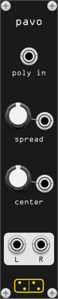

# pavo

*pavo* spreads a polyphonic signal across the stereo field. Heavily inspired by the [Splay Ugen](https://doc.sccode.org/Classes/Splay.html) from SuperCollider.

The channels are distributed evenly across the stereo field depending on the channel count:

| channels | layout |
|----------|--------|
| 1 | `L-----------o-----------R` |
| 2 | `o-----------------------o` |
| 3 | `o-----------o-----------o` |
| 4 | `o-------o-------o-------o` |
| 5 | `o-----o-----o-----o-----o` |
| … | … |

*pavo* uses the [square-root method for constant-power panning](https://www.cs.cmu.edu/~music/icm-online/readings/panlaws/index.html) and applies level compensation when mixing down.

## How to use

Connect a polyphonic cable to the *poly in* input.

- **Spread** knob - sets the maximum spread across the stereo field. 0% = all channels centred; 100% = first and last channels panned hard left and right.
- **Center** knob - shifts the midpoint of the stereo image (±100%). Channels that would fall outside the stereo field are clipped to the boundary.

The *spread CV* input accepts 0V–10V; the *center CV* input is ±5V. When patched, the respective knobs act as offsets.
