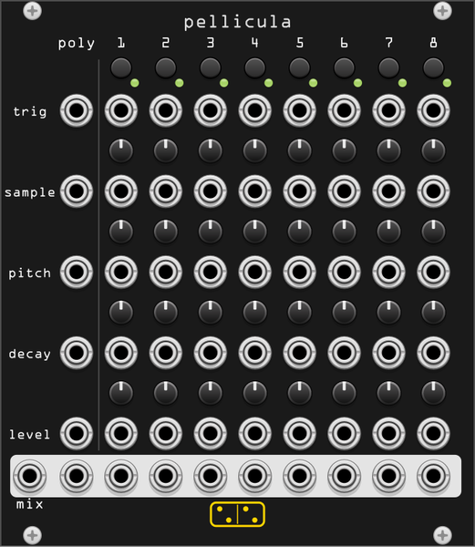

# pellicula



*pellicula* is an **8-voice drum sampler** - the two-drum Erica Synths Pico
DRUM sample-player "exploded" into eight independent voices, with a knob **and**
a CV input for every parameter of every voice, laid out as one big control
matrix.

The playback engine is a clean-room reimplementation of the original Pico DRUM
(the sample-player, not the DRUM2 synthesis version), built from the published
manual: each voice is a one-shot sample player with **sample-select, pitch,
decay and level**, played back with the hardware's **12-bit / 44.1 kHz**
character. No code from the hardware or any port was used.

The Latin *pellicula* is the diminutive of *pellis* (skin, hide) - a "little
skin", the drumhead, and a nod to *pico* (small).

## The matrix

Every parameter row spans a **poly** column plus one column per voice:

```
            poly   voice 1 … voice 8      knob per voice
trig button   -        ●    …    ●              (button)
trig          ●        ●    …    ●
sample        ●        ●    …    ●                 ●
pitch         ●        ●    …    ●                 ●
decay         ●        ●    …    ●                 ●
level         ●        ●    …    ●                 ●
─────────────────────────────────────────────────────
out           ● poly   ●    …    ●         + mix (left)
```

### Poly normalling

Each input row has a **poly jack** and eight **mono jacks**. The rule is simple:

- A **poly cable** drives the voices by channel: channel 1 → voice 1, channel 2
  → voice 2, and so on.
- A **mono jack** *overrides* its voice - patch voice 3's pitch jack and voice 3
  ignores the poly cable's channel 3 for pitch.
- With nothing patched, the voice follows its own knob.

So you can trigger and modulate all eight voices from a single polyphonic
sequencer, then override individual voices with dedicated CV where you want it.

## Controls (per voice)

| control | description |
|---------|-------------|
| **trig button** | Momentary manual trigger - fires the voice from the panel. |
| **sample** | Selects the sample, 1–64 (snapped). The **sample CV** is 1V/oct, quantized to semitones, added to the knob (0 V = the knob's sample). Latched at trigger. |
| **pitch** | Playback speed, ±2 octaves. The **pitch CV** is 1V/oct, summed with the knob. Live (changing it bends a playing voice). |
| **decay** | Amplitude decay envelope, ~5 ms to full sample length. At maximum the whole sample plays untouched; lower it to shorten the tail. Latched at trigger. |
| **level** | Voice output level (feeds the mix). CV adds ±5 V → ±0.5. Live. |

Triggering a voice restarts it from the beginning as a one-shot.

## Inputs & outputs

- **trig / sample / pitch / decay / level** - poly jack + 8 mono jacks per row
  (see poly normalling above).
- **voice outs (1–8)** - the individual voice signals (±5 V).
- **poly out** - all eight voices on one 8-channel polyphonic cable.
- **mix** (left of the output row) - the summed output of all voices, clamped to
  ±10 V. Lower the voice levels or take the individual/poly outs if you need more
  headroom.

## Right-click menu

- **Kits folder** - see *Kits* below. Set / change / clear the global folder your
  kits live in.
- **Kit** - pick which kit this module plays (submenu lists the folder's kits).
- **Shift all samples ±8** - advances (or rewinds) every voice's *sample* selection
  by 8, wrapping at 64. Starting from the default 1–8, each click steps the whole
  module to the next contiguous bank of 8 samples, so you can audition a 64-sample
  kit eight sounds at a time without touching each knob.
- **12-bit playback grit** - requantizes playback to 12 bits for the authentic
  Pico DRUM character. On by default; turn off for clean full-resolution playback.
- **Choke groups** - assign each voice to one of 8 groups (or none). Voices in
  the same group cut each other off when triggered, the way the hardware's
  EXCLUSIVE mode chokes its two drums - useful for open/closed hi-hats.

## Kits

**pellicula ships with no samples** - you bring your own. Point it at a **kits
folder** and every immediate subfolder becomes a selectable **kit**:

```
my-kits/            ← the kits folder (set once, shared by all pellicula modules)
├── 909/            ← a kit
│   ├── 01 kick.wav ← voice sample 1 (ordered by filename)
│   ├── 02 snare.wav
│   └── …
├── 808/
└── acoustic/
```

- The kits folder is a **global** setting (saved plugin-wide), so you set it once.
  Each module then picks its own kit from the **Kit** submenu.
- A kit is up to **64 `.wav` files**, ordered by filename (natural sort, so
  `2` sorts before `10`); files past 64 are ignored. Each voice's *sample* knob
  selects an index into this list (1–64); indices past the kit's size are silent.
- WAV files may be mono or stereo (down-mixed), 8/16/24/32-bit int or 32-bit
  float, any sample rate (resampled on playback). Mono 44.1 kHz is the classic
  drum-sample choice.
- Kits load on a background thread, so switching kits never glitches the audio;
  voices already ringing finish on the old kit. The selected kit is saved with
  the patch **by name**, so a patch reloads its kit as long as your kits folder
  still contains a subfolder of that name.
