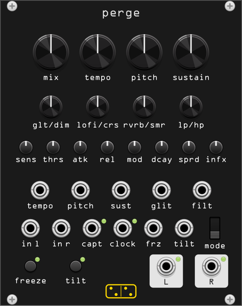

# perge

**Stereo dynamic sampler and multi-effect: repeats that listen to how you
play.**

*perge* is Latin for "carry on!, keep going!" (imperative of *pergere*).
The module is a from-scratch homage to the AC noises / BunkerNoise
**CONTINUA** pedal — whose name is the Italian for the same exhortation —
rebuilt from its public documentation: a
sampler that doesn't just play your sound back, but reacts to how hard and
how fast you play while you're still playing, then transforms the repeats
through a multi-effect section.

## How the repeats work

The module listens to the input with an envelope follower. When the level
crosses **thrs** (threshold), a capture starts, and it runs until the level
falls back below ~70% of the threshold (up to 2 seconds). **thrs** spans
25 mV – 5 V and defaults to playing level: quiet beds, reverb tails and
noise floors don't fire it — perge reacts to *playing*, not to sound being
present. A gate into **capt** forces a capture by hand instead, whatever
the level. The captured sample becomes the newest of three sample slots,
and repeats of it are spawned on a tempo grid. Each capture restarts that
grid (right-click *Resync grid to capture*): at **note end** (the default)
the first repeat lands exactly one tempo interval after the note ends,
delay-like; at **note start** the grid locks to the attack instead, so
repeats fall in rhythm with *when* you played; **off** lets the grid
free-run and repeats start at whatever phase it happens to be in:

- **tempo** sets the repeat rate (100 ms – 2 s, CV addable), or patch a clock into
  **clock** and the repeats follow it (the right-click *Clock multiplier*
  menu scales the incoming clock by 1/4 – x4; it has no effect on the
  tempo knob).
- **sens** sets how strongly your dynamics matter: low = even, consistent
  repeats regardless of touch; high = loud hits produce loud repeats, soft
  playing nearly disappears.
- **atk** / **rel** shape each repeat's envelope, from tight echo-like
  slices to soft atmospheric swells.
- **sustain** sets how long the repeat stream persists (per-repeat decay).
  Past ~90% of the knob the engine **freezes**: the captured audio is held
  indefinitely, capture stops, and every other control keeps working on the
  frozen material. The **freeze** button (latching) and gate do the same.
- **pitch** is inactive at noon. Clockwise, repeats are *randomly* shifted
  up — first an octave fades in, then a fifth above that; counterclockwise
  mirrors downward. Each repeat rolls its own dice.
- **glt/dim** is inactive at noon. Counterclockwise (**glitch**): sudden
  unpredictable tempo accelerations fragment the flow. Clockwise
  (**dimension**): the two previous captures come back as extra layers,
  each locked to the grid but on its own rhythmic pattern (every 2nd and
  every 3rd tick) — up to three samples coexist. The layers ride the
  current train's decay, so every new capture re-fires the whole ensemble
  and **sustain** fades it as one.
- The **mode** switch (bottom row, between the freeze and tilt jacks) plays
  repeats **standard**, **reverse**, or **tail** (only the swelling tail of
  each repeat).
- *Cap grain to tempo interval* (right-click, on by default) limits each
  repeat to one tempo period, keeping repeats short and discrete. Turn it
  off to let each repeat replay the whole captured note, which overlap into
  a denser, more sustained wash.

## The multi-effect section

The wet bus runs through four bipolar effects, all inactive at noon:

| knob | counterclockwise | clockwise |
|------|------------------|-----------|
| **lofi/crs** | lo-fi: pitch-LFO wobble and tape-ish saturation through a narrowing band (darkens first, deep in the throw the bass thins too, old-gramophone style) | crush: sample-rate reduction, harsher as you turn |
| **rvrb/smr** | deep dark reverb | smear: allpass diffusion that melts transients together |
| **lp/hp** | lowpass (darker, warmer) | highpass (thinner, sharper) |

- **mod** sets the lo-fi/crush modulation depth and speed.
- **dcay** sets the reverb/smear tail length.
- **sprd** sets the stereo width of the repeats (each repeat gets its own
  random pan position).
- **infx** routes dry signal through the multi-effect section: at zero
  (the default) only the repeats are processed, turned up the dry signal
  progressively goes through the FX too, the rest staying clean.
- **mix** balances dry and repeats, dry-full to wet-full.

## tilt

**tilt** (momentary button or gate) is the chaos switch: each press rolls
one new random position for the pitch, **lofi/crs** and **rvrb/smr**
controls, anywhere in their full range, and holds it while down, snapping
back on release. A momentarily different pedal every time you stomp it:
the repeats may come back octave-shifted, crushed, smeared, drowned or
suddenly dry, and the next press is another surprise.

## Patching

| jack | function |
|------|----------|
| **in l / in r** | stereo input; right is normalled to left |
| **capt** | capture gate: the rising edge forces a capture regardless of level, the gate holds it open, the falling edge commits it (the LED by the jack flashes while capturing) — sequenced, deterministic sampling |
| **tempo / pitch / sust / glit / filt** | CV for tempo, pitch, sustain, glitch/dimension and filter (added to the knobs) |
| **clock** | external tempo; measured between rising edges, released ~10 s after the clock stops (the LED by the jack flashes on every grid tick) |
| **frz** | freeze gate |
| **tilt** | tilt gate (momentary) |
| **out l / out r** | stereo output; with only *out l* patched the two channels are summed |

## Tips

- Calibrate **thrs** to your source before anything else — the same ritual
  as setting a noise gate's threshold, and worth treating as part of your
  gain staging: play, watch the LED by the **capt** jack, and adjust until
  it lights on your notes and goes dark between them. Everything dynamic in
  the module keys off this. Too low and captures smear into rolling 2 s
  chunks of whatever is sounding; too high and perge stops answering.
- Feed it sparse, dynamic playing with **sens** high: the module answers
  loud phrases and ignores the quiet ones, like a duet partner.
- **sustain** just below the freeze zone plus a slow clock makes drifting,
  Basinski-adjacent beds; add a little **lofi** and **dcay** high.
- **glitch** at 3 o'clock equivalent (CCW!) with **tail** mode turns
  percussive input into stuttering reversed ghosts.
- Patch a random gate into **tilt** for periodic bursts of chaos.
- With synth pads that never fall below the threshold, the capture rolls
  over every 2 s and the repeats degenerate into arbitrary chunks of the
  pad. Raise **thrs** until only deliberate swells cross it and captures
  become discrete phrases again.

## Notes

- The sample buffer lives at the engine sample rate; changing the sample
  rate (or the right-click "Clear buffer") empties it. Buffer contents are
  not saved with the patch.
- Committed captures are copied out of the rolling input buffer: the three
  sample slots (and anything frozen) never expire, however long ago they
  were played.
- The repeats engine is a voice pool (16 voices); extremely fast clocks
  with long releases steal the voice nearest the end of its envelope,
  with a short declick fade.
