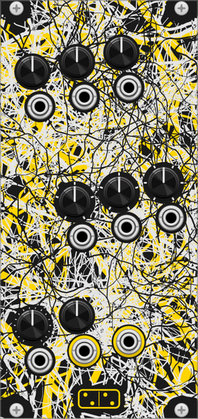

# radix

**A chaotic 8-bit source on its own clock: 150 programs, picked by three
stepped knobs with CV.**

*radix* is Latin for "root": the thing every sample grows from, one integer
at a time. The module is in the family of Dirty Electronics' **Radical22**
(Dirty Electronics and Max Wainwright), and of the bytebeat music it draws
on. It is not a port: it is built from technique (a phase accumulator
allowed to overflow, integer arithmetic on the increment, XOR on the low
bits, text as a wavetable, an engine clock slower than the audio rate), and
none of the Radical22's firmware, tables or program map is in it.

An integer machine runs on a clock of its own, from 100 Hz to 96 kHz, and
Rack hears it through a zero-order hold with no filter. Per tick of that
clock:

1. **Source** chooses a modulator byte
2. **Law** turns it into the accumulator's increment
3. the accumulator steps, wrapping when it overflows, on purpose
4. **Table** reads the accumulator into a 16-bit sample
5. **Bits** truncates it, **Grit** XORs the accumulator into its low bits
6. the sample is held until the next tick

Nothing on the output is band-limited. The clock aliases against Rack's
rate, the arithmetic overflows, and that is the sound. The one thing taken
off is DC, below 2 Hz.

## The panel

There are no labels: every control and jack names itself in its tooltip.
The controls sit in three tilted blocks, each a row of knobs with their CV
jacks directly underneath.

| block | knobs, left to right | jacks under them |
|---|---|---|
| top left | **Rate**, **Param**, **Clock** | V/oct, Param CV, Clock CV |
| middle right | **Source**, **Law**, **Table** | Source CV, Law CV, Table CV |
| bottom left | **Bits**, **Grit** | **In**, **Out**, **CV out** |

The two outputs sit in a yellow crown. The stepped knobs carry one tick per
position.

## Controls

| knob | function |
|---|---|
| **Rate** | pitch, C4 +-4 octaves; the V/oct input adds to it |
| **Param** | 0-255, the modulator byte or what shapes it, depending on **Source** |
| **Clock** | the engine's tick rate, 100 Hz to 96 kHz, default 32 kHz. It sets how coarsely the pitch is drawn, not the pitch (see the menu) |
| **Bits** | 16 down to 1, truncating the sample |
| **Grit** | XORs the accumulator's own bits into the sample, from a faint edge to the whole sample corrupted. Locked to the pitch, so it stays in tune |
| **Source** | where the modulator byte comes from (below) |
| **Law** | how it becomes the increment (below) |
| **Table** | how the accumulator is read (below) |

**Source:**

| position | modulator byte | what **Param** does |
|---|---|---|
| Param | **Param** itself | the byte |
| Table walk | the table, stepped once per cycle | the stride: 0 holds, 1 plays the table's shape slowly, 128 alternates two values |
| Self | the table at the accumulator: the machine reads its own output | how far ahead it reads |
| Counters | three counters at different rates, XORed | a mask over their bits |
| Input | the **In** jack | depth: at 0 the input is not heard |

**Law:**

| position | increment |
|---|---|
| Add | the pitch, bent up to half an octave either way (byte 128 is the plain pitch) |
| Multiply | the pitch times 1 to 32, overflowing past the clock |
| Shift | the pitch shifted 3 octaves down to 4 up |
| XOR | the pitch with its top bits XORed by a running register; it drifts and does not come back |
| Sync | the plain pitch, with the table read at 1 to 9 times the phase: a hard sync against itself |

**Table:** Sine, Saw, Pulse, Noise (a fixed random table), Bits (the
accumulator XORed with itself one byte down, no table at all), and Text
(the letters of a string you set in the menu, as a staircase).

## Inputs and outputs

| jack | function |
|---|---|
| **V/oct** | 1 V/oct into **Rate** |
| **Param CV** | adds to **Param**, 1 V = 25.5, so 10 V covers the knob |
| **Clock CV** | 1 V/oct into **Clock** |
| **Source / Law / Table CV** | add 1 V per step to their knob, rounded and clamped at the ends: a slow ramp walks the positions in order, a sequencer picks them |
| **In** | audio for **Source** on Input; also where the feedback cable goes |
| **Out** | audio, +-5 V |
| **CV out** | 0-10 V stepped, a rungler on the accumulator: an 8-bit shift register clocked by each cycle, its three newest bits into a DAC |

## Context menu

- **Clock moves pitch**: off, **Clock** only changes the resolution and
  **Rate** keeps the pitch. On, the clock moves the pitch as on the hardware,
  and the default clock plays **Rate**'s own pitch.
- **Text table**: the string behind the Text table. Enter applies it. An
  empty string, or one letter repeated, is silence. Saved with the patch.

## Tips

- The defaults are the plain end, a sine at C4. Turn **Source** first.
- **Out** into **In** with **Source** on Input, then bring **Param** up from
  zero: the machine starts feeding on its own output. Every **Law** howls
  differently.
- **CV out** into **Param CV** makes the rungler step the program's byte.
- A slow ramp into **Law CV** or **Table CV** walks through the programs,
  with a hard change at each step. The click at the change is meant: the
  accumulator carries over, only the rule changes.
- Counters with Sync is the busiest corner; Param with Add the calmest.
- **Clock** low with **Rate** high is where the aliasing lives.

## Differences from the Radical22

radix is built from a design written for it (see
[doc/design/radix.md](design/radix.md)), not from the Radical22's firmware,
and generalises where the hardware hardcodes:

- **Three axes instead of a program list.** The hardware has a fixed list of
  programs selected by one CV. radix separates where the modulator comes
  from, how it is applied and how the result is read, 5 x 5 x 6 = 150
  programs, each axis with its own knob and CV.
- **Playable.** **Rate** tracks V/oct, and the clock is a knob with its own
  CV, where the hardware's clock is the processor's own.
- **Text is yours.** The hardware bakes one string into one table; here the
  string is set per patch.
- **Feedback and a CV out.** **In** takes the module's own output, and
  **CV out** exposes the rungler.

## Attribution

Radical22 by Dirty Electronics and Max Wainwright; this implementation is
original code.
