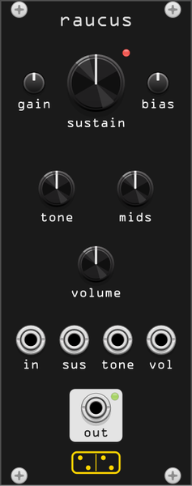

# raucus



*raucus* (Latin: hoarse, harsh, the root of "raucous") is a model
of the four-transistor **Big Muff Pi**, the USA V3 of 1976-77: an input
booster, two common-emitter stages clipped by antiparallel silicon diodes in
their collector-base feedback, the passive two-branch tone network, and a
recovery stage to make back what that network takes.

10 HP. Polyphonic: one pedal per channel.

## Controls

| Control | Range | What it does |
|---|---|---|
| **sustain** | 0 – 100 % | how hard the clipping pair is driven. It is a level control *into* the stages, not a threshold, which is why the hardware has no clean setting |
| **tone** | bass ↔ treble | the passive network. It is not a tilt: it is two branches and the notch between them |
| **mids** | 0 – 100 % | fills the scoop back in, the tone-bypass mod. Not a hardware control |
| **volume** | 0 – 100 % | output level |
| **gain** (trim) | 0.01 – 3 V | what a 5 V Rack signal arrives as at the pedal's input. Not a hardware control |
| **bias** (trim) | ±100 % | walks the clipping stages' operating point off centre: the starved, gated, lopsided sound. Not a hardware control |

## Ports

| Port | |
|---|---|
| **in** | audio in, polyphonic |
| **sus**, **tone**, **vol** | CV on the three real controls, 10 V = full scale, summed with the knob and smoothed over 10 ms |
| **out** | audio out, polyphonic |

The red LED by **sustain** shows how hard the diodes are working; the green
one by the output jack follows the level.

## Context menu

- **Clipping diodes** - silicon 1N4148 (stock), germanium, LED, or lifted.
- **Oversampling** - 1× to 16×, default 4×.

## The one control that isn't on the pedal, and why

A guitar pickup delivers a couple of hundred millivolts. Rack's nominal ±5 V
is some 25 dB hotter, and a fuzz whose whole character is *where* its gain
structure lands is not a thing to feed 25 dB of extra level to without saying
so. **gain** sets the arrival level in volts; the default of about 0.13 V is a
hot guitar, and turning it up walks the pedal into the territory where a
modular signal would put it.

## What is modelled, and against what

Circuit values and stage figures come from
[ElectroSmash's analysis of the USA V3](https://www.electrosmash.com/big-muff-pi-analysis).

**The tone stack is solved, not approximated.** The usual shortcut is a
lowpass and a highpass mixed by the knob, which gets the general tilt and
misses everything interesting. raucus runs the actual passive network - a
39k/10n bass leg to ground, a 3.9n/22k treble leg to ground, the 100k pot
between them, the driving stage's 15k source impedance and the volume pot's
100k load - as a single biquad from a nodal analysis of the whole thing.

What that buys, measured on the filter the module actually runs
(`test/raucus_probe tone`):

| tone | 60 Hz | 1 kHz | 12 kHz | notch |
|---|---|---|---|---|
| 0.00 (bass) | −6.0 dB | −12.3 dB | −33.5 dB | - |
| 0.50 | −10.9 dB | −19.7 dB | −15.1 dB | −19.8 dB at 1111 Hz |
| 1.00 (treble) | −19.7 dB | −13.6 dB | −7.6 dB | −20.5 dB at 276 Hz |

The notch sits at 1.1 kHz with the pot centred and walks down to 276 Hz as
you turn toward treble - behaviour a two-branch approximation cannot produce,
because there the notch cannot move. Driven from an ideal source into a light
load, the same expression gives 7.4 dB of insertion loss and a notch of
−14.2 dB at 1042 Hz, against ElectroSmash's 7 dB and −13.5 dB at 1 kHz.

**The clipper is solved, not limited.** The 1 µF capacitor in series with each
diode pair blocks the DC bias and nothing else - across 470 kΩ its corner is a
third of a hertz - so the feedback clipper is *memoryless*, and the stage is
exactly the static solution of

```
v + Rf·Id(v) = w,    Id(v) = 2·Is·sinh(v/nVt),    w = −gain · in
```

which is worth knowing because it means the transfer curve can be solved once
into a table rather than Newton-iterated every sample. raucus solves it on a
4096-point grid with a companded `sign(w)·√|w|` index; the result is within
0.01 mV of a bisection solve of the same equation anywhere in range
(`test/raucus_probe diode`), for a per-sample cost of a square root and a
lerp.

The shape that comes out is the point. Feedback clipping is not a limiter: at
a would-be output of 0.25 V the stage gives 0.18 V, at 1 V it gives 0.29 V, at
3 V it gives 0.35 V. It keeps compressing rather than flattening, which is the
Big Muff's sustain - and it is why the level at the output barely moves as the
input goes from 0.5 V to 10 V.

**The published operating points** are used as measured rather than as the
resistor ratios suggest: 16.7 dB for the booster, 23 dB and 25 dB for the two
clipping stages (not the 33 dB that 470k/10k implies - the transistors' open
loop gain is only about 66), 13 dB for the recovery stage, and the stages'
pole pairs at 55 Hz/1.78 kHz and 94 Hz/1.17 kHz.

## Aliasing

Spectral distance from the same patch rendered at 16×
(`test/raucus_probe alias`), sustain at maximum:

| input | 1× | 2× | 4× | 8× |
|---|---|---|---|---|
| 223 Hz | −42 dB | −51 dB | −52 dB | −50 dB |
| 2238 Hz | −24 dB | −35 dB | −52 dB | −61 dB |

A low note is nearly free; a high one is not, which is why the default is 4×.
At 1× the module is usable but a top-octave note brings its aliases with it.

## The diodes

| choice | what changes |
|---|---|
| **Silicon 1N4148** | stock. The measured RMS the others are compared against |
| **Germanium** | conducts a decade earlier, so it clamps sooner and softer: about a quarter the output level, and gone soggy |
| **LED** | needs about 1.7 V before it does anything, so the stages swing much further first: nearly three times the level, cleaner, closer to overdrive |
| **Lifted** | no diodes at all. The stages clip against their own supply instead - loudest and hardest |

The LED and lifted settings are genuinely much louder, as they are on a modded
pedal. The makeup gain here is calibrated on the stock silicon pair, so turn
**volume** down when you use them; the output soft-limits toward Rack's ±10 V
rail rather than squaring off against it, but it will get there.

## What is not modelled

- **No transistor.** The stages are gain, filtering, a solved diode clipper
  and a soft rail limit. There is no Ebers-Moll solve, no beta spread, no
  leakage, no supply sag, and no noise.
- **One revision.** The V3, and only from a published analysis of it. Kit Rae
  documents dozens of variants that differ within a single named era, so
  "Triangle" or "Ram's Head" presets would be a claim about a specific unit
  that this model cannot honestly make. The diode menu changes what is
  actually a component swap; it is not a claim about a historical revision.
- **The booster's and recovery stage's pole pairs** are plausible values for
  the coupling and Miller capacitances, not measurements; only the two
  clipping stages' are published.
- **The clipping level** sits some 50 mV below what a true op-amp model with
  the real 10k input resistor would give, because the measured closed-loop
  gain is folded into one number rather than solved from the transistor.
- The tone stack is bilinear-transformed without prewarping. At the default 4×
  its top octave is exact to a fraction of a dB; at 1× and 44.1 kHz it is not.

## Patch ideas

- **Sustain for days**: sustain up, tone at 11 o'clock, and play single notes.
  The compression is in the clipper, not in a compressor.
- **Fill the scoop**: **mids** at full turns the scooped fuzz into something
  that cuts, and is the mod most often done to the hardware.
- **Starved**: **bias** hard over with sustain low. The stages clip on one
  side long before the other, and notes gate and splutter as they decay.
- **Poly fuzz**: one pedal per voice is not what a real one does to a chord -
  a real one intermodulates the whole chord into mush. Patch a poly synth
  straight in for the clean version, or sum to mono first for the mush.
- **In front of [vespae](vespae.md)**: fuzz into the Wasp filter is the oldest
  trick in the book and still works.
