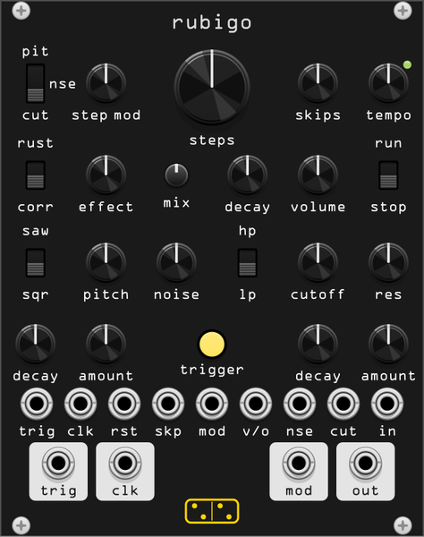

# rubigo

**A digital percussion voice played by its own generative sequencer. A
Metal Fetishist clone.**

*rubigo* is Latin for "rust". The module is a clone of Body Synths' **Metal
Fetishist** (firmware v2.0), written from the hardware's reference manual.
The firmware is closed, so where the manual is silent the choices are ours;
they are listed at the end and in [doc/design/rubigo.md](design/rubigo.md).

One oscillator and a noise source go through a driven filter, a digital
distortion and a clipping volume stage, and three envelopes shape pitch,
cutoff and volume on every hit. It is monophonic, like a synthesizer, not a
drum machine: one sound, changing from step to step.

The sequencer does not ask you to program anything. Two random generators
decide, step by step, *whether* the voice fires and *what value* the step
carries. That value moves the pitch, the noise mix or the cutoff. The big
**steps** knob then locks what you are hearing into a loop, and lets you
throw away and regenerate parts of it. You discover rhythms rather than
write them.

## The panel

| row | contents |
|---|---|
| top | the destination switch **pit / nse / cut**, **step mod**, **steps**, **skips**, **tempo** with the clock light |
| second | **rust / corr**, the **effect** knob, **mix**, the volume **decay**, **volume**, **run / stop** |
| third | **saw / sqr**, **pitch**, **noise**, **hp / lp**, **cutoff**, **res** |
| fourth | the pitch envelope's **decay** and **amount**, **trigger**, the cutoff envelope's **decay** and **amount** |
| jacks | inputs **trig**, **clk**, **rst**, **skp**, **mod**, **v/o**, **nse**, **cut**, **in**; outputs **trig**, **clk**, **mod**, **out** |

Every modulation *adds* to its knob. **pitch** is the lowest pitch,
**cutoff** the lowest cutoff, and the envelopes and the step value push up
from there.

## The voice

| control | function |
|---|---|
| **pitch** | 30 Hz to 1500 Hz. Modulation takes it higher |
| **saw / sqr** | the oscillator's waveform |
| **decay**, **amount** (left pair) | the pitch envelope: a 1 ms jump up by **amount** (up to +600 Hz), then an exponential fall back to **pitch** over **decay** (1 ms to 3 s) |
| **noise** | crossfades the oscillator (left) into white noise (right). A cable in **in** replaces the noise |
| **hp / lp**, **cutoff**, **res** | a state-variable filter, 20 Hz to 20 kHz, with a fixed drive in front, so nothing passes it clean. At full **res** it rings on its own |
| **decay**, **amount** (right pair) | the cutoff envelope, up to 8 octaves. It raises the cutoff, which opens the filter in **lp** and closes it in **hp** |
| **effect**, **rust / corr** | **corr** (corrosion) is a digital overdrive; **rust** is the same overdrive followed by a downsampler whose rate falls from the engine's rate to 400 Hz as the knob turns up. No anti-aliasing: the aliasing is the sound |
| **mix** | dry / wet of the effect. The hardware hides this under a held button |
| **volume**, **decay** | the level, with asymmetric clipping that grows as **volume** rises, and the volume envelope, 1 ms to 3 s. Nothing sounds until it is triggered |
| **trigger** | fires all three envelopes, with the sequencer running or not. It lights on every hit |

For a kick: **pitch** at minimum, pitch **decay** between 9 and 10
o'clock, pitch **amount** between 1 and 3 o'clock. Try both waveforms.

For a click at the start of a sound: **cutoff** low in **lp**, the cutoff
**decay** almost at minimum and its **amount** at maximum.

## The sequencer

| control | function |
|---|---|
| **run / stop** | starts and stops the sequencer. **trigger** and **trig** in work either way |
| **tempo** | the internal clock, 0.4 Hz to 80 Hz, which is audio rate. With a clock at **clk**, a ratio instead: /8, /4, /2, x1, x2, x4, x8 across its travel. The default sits on /2 |
| **skips** | the share of steps that do not fire, 0% to 100% |
| **step mod**, **pit / nse / cut** | how far each step's random value moves the destination. On **pit** it adds up to 1500 Hz, so **pitch** sets the lowest note and **step mod** the highest; the notes are microtonal |
| **steps** | **off**, 2, 4, 8, 10, 16 or 32 |

Each step holds two random numbers. One is compared with **skips**: the
step fires if it is above it. The other, scaled by **step mod**, is the
step's value. Both are read live, so turning **skips** moves triggers in and
out of a locked loop one at a time, and turning **step mod** rescales the
loop without changing its shape. A skipped step keeps the previous value.

**steps** is where the rhythm is found.

- At **off** both generators run free, a new pair every step.
- Turning it up from **off** locks the last steps you heard into a loop of
  that length.
- Turning it up from a loop keeps the loop and adds new steps at the end.
- Turning it down throws away the end. Turning it back up fills that part
  with new random steps.
- Back at **off** everything is thrown away.

So moving between two lengths regenerates only what lies between them.
Unlike the hardware, rubigo keeps the loop in the patch: save, reload, and
it is still there.

## Jacks

| jack | function |
|---|---|
| **trig** in | fires the voice, like **trigger** |
| **clk** in | advances the sequencer when it runs; **tempo** becomes the ratio. If the clock stops, the internal clock takes over after two seconds (or four clock periods, if longer) |
| **rst** in | the next step is step one |
| **skp**, **mod** in | added to **skips** and **step mod**: 0 to 10 V covers each knob's travel |
| **v/o** in | 1 V/octave on **pitch**. The envelope and the step value still add their hertz on top, so a kick keeps its sweep when played from a keyboard |
| **nse** in | added to **noise**: +-5 V covers the travel either way |
| **cut** in | added to **cutoff**, 2 octaves a volt. Or to the **Mod assign** target |
| **in** | audio, replacing the noise |
| **trig** out | 10 V, 1 ms, every time the voice fires, whatever fired it |
| **clk** out | 10 V, 1 ms, every step, fired or skipped |
| **mod** out | the step value after **step mod** and its CV, 0 to 10 V |
| **out** | the voice |

## Context menu

| item | function |
|---|---|
| **Effect** | replaces the distortion. **2nd oscillator**: a second oscillator mixed at up to 50% (by **mix**), **corr** ranging an octave down to unison, **rust** unison to an octave up, set by the **effect** knob. **Phaser**, **flanger**, **chorus**: **corr** subtle, **rust** intense, the knob sets the LFO from 0.05 Hz to 8 Hz |
| **Mod assign** | sends the step value on **cut**, and the **cut** jack, somewhere other than the cutoff: volume decay, pitch decay amount, cutoff decay amount or the effect knob (the knob is the minimum, the modulation pushes it up), or volume (the knob is the maximum, the modulation pulls it down) |
| **Step lengths** | 3 5 7 12 18 24 instead of 2 4 8 10 16 32 |
| **Restart the sequence on run** | switching to **run** starts from step one |
| **Internal clock returns when the external stops** | on by default. Off, the sequencer waits until **run / stop** is switched again |
| **Reasoned random** | a whole patch drawn from one of five archetypes (below). **Ctrl+R** does the same with any archetype. The loop is kept |

### Reasoned random

A uniform random draw of every knob mostly lands on silence or mush: many
of the knobs have one or two useful regions, and the rest of their travel
lies between them. The reasoned random first picks an archetype, then
draws each control from that archetype's ranges:

| archetype | what it draws |
|---|---|
| **Kick** | pitch envelope on, low cutoff, a short decay, skips, noise or a little pitch on the step mod |
| **Bass** | resonant low-pass with a plucked cutoff envelope, pitch step mod, 8 or 16 steps |
| **Noise** | noise at half or full, often through **rust**, cutoff or noise on the step mod |
| **Resonant** | the filter near self-oscillation, the cutoff envelope wide open, cutoff step mod |
| **Drone** | fast **tempo**, the longest volume decay, no skips, **steps** off |

The ranges come from the principles the Metal Fetishist's own preset book
follows: the pitch envelope is either off or kick-shaped, never in between;
noise is none, half or all; resonance is zero unless the filter is the
voice; **steps** is off, 8 or 16. Of 200 uniform draws, 43 are inaudible;
of 200 reasoned ones, 1.

## Presets

Eleven, in the preset browser. Most are the hardware manual's own "try
this" recipes: **kick**, **clatter** (kick and noise from the step mod on
**nse**), **melody** (the filter's resonance playing the steps), **drone**,
**wireless** (the sound-effect setting: patch something into **in**),
**ticks** (the cutoff click). The rest use the menu: **swell** (Mod assign
on the volume decay), **sub** (the 2nd oscillator an octave down),
**septet** (a seven-step loop). A preset sets the knobs, the switches and
the menu's effect, Mod assign and step lengths. It leaves the loop alone.

## Patches

These are from the hardware manual.

- **Two destinations at once**: **mod** out into **nse** or **cut**, with
  the switch on another destination.
- **Repeats instead of skips**: **clk** out into **trig** in, then raise
  **skips**. Every step fires now, and a skipped step repeats the previous
  value instead of falling silent. With a long loop, **skips** decides when
  the modulation changes and when it repeats.
- **Pulses in the gaps**: **clk** out into **v/o** or **nse**, long volume
  and cutoff decays, some **skips**, a fast **tempo**: a short pulse at
  every step, heard where a step is skipped.
- **A second oscillator from the clock**: **tempo** at audio rate, **clk**
  out into **in**, and **noise** crossfades between the oscillator and the
  clock's pulse wave.
- **Just the resonance**: an unconnected cable in **in**, **noise** full,
  **res** full, **step mod** on **cut**. The filter plays alone.
- **Rhythmic processing**: a radio, tape hiss or a drone into **in**,
  **noise** up. With **tempo**, the volume **decay** and **noise** all at
  full, rubigo is an effect.

## Differences from the hardware

- **The loop is saved** with the patch. On the hardware sequences cannot
  be kept.
- **Levels** follow Rack: +-5 V audio, 10 V triggers, 0 to 10 V for the
  unipolar inputs and **mod** out. The hardware's jacks run 0 to 5 V.
- **skp**, **mod** and **rst** are rubigo's own. **mix** is on the panel
  instead of under a held button, and it is one setting for every effect.
- **No MIDI**: Rack's MIDI-CV already feeds **v/o** and **trig**.
- **Locking from off** keeps the steps just heard, in the order heard. The
  manual does not say which steps it locks.
- **A clocked module waits for its clock** after a load. Unclocked, it plays
  its first step at once.
- The voice's curves are ours. The manual gives ranges, not circuits: an
  exponential decay reaching -60 dB at the **decay** time, a zero-delay
  state-variable filter with a limited resonance loop, a biased tanh for the
  overdrive, sample-and-hold for the downsampler, polyBLEP oscillators.
