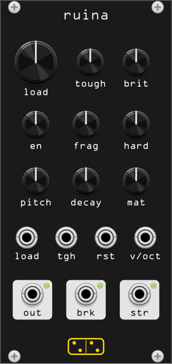

# ruina



*ruina* (Latin: a falling down, a collapse) is the same fracture engine as
[crepitus](crepitus.md) with the other framing. A CV **loads** an object. The
object accumulates damage, creaks and crackles as it goes, and decides for
itself when it has had enough. When it gives, it emits the break, a trigger,
and a new object.

The point is the trigger. Its timing is drawn from a Weibull distribution, so
the same gesture twice gives two different lifetimes: the patch can lean on the
object, and watch **strain** climb, but it cannot tell the object when to break.

12 HP. Monophonic.

## Controls

| Control | Range | What it does |
|---|---|---|
| **load** | 0 – 100 % | how hard the object is being leaned on. Damage accumulates as the *cube* of this, so half the load is eight times the life |
| **tough** | 0.1 s – 100 s | life at full load. The knob reads in seconds |
| **brit** | shape 0.5 – 20 | brittleness: the Weibull shape. At the low end the object may go at any moment; at the high end it goes when it is due, within a few per cent |
| **en** | 0.05 – 5 J | energy of the average emission event; the break itself is thirty of them |
| **frag** | 0 – 100 % | spread of the fragment sizes |
| **hard** | 10⁵ – 5·10⁹ | contact stiffness: soft thud to hard click |
| **pitch** | 30 Hz – 3 kHz | fundamental of the object |
| **decay** | 5 ms – 2 s | modal decay, before the material's own scaling |
| **mat** | rubber → wood → metal → glass | continuous morph across four sets of modal ratios, decays and gains |

## Ports

| Port | |
|---|---|
| **load** | load CV, 10 V = full scale, summed with the knob |
| **tgh** | toughness CV, 10 V = full range |
| **rst** | rising edge: a new object, undamaged, with a new lifetime |
| **v/oct** | 1 V/oct on the object's pitch |
| **out** | audio: the creaking, then the break |
| **brk** | 1 ms trigger the moment the object fails |
| **str** | accumulated damage, 0 – 10 V |

**str** is damage against the *nominal* threshold, not the drawn one. It climbs
towards 10 V and the object usually goes somewhere near the top, but the patch
is never told where. That is the whole design: a modulation source with
hysteresis whose end the patch can see coming without being able to time.

## Context menu

- **Output gain** — five steps, 0 dB default.
- **Output limiter** — a tanh on the way out, on by default.
- **New object now** — the same as a pulse into **rst**.

## What is modelled

The sound is the [crepitus](crepitus.md) engine: the SDT's fracture-event
grain (`src/sdt/`, GPL-3.0-or-later, from [SkAT-VG/SDT](https://github.com/SkAT-VG/SDT))
driven by a self-exciting point process. What ruina adds is the front end,
which is three pieces of materials engineering:

**Damage accumulates as a power law in the load.** `damage += load³/tough · dt`.
The cubic exponent is a Basquin-style fatigue law, and it is what makes **load**
worth automating: the difference between leaning and pushing is not linear.
`ruina_probe` measures the law directly, against the prediction:

```
load    life(s)  cube-law prediction
0.30    117.55   117.04
0.60     14.22    14.63
1.00      3.03     3.16
```

**Failure is a Weibull draw.** At reset the object picks a threshold
`(-ln U)^(1/k)` with `k` from the **brit** knob, and fails when the damage
crosses it. Weibull is the standard distribution for brittle failure precisely
because it is the statistics of "the weakest link in a chain of flaws", and its
shape parameter is exactly the knob a patch wants: how repeatable the object is.
The measured coefficient of variation of the lifetime matches the theory:

```
brit    k        cv       weibull cv
0.00    0.50     1.324    2.236   (truncated: the draw is clamped to 6x)
0.25    1.26     0.749    0.800
0.50    3.16     0.401    0.347
0.75    7.95     0.158    0.149
1.00   20.00     0.064    0.062
```

The threshold is clamped to a factor of six either way, which is why the most
ductile setting falls short of its theoretical spread: an unclamped Weibull at
shape 0.5 has a tail that would occasionally hold the object for hours.

**Acoustic emission rises before failure, and organises.** The event rate goes
as `load² · (0.05 + damage²)`, and the branching ratio of the process rises
with the damage, so a nearly-failed object does not just crackle faster, it
crackles in avalanches. Measured over one object's life:

```
strain(V)  ev/s
1.0         44
3.0        117
5.0        206
7.0        436
9.0        734
```

That ramp is the signal the patch is listening for. It is also, as it happens,
how acoustic-emission monitoring actually predicts failure in the field.

**The collapse** is the fracture engine run supercritically with no recovery:
one big strike, then a branching cascade at 2.2 that eats the object's integrity
down to nothing and stops on its own, about 200 ms later.

## Measurements

`test/ruina_probe` prints all four tables above plus a CPU figure; at 48 kHz a
loaded object costs about 1.5 % of a core.

## Patch ideas

- **str** into a filter cutoff and **brk** into a reset: a ramp that ends when
  it decides to, over and over.
- **load** from a slow LFO with **tough** long: an object that survives most
  cycles and occasionally does not.
- **brk** as the clock for something else. It is the only clock in the rack
  that the patch cannot make faster by asking.
- Two of these at different **tough** settings, **brk** of one into **rst** of
  the other.
