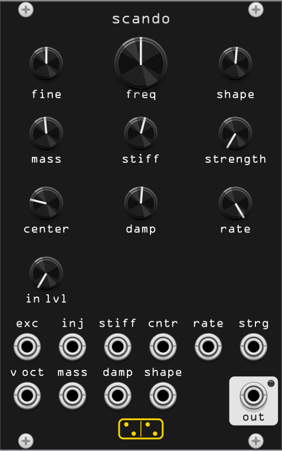

# scando

*scando* is a **scanned-synthesis** oscillator. Instead of reading a fixed
wavetable, it reads a *moving* one: a string of masses connected by springs
vibrates slowly, and the shape of that string is scanned at audio rate to
produce the tone. Because the string keeps changing, the timbre evolves on
its own - no LFOs or modulation needed.

The technique was devised by Bill Verplank, Max Mathews and Robert Shaw at
Interval Research (1998–2000). Its key idea is that **pitch and timbre are
independent**: the string vibrates at slow "haptic" rates (well below hearing),
while the scan speed alone sets the pitch. The Latin *scandere* means "to climb"
and, in prosody, "to scan verse" - the root of the word "scan".

## How it works

The string is a chain of 128 masses with its two ends pinned (the classic "fixed
ends" boundary, the same non-circular topology used by Csound's scanned-synthesis
opcodes). Each interior mass is pulled by springs toward its neighbours
(**stiffness**), pulled back toward zero by a centering spring (**centering**),
slowed by **damping**, and given weight by **mass**. Disturb it - with the
hammer, the continuous **strength** drive, the faint internal bed, or an injected
audio signal - and it ripples and settles, its shape morphing as energy moves
along the chain. A phase accumulator scans that shape once per cycle at the pitch
you ask for. Because the ends are pinned to zero, the scanned wavetable loops
seamlessly.

By default the string rests in silence. Trigger **exc** and it plays as a
plucked voice that rings and decays. Raise **strength** and it free-runs into a
sustained, slowly-evolving tone; patch audio into **inj** and it rings in
sympathy. Excite, inject and strength are the three ways to wake it.

## Controls

| control | description |
|---------|-------------|
| **freq** | Fundamental pitch (the scan speed). Roughly 16 Hz–4 kHz, summed with v/oct and fine. |
| **fine** | Fine pitch trim, ±7 semitones. |
| **mass** | Weight of the masses. Low = heavy and sluggish (subtle, slow motion); high = light and volatile (lively, fast motion). |
| **stiff** | Spring force between neighbouring masses. Higher couples the masses more tightly, brightening and adding metallic, inharmonic partials. |
| **damp** | How fast motion bleeds away. Low = short, percussive decays; high = long sustains that approach self-oscillation. |
| **center** | Pull of every mass back toward the center line. Higher centering speeds up the evolution and reshapes the harmonics. |
| **shape** | The hammer profile used to excite the string. Morphs smoothly through **sine → saw → noise → dual-pulse**. |
| **strength** | Continuously drives the string with the current hammer **shape**. At zero the voice only rings from the hammer/inject; raise it for a self-sustaining, hammer-shaped tone. |
| **rate** | Update rate of the string physics, ~500 Hz–8 kHz. Strongly affects every other control: higher rates evolve faster and shift the apparent stiffness/damping. |
| **in lvl** | Attenuator for the **inject** input. |
| **excite** (button) | Hammers every mass to the current **shape** - a pluck, same as a trigger on **exc**. |

## Inputs and output

| jack | description |
|------|-------------|
| **v/oct** | 1V/octave pitch, added to the **freq** and **fine** knobs. |
| **exc** | Excite trigger. A rising edge hammers every mass to the current **shape** - a pluck (same as the **excite** button). |
| **inj** | Audio inject. The signal excites the string through the current hammer shape (scaled by **in lvl**), behaving a little like an envelope follower. |
| **out** | Audio output (±5V). A self-levelling limiter holds a musical level across the whole range of the controls. |

CV inputs (**stiff, cntr, rate, strg, mass, damp, shape**) add ±5V to their
knobs. The green **level** LED tracks the output amplitude.

## Patch tips

- **Drone:** raise **strength** and **damp**; sweep **stiff**, **center** or
  **rate** slowly to hear the spectrum shift.
- **Plucked / percussive:** set **strength** to zero, lower **damp**, then send a
  clock or gate to **exc**.
- **Resonator:** keep **strength** low and patch audio into **inj** - the string
  rings in sympathy with the input.
- **Metallic / bell-like:** high **stiff** with low **mass**.
- **Soft / pure:** **shape** toward sine, low **stiff**, moderate **damp**.

## Notes

The string shape is read with 4-point cubic (Catmull-Rom) interpolation and the
output is DC-blocked. This is a single-string version; a possible future
addition is multi-string / matrix topologies.
