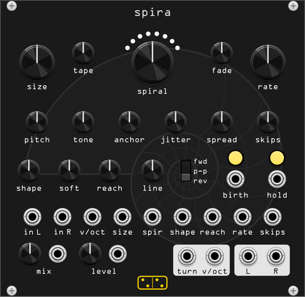

# spira

**A looper of grains, or a granulator of loops. Circles grow off the input
and turn into spirals.**

*spira* is Latin for "coil, spiral".

The input is a **line**: it plays on, and spira keeps the last 48 seconds of
it. A **circle** is a short window of the line that loops on itself while the
line goes on. Each turn of a circle is a **lap**, and between laps the
circle can change: shorter or longer, faster or slower, quieter, darker,
thinner. A circle that changes turn by turn is a spiral.

Inward, every lap shorter than the last: the laps add up to a known length,
so the spiral ends. On the way the repeats get so short that they stop
being repeats and become a pitch. Outward, every lap longer: the circle
slows down and drops until it is a smear.

Plain repeats are a stutter effect. What keeps spira from being one is that
each lap is a grain rather than a cut: it has its own envelope (**shape**,
**soft**), a direction (forward, ping-pong, reverse), a place that can
wander (**jitter**), and a filter that moves turn by turn (**tone**). Many
circles sound at once, each at a different stage of its spiral.

## The panel

| row | contents |
|---|---|
| top | **size**, **tape**, the **spiral** knob under its ring of eight lights, **fade**, **rate** |
| second | **pitch**, **tone**, **anchor**, **jitter**, **spread**, **skips** |
| third | **shape**, **soft**, **reach**, **line** in the centre, then the direction switch **fwd / p-p / rev**, **birth** and **hold**, each button over its jack, one label under both |
| jacks | inputs **in L**, **in R**, **v/oct**, **size**, **spir**, **shape**, **reach**, **rate**, **skips** |
| bottom | **mix** and **level**, each a knob and its CV jack under one label; the logo; outputs **turn**, **v/oct**, **L**, **R** |

## The spiral

| control | function |
|---|---|
| **size** | the first lap, 10 ms to 4 s. It is a length of time, so **pitch** does not change the rhythm |
| **spiral** | the next lap's length over this one's. In the middle, x1: a circle. Left, down to x0.5: each lap shorter, and the circle converges. Right, up to x2: each lap longer. Near the middle the knob is fine-grained: at 0.2 it is x1.03, at 0.5 x1.19 |
| **tape** | how a lap gets shorter or longer. At 100% it plays the same window faster or slower, and the pitch follows, as on tape. At 0% it cuts the window, or opens it wider, at the same speed. Speed stops at two octaves up and four down; past that the window is cut instead |
| **fade** | the level change per turn. In the centre 0 dB: the circle loops unchanged. Left it fades, down to -60 dB, where a circle is one lap and gone, a slice rather than a repeat. Right it swells, up to +6 dB a turn, until it reaches +12 dB and holds there. The knob is finest near the centre: a quarter turn left is about -4 dB, half way -15 dB; the default is -1.5 dB. It is measured on the first lap's length, so a lap half as long fades half as much, and a converging spiral arrives with some level left, so the tone at its end can be heard |
| **tone** | a filter that moves per turn, on the same time scale as **fade**. Below 0 a low-pass closes by that many octaves per turn, down to 80 Hz. Above 0 a high-pass opens instead, up to 8 kHz |
| **anchor** | when **tape** cuts, which end of the window stays: the start (0%), the end (100%), or in between |

A converging circle ends once its laps reach 1 ms, fading over its last
laps. Its whole life is **size** / (1 - ratio): at **spiral** 0.84x and
**size** 250 ms, about 1.6 seconds. An unwinding circle grows until its
laps are 16 s long and then turns at that length.

### The ring

The eight lights over **spiral** are the eight circles. Each new circle takes
the next light round, left to right and back to the first, so births walk
round the arc; a ninth circle takes the light of the oldest, which is the one
it replaces. A light's **brightness** is its circle's level: the lap's
envelope, its fade, its end, read from the engine, not measured, over 48 dB,
so a circle you can still hear is still visibly lit. Its **colour** is the
circle's spiral: yellow for a plain circle, heating to orange-red as it winds
inward, cooling to blue as it unwinds. With the menu's "keep the settings
they were born with" on, each circle keeps its own colour, and a modulated
**spiral** paints the ring.

## The lap

| control | function |
|---|---|
| **pitch** | the circle's speed at birth, -24 to +24 semitones, plus **v/oct** |
| **shape** | an envelope on every lap. Left, each lap decays: repeats become plucks, with a sharp attack whatever **soft** says. Right, each lap swells and stops sharply: backwards-sounding repeats. In the middle, flat. A pluck keeps only what falls near the start of its window, which on a drum loop is not much, so most of the level the envelope takes is given back: fully plucked or swelling circles sit within about 3 dB of flat ones |
| **soft** | how one lap turns into the next. At 0 the loop jumps back to its start in 1 ms: a clean cut, and every repeat begins with a clear attack, like a stutter. Turned up, the end of each lap fades out while the next one fades in over it, for up to half a lap: the seam disappears, the repeats blur into each other, and at full the circle is a smooth, overlapping texture rather than a sequence of repeats. With **size** short and **soft** full, circles become grains |
| **fwd / p-p / rev** | the direction. In ping-pong the laps alternate forward and backward, and with **spread** they also alternate left and right |
| **jitter** | each lap's place and length move at random, by up to half a window and a quarter of an octave. It also loosens **rate** |

## The line

| control | function |
|---|---|
| **rate** | circles per second, 0.05 to 20. At the bottom, off: circles are born only by **birth** |
| **skips** | the share of births skipped, from **rate** and from the **birth** jack, never from the button. The timing stays, so a clock into **birth** keeps its grid and gets holes in it, where **jitter** would move the births off it. A skipped birth leaves no trace: no flash, no **turn**, and the ring does not move on |
| **birth** | a circle now, from the button or a trigger at the jack. The button flashes at every birth, whatever caused it |
| **reach** | where a circle is born. At 0 it is born just behind the playhead, on the last **size** of the line. Turned up, it is born up to **reach** x **line** further back |
| **line** | 1 to 30 seconds: how far back **reach** can go, and the loop's length under **hold** |
| **hold** | the button latches, and the jack holds while high. The line stops recording and loops its last **line** seconds, or less if less has been recorded since the module started. Circles born under hold come from the held loop |
| **spread** | each circle gets its own place in the stereo field, up to hard left or right. It is a balance, not a pan: a circle is already stereo, so in the centre it is at unity and turning only takes from one side |
| **mix** | the line against the circles. In the middle both are at unity, so spira works as an insert. At 0 only the line, at 100% only the circles |
| **level** | the circles' level, -12 to +12 dB, before **mix**. **mix** only trades one against the other; this is how the circles get louder than what they loop |

Up to eight circles sound at once. A ninth takes the place of the oldest,
which fades out over 5 ms. The circles are summed at unity with the line,
and a pile of loud circles can go well past what a module should send. The
menu's **Output** decides what happens then: **Limit** turns the whole
output down so its peaks stay at 8 V, and a normal +-5 V signal never
reaches it; **Saturate** bends everything above 6 V toward 10 V, which
pushed hard is a grit of its own.

## Jacks

| jack | function |
|---|---|
| **in L**, **in R** | the line. **in R** is normalled from **in L** |
| **v/oct** in | added to **pitch** |
| **size** in | 1 V/oct on **size**: +1 V doubles the first lap |
| **spir**, **shape** in | added to their knobs: +-5 V covers the travel |
| **reach**, **skips** in | added to their knobs: 0 to 10 V covers the travel |
| **rate** in | 1 V/oct on **rate**; it does not turn an off **rate** on |
| **birth** jack | under its button: a trigger, a circle now |
| **hold** jack | under its button: a gate, hold while high |
| **mix** jack | added to **mix**: 0 to 10 V covers the travel |
| **level** jack | added to **level** at 2.4 dB/V, so 10 V covers the knob; it can go on below it, down to -72 dB, so an envelope here can silence the circles |
| **turn** out | eight channels, one per circle in the ring's order: 10 V, 1 ms, at the circle's birth and at each of its laps. A mono input reads the first channel only |
| **v/oct** out | eight channels, one per circle in the ring's order: its speed, 0 V at the speed of the line, held when the circle ends. With **tape** on a converging spiral it climbs an octave each time the laps halve: patch it into a polyphonic oscillator and each voice follows its circle |
| **L**, **R** | the line and the circles |

## Context menu

| item | function |
|---|---|
| **Output** | **Limit** (the default): peaks over 8 V turn the whole output down, quickly, and it comes back over 150 ms; the circles get louder against the line but not louder than 8 V, and nothing distorts. **Saturate**: above 6 V the output bends toward 10 V, more the harder it is pushed |
| **Circles keep the settings they were born with** | off (the default), the knobs reach the sounding circles at their next lap, so a single long circle can be played. On, a circle keeps everything it was born with, and moving a knob only shapes the circles to come: modulate **spiral** and every circle gets its own |

## Presets

Eight, in the preset browser, each a way past the plain stutter: **zip**
(inward on tape, rising into a pitch), **roll** (inward by cutting),
**unwind** (outward, slower, lower and darker), **brake** (a tape stop),
**cloud** (short soft laps, twelve circles a second), **plucks** (decaying
laps in ping-pong), **swells** (reversed laps a fifth up, thinner every
turn) and **scatter** (circles from anywhere on the last four seconds: press
**hold** and they wander a frozen loop). A preset sets every knob and the
menu; it leaves **hold** as it is.

## Levels

The line passes at its own level. A circle starts at the level of what it
loops, then **level**, and changes by **fade** per turn. At the defaults a
circle's first lap matches the line, and averaged over their lives the
circles sit about 5 dB under it (they are fading); **level** at +5 dB
evens them out. The buffer holds 48 seconds of
stereo at the host's sample rate: about 18 MB at 48 kHz, 74 MB at 192 kHz.
