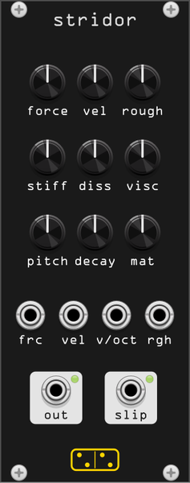

# stridor

*stridor* (Latin: a creaking, a grating, a shrill sound) is **dry friction as a
voice**. A probe is pressed against a resonant object with a normal force and
dragged across it at a sliding velocity. The contact sticks, loads up, lets go,
and sticks again. At low speed the slips are ragged and the object grinds; as
speed rises they lock into the object's own modes and it squeals; past that the
contact simply slides and all that is left is the hiss of the surface.

Nothing switches between those. It is one relaxation oscillator crossing a
bifurcation, and the knob that crosses it is **vel**.

10 HP. Monophonic — it is one contact.

## Controls

| Control | Range | What it does |
|---|---|---|
| **force** | 0 – 12 N | how hard the probe is pressed. At zero there is no contact and no sound |
| **vel** | 1.5 mm/s – 0.8 m/s | how fast it is dragged, **exponential**. Everything interesting happens in the first third of the knob; the top third is smooth sliding |
| **rough** | 0 – 100 % | the surface. Drives the scraping grain and the contact noisiness together, because both are the same physical fact |
| **stiff** | 500 – 10000 | bristle stiffness of the contact: how far it deflects before it breaks away, so where in the **vel** range the stick-slip band sits |
| **diss** | 0.5 – 80 | bristle dissipation. Damps the contact, widening the sound |
| **visc** | 0.5 – 12.5 | viscous term. Damps the object through the contact, so it pulls the pitch and thins the ring |
| **pitch** | 20 Hz – 2 kHz | fundamental of the object |
| **decay** | 15 ms – 4 s | modal decay, before the material's own scaling |
| **mat** | rubber → wood → metal → glass | a continuous morph across four sets of modal ratios, decay factors and mode gains |

## Ports

| Port | |
|---|---|
| **frc** | normal force CV, 10 V = full scale, summed with the knob |
| **vel** | velocity CV, 10 V = full scale, summed with the knob (so it is exponential too) |
| **v/oct** | 1 V/oct on the object's pitch |
| **rgh** | roughness CV, 10 V = full scale |
| **out** | audio |
| **slip** | a 0.1 ms trigger every time the contact goes from sticking to sliding |

**slip** is not a slow gate. One slip is one cycle of the relaxation
oscillator, so in the grinding band it fires a few hundred times a second and
in the squeal it becomes a pulse train at the squeal frequency. Use it as a
rate/sync signal, or divide it.

## Context menu

- **Output gain** — the model works in metres of displacement, and the voltage
  it lands on depends on the patch. Five steps, 0 dB is the default.
- **Output limiter** — a tanh on the way out, on by default. The loudest
  corner of the force/velocity plane runs several volts RMS.

## What is modelled

The engine is a port of the **Sound Design Toolkit** (Delle Monache,
Rocchesso et al., out of the SOb / CLOSED / SkAT-VG projects,
[SkAT-VG/SDT](https://github.com/SkAT-VG/SDT), GPL-3.0-or-later). The port
lives in `src/sdt/` and is shared with the other SDT modules. Three pieces of
it are here:

- **`SDTResonator`** — the object: six parallel mass-spring-dampers, one per
  normal mode, discretised with the impulse-invariant method.
- **`SDTFriction`** — the contact: the elasto-plastic bristle model. A state
  `z` is the average deflection of the asperities in contact; below break-away
  it deflects elastically (the contact sticks), above it the deflection is
  partly plastic (the contact slides), and the fraction that is plastic moves
  smoothly between the two. The friction force is that deflection times a
  stiffness, plus a dissipation term, plus a viscous term, plus noise scaled
  by the square root of speed times load.
- **`SDTScraping`** — the surface: pink noise run through a decaying "ground
  trace" whose bumps are the profile the probe rides over, with the bump force
  scaling as velocity squared.

Around the contact sits the SDT's energy check: the force is bisected down
until the contact cannot hand the pair more energy than it has. Without it a
stiff contact diverges in a sample or two.

### What is not stock SDT

- **The pickup gain is 1, not 100.** In the SDT tutorial patches the modal
  pickup gains are 100, and the pickup gain scales both the output *and* the
  velocity the contact senses, so it is the loop gain of the friction
  feedback. At 100 the viscous term damps every mode to Q ≈ 4 and the object
  never rings. Volume is made up after the model instead.
- **Light modes**, 5 g each. The object's own velocity has to be able to swing
  the relative velocity at the contact, or there is no stick-slip cycle at all,
  only sliding.
- **The material morph**, the coupled **rough** control, and the **slip**
  trigger taken from the model's plastic fraction, none of which the SDT has.

## Measurements

`test/stridor_probe` prints the level across the force/velocity plane, the
slip rate through the velocity sweep, the material sweep and a CPU figure.
At 48 kHz the voice costs about 1.1 % of a core.

The slip rate through the velocity range, at force 0.7, is the shape of the
whole instrument: zero below about 5 mm/s (the contact sticks and murmurs),
a few hundred per second through the grinding band, and back to zero once the
contact is sliding freely.

## Patch ideas

- **force** from an envelope, **vel** from a slow LFO: a door that has to be
  pushed before it will complain.
- **v/oct** into the object with **decay** high and **rough** low: a bowed,
  if scrapy, pitched voice.
- **slip** into a clock divider, then into anything: the rhythm is the
  friction's own, and the patch cannot dictate it.
- Sit **vel** just below where the squeal starts and modulate **force**
  slowly. The bifurcation crossing is the sound.
