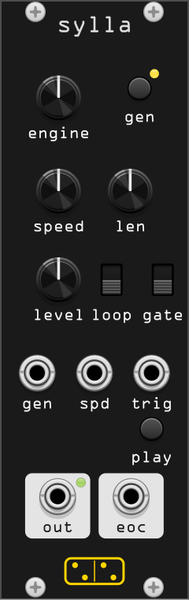

# sylla

**Random sample generator and player: press GEN, get a sound that has
never existed before.**

*sylla* is a clipped *syllaba*, Latin for "syllable" - haiku are counted
in syllables, and sylla speaks one small sound at a time. It is the
standalone voice of the [imber](imber.md) pair, inspired by Giorgio
Sancristoforo's **Haiku**, whose sample material is synthesized from
nothing at every launch. sylla exposes that generator library as a
normal sampler voice: no files, no disk, every sound rendered fresh by
a background thread while the previous one keeps playing.

## Engines

The **engine** knob is a rotary switch over the generators themselves: one
position, one engine. Its position decides the character, and GEN only
decides which sample of that character you get.

That is the whole point of the control. It used to select a *family* and
roll one of its members at every render, which meant the knob did not
determine the sound: if you liked what you just heard and pressed GEN for
another take on it, you often got a different engine instead. Families
survive as what they always described well, a grouping. They order the knob
and they name the positions.

The order runs as one continuum, from the most sustained to the most
transient, so the knob is still a gesture:

| group | engines |
|-------|---------|
| **drone** | *pure*, *detuned*, *FM*, *sub*, *stretched* - oscillator-fed stacks, from a near-sine through 2-op FM to a stretched-partial stack that beats against itself |
| **pad** | *slow*, *cluster*, *tape* - chordal beds, static or wowing |
| **air** | *filtered*, *wash*, *vowel*, *comb* - noise-fed: resonant noise, sweeping washes, a glottal pulse train through morphing formants, and noise driven into a comb |
| **bell** | *classic*, *inharmonic*, *chime*, *body* - struck: three additive sets with long tails, plus a noise-excited metal or wood body with a short dry ring |
| **pluck** | *clean*, *dirty* - Karplus-Strong strings |
| **phrase** | *melody*, *stab*, *run*, *stutter* - figures in time |
| **dust** | *grains*, *bursts* - particles |
| **broken** | *glitch*, *skip* - bubbly sample-and-hold, and CD-skip material |
| **micro** | tiny one-shots, milliseconds long |
| **random** | the last position: a weighted roll across the whole loop pool, the same distribution [imber](imber.md) fills its bank from |

Twenty-eight positions is a lot for one knob, so the same list is in the
right-click menu under **Engine** when you know exactly what you want.

**Random pool** in the same menu decides which engines that last position
may land on. Every engine starts enabled; untick the ones you do not want
and the roll is confined to the corner of the library you are after, which
is how you keep a self-renewing patch (EOC into GEN) surprising without
letting it wander into material that does not belong. The two one-shots,
*broken skip* and *micro*, are not listed: they finish themselves and stay
out of the pool exactly as they stay out of imber's bank, so they are
reachable by name only. Disabling everything falls back to the full pool
rather than rendering silence.

The pool is part of what the seed reproduces, so changing it re-renders the
current sample when the knob is on *random*, and leaves it alone when the
knob names an engine.

The two sustained groups divide by excitation rather than register: **drone**
is oscillator-fed and **air** is noise-fed. Anything whose source is noise
lives in air, however firmly a filter or a comb pitches it afterwards.

All engines get a light, randomized lo-fi "dirt" pass. Pitch is quantized to
a scale table, D minor pentatonic by default; see
[Root and scale](#root-and-scale).

### The legacy families

sylla shipped in 2.9 with a family knob, and patches store only a seed, so a
sample reproduces solely under the selection that rendered it.
**Generator selection** in the context menu keeps both: *v1 legacy families*
gives back the ten-position knob (drone, pad, fragment, bell, ambient,
glitch, karplus, skip, micro, random), each position rolling a member as it
used to, and its *random* deriving its family from the seed as it always
did, untouched by the random pool. Patches saved before the change load on it automatically and sound
exactly as they always did. New modules start on engines.

Besides addressing engines directly, the current selection differs from v1 in
what it contains:

- **ambient is gone.** It was a level and a register rather than an
  excitation, which is why it sounded like a blend of its neighbours: its
  tape pad *was* the pad generator with wow instead of static detune, its
  wash *was* filtered-noise drone over a quiet chord bed, its chime *was*
  the bell routine an octave up at half the level. All three moved to the
  group they were already made of.
- **fragment was a grab bag** of six unrelated recipes; it split across
  pluck, phrase and dust. Its dirty pluck is Karplus-Strong, so it sits
  with pluck now.
- **karplus** is named for what it sounds like instead of for who invented
  the algorithm.
- **three engines are new**: the vowel drone, the struck body and the
  stretched-partial stack, filling gaps the regrouping exposed.

## Root and scale

Every pitch a generator reaches for is snapped to one scale table. That is
the tonal glue: it is why random material comes out musical, why two
syllas agree with each other, and why sylla agrees with
[imber](imber.md). **Root** and **Scale** in the context menu choose it.

The default is D minor pentatonic, the tuning the whole library was
written against, so patches saved before the menu existed reproduce
exactly. Fifteen scales are available, the same set and order as the
pages64 modules use: major, natural / harmonic minor, the four remaining
modes, major and minor pentatonic, blues, whole tone, chromatic, hijaz,
byzantine and hirajoshi.

The chord generators (pad beds, chord stabs, the vowel and wash beds)
follow the scale too. Their four voices are the scale notes nearest an m7
template, so the stack shifts with the scale you pick: m7 on minor
pentatonic, natural minor, dorian, phrygian and blues, maj7 on major and
lydian, dominant 7th on mixolydian and hijaz, minor-major 7th on harmonic
minor.

Changing root or scale re-renders the current sample from its own seed, so
you hear the sound you had, transposed, rather than waiting for the next
GEN. Two syllas can now sit in different keys, and a patch is no longer
locked to D minor forever.

## Controls

- **ENGINE** - which generator the next render uses (snap knob, one
  position per engine, also in the right-click menu). Every position,
  *random* included, derives its sound from the sample's seed, so a
  reloaded patch always comes back with the same sound.
- **GEN** (button + trigger input) - render a new sample. The yellow LED
  lights while the worker thread is busy; the old sample plays until the
  new one lands. Requests during a render are ignored. GEN only changes
  what is loaded, never whether it plays: a stopped sylla stays quiet.
- **SPEED** - playback rate 0.1–2×. The CV input adds ±1 V/oct around
  the knob.
- **LEN** - play window, as a fraction of the buffer measured from its
  start (min 30 ms), with soft window edges.
- **LEVEL** - output level.
- **LOOP** switch - *loop* wraps at the window end; *one-shot* stops
  there. A loop wraps through a 25 ms equal-power seam and skips the
  buffer's own fade-in on later laps, so a drone holds level instead of
  dipping once per lap. One-shot keeps both buffer fades, where they are
  the sample's attack and release.
- **GATE** switch - *trigger* responds to rising edges; *gate* follows
  the level.
- **PLAY** button - a trigger and a gate source in its own right, so the
  whole transport works with nothing patched.

## Transport

LOOP and GATE together make a small square, and PLAY or the TRIG input
drive it identically:

| | trigger mode | gate mode |
|---|---|---|
| **one-shot** | an edge plays the window once | plays while the gate is high, and stops at the window end even if the gate stays up |
| **loop** | an edge toggles the loop on / off | loops while the gate is high |

A fresh sylla starts in one-shot + trigger, so it sits quiet until you
ask for a sound: press PLAY to speak the sample once. The loop toggle
starts *on*, so flipping LOOP up drones straight away with nothing
patched - an instant generative drone/texture source. PLAY stops it,
another press starts it over. The run state is saved with the patch.

Nothing ever cuts mid-signal. Retriggering a sounding window, and a
freshly generated sample landing under a playing head, both hand over
through a 4 ms crossfade: the outgoing audio keeps playing from a
second read head while the new one comes up under it. Hammer PLAY or
GEN as fast as you like, it stays clean. Loop wraps are seamed the same
way, with 25 ms of equal-power overlap.

## Patching

- **TRIG** drives the transport square above; it needs no cable, since
  PLAY does the same job by hand.
- **OUT** is mono (the generators are mono by design; pan or spread it
  downstream - [pavo](pavo.md) is a good neighbor). The LED on the badge
  shows level.
- **EOC** emits a trigger at each window end / loop wrap - patch it back
  into GEN with LOOP on for a drone that renews itself at every wrap. In
  one-shot, patch it to both GEN and TRIG, since generating alone no
  longer restarts playback.

## Impermanence

True to Haiku's "built from nothing" spirit, the rendered sample is not
saved with the patch - only its seed is. Reloading the patch regenerates
the exact same sound; pressing GEN never brings one back.
