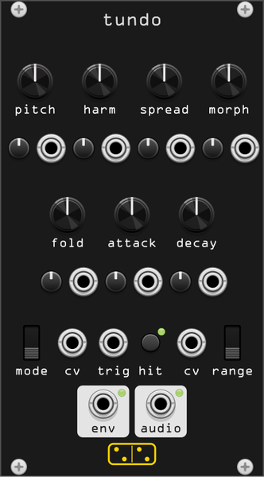

# tundo



**Parameterized digital drum voice: six additive oscillators, morphing waves, prime spread and an infinite folder.**

*tundo* is Latin for "I beat, I pound", from *tundere*, to strike
repeatedly - and the repetition in the verb is a wink at the *iteritas* of
the module it is built after, Noise Engineering's **Basimilus Iteritas
Alter**. It is a synthesized drum: six tonal oscillators plus a noise
oscillator, stacked into a modal spectrum, folded, and re-enveloped. Where
[pellicula](pellicula.md) plays the drumhead back from samples, tundo
builds the hit.

```
        per oscillator, i = 1..6
 pitch ─> f_i = f0 · r_i(spread) · pitchEnv(liquid)
          w(phase_i, morph)     sine ─> tri ─> saw ─> square
          × g_i(harm) × decayEnv_i(decay · d_i(harm))
                     │
 noise (LCG, held) ──┤
                     v
              Σ ─> × (attack env × decay env) ─> infinifolder ─> audio
                                   (threshold reflection,        │
                                    amplitude compensation,      └─> env
                                    pulse train at the top)
```

Two things make this sound like a drum machine rather than an additive
organ. The first is that the partials do not share an envelope: **harm**
staggers both their levels and their decay lengths, so the spectrum
collapses towards the fundamental as the hit dies, which is what a struck
membrane does. The second is that the whole engine runs on its own clock,
at a rate locked to a power-of-two multiple of the fundamental (§ *Sample
rate* below), so its aliasing lands on harmonics of the note instead of
smearing across the spectrum. That grit is not an artefact to be filtered
out; it is the sound.

## Controls

Every knob has its own attenuverter and CV input directly below it.

| knob | function |
|------|----------|
| **pitch** | −3 to +5 octaves around C1 (32.7 Hz), before the **range** switch. Its attenuverter is the one that **defaults fully open**, so a cable into its CV jack tracks 1 V/oct with no setup; turn it down to use the jack as a scaler, or negative to invert |
| **harm** | how much spectrum there is. Full CCW is one oscillator. The first quarter fades in a second tone; the rest of the turn extends first the *decays* and then the *amplitudes* of the remaining four partials, staggered, so the sound thickens from the bottom up |
| **spread** | the intervals between the partials, from the harmonic series (1 2 3 4 5 6) at full CCW to the prime series (1 3 5 7 11 13) at full CW, interpolated in the log domain. Harmonic is a pitched drum; prime is a bell or a gong; between them is a continuous inharmonic warp. **The fundamental never moves**: the first entry of both series is 1, so this is a timbre control, not a tuning one. The prime end genuinely has an ambiguous pitch, the way a bell does, but that is the spectrum and not a transposition |
| **morph** | the waveform every oscillator uses: sine → triangle → saw → square, in three equal thirds of the knob |
| **fold** | the first three quarters lower the folder's reflection threshold, from no folding to eight-odd reflections on a peak. The top quarter crossfades in a train of decaying pulses, one fired at every peak and trough of the tonal sum, so the train is locked to the note and **harm** sets how dense it is: two clicks a cycle with one partial, a dozen with six. It replaces the dense fold rather than piling on top of it, so the end of the knob is peakier and thinner, not louder |
| **attack** | one knob, two halves. From full CCW to noon it mixes in a burst of noise, loudest at full CCW. The noise tracks the pitch, so it darkens as you play lower, but only down to a floor: in **bass** range it would otherwise sit entirely below 1 kHz and a low snare would have no crack left. Noon is the classic analog pop, a 0.5 ms attack with no noise. From noon to full CW the attack stretches exponentially to 2 s, and the decay waits for it: the hit swells, then falls, so a slow attack still sounds at full level however short **decay** is |
| **decay** | 5 ms to 4 s, exponential, for all oscillators together - **harm** decides how much of that each partial gets. With *Free-run* armed in the context menu, full CW holds the envelopes open and tundo becomes an oscillator |

## Switches, button, inputs and outputs

| control | function |
|---------|----------|
| **mode** | **skin** - plain additive, each oscillator one non-interacting mode of a drum: tonal sounds, snares, stabs. **liquid** - skin plus a pitch envelope on every oscillator, for the extra kick. **metal** - the oscillators modulate each other, as two 3-operator phase-modulation stacks: noisy, alien, cymbals. **harm** sets the modulation index here rather than partial levels, from a light index at full CCW to six radians at full CW, the four modulators staggered across the knob |
| **range** | octave offset: **bass** +0, **alto** +2, **treble** +4 |
| **cv** (left) | mode CV. When patched it **overrides the switch**, splitting 0–5 V in three (below 1.67 V skin, below 3.33 V liquid, above metal) |
| **cv** (right) | range CV, the same three-way split |
| **trig** | strike, Schmitt-triggered at 1.5 V rising. There is no legato: a retrigger restarts every envelope from zero, as the hardware does |
| **hit** | button, strikes the voice by hand; it ORs into **trig** and lights its LED |
| **audio** | the voice. ±5 V by default, see *Output level* |
| **env** | the voice's own envelope, 0–10 V - the whole of what drives the folder, attack and decay together, so it follows **harm**, **attack** and **decay** and not just the trigger |

## Context menu

| item | options | default |
|------|---------|---------|
| **Sample rate** | *Fundamental-locked (hardware)* / *Clean (oversampled)* | fundamental-locked |
| **16-bit quantization** | on / off (ignored in clean mode) | on |
| **Spread law** | *Harmonic → prime* / *Extended (unison → harmonic → prime)* | harmonic → prime |
| **Free-run at full decay** | on / off | off |
| **Liquid pitch depth** | 1 / 2 / 3 / 4 octaves | 2 |
| **Output level** | 5 Vpp / 10 Vpp / 14 Vpp | 10 Vpp |

**Sample rate.** The hardware runs its engine at a rate that is a multiple
of the fundamental, so every alias image and every zero-order-hold image
lands on a harmonic of the note. tundo does the same: the internal rate is
`f0 × M` with `M` the power of two nearest twice the host rate, re-chosen
only when the fundamental moves more than a semitone, and the host sees
the result through a zero-order hold. Turn **morph** up and listen to how
the square's grit stays *tuned*.

*Clean* trades that for a fixed 4× oversampled engine with PolyBLEP saw
and square edges, a second-order decimation filter and interpolated
resampling. It is the same voice with the character sanded off - useful if
tundo is playing a melodic line rather than a drum part.

**Spread law.** The default runs harmonic → prime, which is what the
manual describes. The extended law re-maps the same knob onto
unison → harmonic → prime, so the first half compresses the partials
towards a slightly detuned unison: the fat-supersaw region the
harmonic-only law cannot reach.

**Free-run.** Armed, it makes full CW on **decay** hold the envelopes open
rather than decay over four seconds; the drone starts immediately, and
**trig** then re-strikes the attack only.

## Patch starting points

| sound | settings |
|-------|----------|
| **kick** | mode liquid, range bass, pitch −1, harm 9:00, spread full CCW, morph full CCW, fold 10:00, attack noon, decay 10:00 |
| **snare** | mode skin, range alto, harm 2:00, spread 2:00, morph 11:00, fold 11:00, attack 10:00 (some noise), decay 9:00 |
| **hat** | mode metal, range treble, harm 3:00, spread full CW, morph 3:00, fold noon, attack 11:00, decay full CCW |
| **metallic stab** | mode metal, range alto, harm 3:00, spread 3:00, morph 2:00, fold 3:00, attack 1:00, decay noon |
| **supersaw bass** | mode skin, range bass, extended spread law, spread 9:00, morph 2:00, fold 2:00, attack 1:00, decay 2:00 |

## Differences from the hardware

- Every knob gets its own attenuverter and CV input, not just the four the
  hardware exposes.
- **mode** and **range** CV *override* their switches when patched. The
  hardware's behaviour here is ambiguous in the manual; override is the
  useful reading.
- The engine's internal rate is a power of two times the fundamental. The
  hardware's actual multiple is undocumented - powers of two keep the
  images exactly aligned, and if the grit is ever too coarse or too clean
  that is the constant to move.
- Mono. A polyphonic version would be a different module.
- Free-run is off by default and lives in the context menu, since a drum
  voice that drones when you turn a knob all the way up surprises people.

## Where this is guessing

The manuals describe the architecture in detail but not the curves, so
these are ours and are marked `(soft)` in `src/tundo_dsp.hpp`:

- The **harm** staging constants. The manual gives the order - second tone
  in the first quarter, then decays, then amplitudes - and nothing else.
  The thresholds, ramp widths and the `i^-0.7` spectral tilt are invented.
- The **fold** pulse amplitude, time constant, and which signal's minima
  and maxima fire it. "An exponentially decaying pulse at the local minima
  and maxima" fixes the mechanism, not the shape, and not the source: the
  folded output is made of corners by construction, so firing from it gives
  a solid buzz whose density follows the fold depth rather than a train. It
  fires from the tonal sum instead, and each pulse decays in a sixteenth of
  a cycle, which is short enough to stay clear of the next one.
- The noise burst's colour. That it tracks the pitch is a choice, and so
  is the 8 kHz floor under it that keeps the bottom of the range from
  going muffled. Neither is documented anywhere.
- The **metal** routing: Alia's manual says "a pair of 3-operator
  phase-modulated oscillators", and which operator feeds which, and how
  **harm** maps to modulation index, is ours. That mapping has its own
  staging and its own floor, deliberately: an index of zero would leave a
  bare carrier, and two bare carriers at ratios 1 and 2 cannot be told
  apart from **skin**. Stack A carries ratio 1 and
  is modulated by ratios 3 and 5; stack B carries ratio 2 and is modulated
  by 4 and 6, so **spread** keeps retuning everything.
- The loudness compensation law. The manual says compensation happens; how
  is ours. The partial sum is normalized by the gain of the partials
  *currently alive*, so **harm** changes timbre rather than level, and the
  envelope is applied once, *before* the folder: a hit starts deep in the
  fold and unwinds as it decays, and the folder's 1/threshold makeup means
  **fold** adds sustain the way a fuzz pedal does.
- A strike resets the partial phases to the waveform's crest rather than
  its zero crossing. That step is the analog pop the manual puts at the
  centre of **attack**, and without it a short decay at low pitch is
  inaudible, because a quarter cycle outlasts the whole envelope.

## Attribution

The Basimilus Iteritas family is designed and built by **Noise
Engineering** (Kris Kaiser, Stephen Hensley). tundo is an independent
implementation written from Noise Engineering's own published manuals for
the [Basimilus Iteritas](https://manuals.noiseengineering.us/bi/),
[Basimilus Iteritas Alter](https://manuals.noiseengineering.us/bia_german/),
[Basimilus Iteritas Alia](https://manuals.noiseengineering.us/bia/) and
[Basimilus Iteritas Magnus](https://manuals.noiseengineering.us/bim/); no
firmware was consulted, and it is not affiliated with or endorsed by Noise
Engineering. "Basimilus", "Iteritas" and "Noise Engineering" are their
trademarks.
