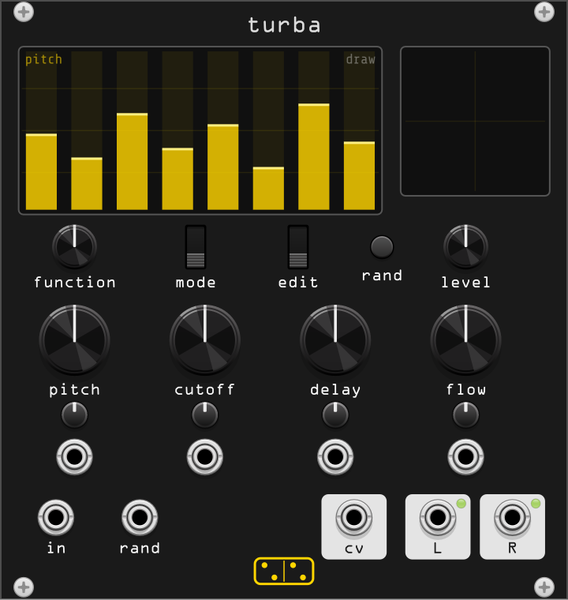

# turba



**Sixteen oscillators, sixteen feedback combs, each one modulated by
whichever of them you point it at. One knob decides whether it drones or
shatters.**

*turba* is Latin for uproar, tumult, commotion; a disorderly crowd. The module
takes its architecture and its interface from **Skrewell**, the chaotic sound
generator in the REAKTOR factory library — "an intuitive and
visual sound design workstation whose soundscapes can range from meditative
atmospheres to crackling harshness", in the manual's words.

It is **not a port**, and not for want of trying by other people: Skrewell's
chaos lives inside REAKTOR's built-in filters, which cannot be opened, and
every attempt to rebuild it in Max/gen~ or Pd has run aground on exactly that.
The verdict on the Cycling '74 thread is worth quoting, because it is the
reason this module is inspired-by rather than a clone: "being a sound
generator tool based on feedback, any minor difference in any of the modules
makes the result very different (butterflies, hurricanes, and stuff)". What is
taken here is the structure the factory library manual describes, and the
interface, both reimplemented from scratch. Same precedent as
[bulla](bulla.md).

## The engine

Eight voices, **sixteen loops**: the ensemble was taken apart for this (see
*Attribution*) and every tone generator in it holds exactly two `LEVER`
macros with a `crossvoice` between them, where a LEVER is not an oscillator
but a whole channel — oscillator, filter, normalizer, delay and feedback. A
voice here is a pair of those, and the pair is fed **identical** values from
the same eight bars: what separates the two is only that each takes its
modulation from the other side of the bank. Each lever:

```
   osc at F x fm^FM ──> x A(1 + am·AM) ──> [multimode 2-pole, in pre]
                                                          │
                       ┌──────────────────────────────>  (+)
                       │                                  │
          x feedback   │                     [2-pole HP into 2-pole LP,
                       │                            in loop]
                       │                                  │
                       │                                  v
                       │                                delay
                       │                                  │
                       └────────── normalizer <───────────┘
                                        │
                                        └──> y, to the mix and to the bank
```

Read off the ensemble rather than guessed, and the order matters. The **delay
comes before the normalizer**, and the normalizer's output is both what the
lever puts out and what feeds back. So the oscillator is never heard directly:
everything reaches the output through the delay line, however short it is set.
The three topologies differ in where the filter sits and in what it is, which
is what the factory manual says and now also what the patch says.

The delay is not a free length. Its time is set as a **pitch**, run through an
Exp and then through `1000 / f`: every loop is a comb tuned to a note, and the
`short` and `long` knobs that bound it are pitch knobs like all the others.

The oscillators never stop and there is no gate and no pitch input. Like the
original, you switch it on and it runs.

What makes it more than sixteen parallel drones is the coupling, and its shape
is read off the ensemble. The `crossvoice` macro beside each lever holds
**eight From Voice modules wired to the channel inputs of a selector**, and
the `fm` and `am` bars drive that selector's position. So a bar does not say
*how hard* a lever is modulated — it says **which voice modulates it**,
blending between two adjacent voices when it sits between them. The source
is the partner lever of the chosen voice: crossed within the pair, selected
across the bank.

The two bars therefore draw a **coupling topology**, sixteen values deciding
who listens to whom, and that is the instrument. Depth is one global amount
on the **flow** knob. Every loop ends up part of one system, and with the
filter saturating inside it that system is genuinely chaotic — see *Is it
actually chaotic* below.

Both levers always run, as they do in the ensemble. The left output is the
first lever of every voice and the right output the second, which is also the
ensemble's: each tone generator has an `L` and an `R` and they are its two
levers, with Reaktor summing the eight voices into each.

### The FM is a ratio

Worth its own note, because it is the single biggest thing separating this
module from a polite one, and it took two goes to get right.

Skrewell's oscillators are the FM variants of Reaktor's primary set, and in
every LEVER the `P` input is wired to a constant **−300**: a MIDI pitch so low
the oscillator would sit at a fraction of a hertz. So the pitch input is dead
and the entire frequency arrives through the linear `F` input. That much was
already known from AlbertoZ's account on the Cycling '74 thread — *"the width
W inlet is not used… and the P inlet is fixed to -300"* — and it suggested
through-zero linear FM, which is what this module did for a while.

The graph says otherwise, and what it says is better. `F` is multiplied by the
output of an **Exp**, whose input is a Selector between **Log(1/fm)** and
**Log(fm)** positioned by the modulator. The reciprocal and the two logarithms
cancel exactly, so the whole chain is

```
    freq = F × fm ^ m,        m = the modulator, −1 … 1
```

a **frequency ratio**, geometric and symmetric about the carrier. `fm` runs
from **1 to 16**, and those are not chosen numbers: they are the Min and Max
of the FM knob, sitting in its own record in the ensemble file. At 1 there is
no modulation at all — one to the power of anything is one — and at 16 it is
four octaves either way. That is why **flow** at its left stop is a bank of
plain oscillators rather than a bank of quiet ones.

AM is read the same way, from a Mult/Add:

```
    amp = A × (1 + am × M)
```

with `am` running **0 to 5**. Past 1 the factor goes negative and it is ring
modulation, which is where a good deal of the harshness lives.

### Three topologies

The **mode** switch chooses where the filter sits, after Skrewell's three
operation modes. colB's reading of the ensemble matches the manual here:
three pairs of oscillators, *"two pairs use pulse waves and the other uses
sinusoid (par FM)"*, only one pair live at a time.

| mode | | |
|------|---|---|
| **loop** | pulse oscillator, a 2-pole **HP into a 2-pole LP** **inside** the loop, between the summer and the delay | the harshest of the three: everything that recirculates is filtered and saturated again on every pass. This is the ensemble's bandpass generator, and bars five and six are its two corners |
| **pre** | pulse oscillator, one **multimode** 2-pole **between the oscillator and the summer** | the filter colours what enters the loop once and then leaves it alone; more tonal, more delay-like. The ensemble's multimode generator, and bars five and six are cutoff and type |
| **bare** | **parabolic** oscillator, **no filter** | the calm one. A parabolic wave is much rounder than a pulse and with no filter in the way the loops behave like plain combs. Measured centroid 401 Hz against 541 Hz for **loop** |

The three generators share one set of eight bars and read two of them
differently, which is the original's own arrangement — its parameter lists are
`F fm A am cut lbh DEL FB`, `F fm A am hp lp DEL FB` and, for the one with no
filter, six. In **bare** those two bars do nothing and the edit area says so.

The bandpass mapping is worth knowing about, because it is not two independent
cutoffs. The LP corner is `cc1/2 × (1 − cc2) + cc2` and the HP corner is that
same value multiplied by `cc2` again, so **the HP can never climb above the
LP** and the band never closes on you however you draw the bars.

## The edit area

The eight bars are the eight voices. Which parameter they show is the
**function** knob; there are eight functions, so the bank is 64 values in all,
and they are in the ensemble's order: `F fm A am cut lbh DEL FB`.
They are real module parameters: they save with the patch, they randomize with
the module, and they are visible over [limen](limen.md) as
`Channel <n> <function>`.

| function | range | |
|----------|-------|---|
| **pitch** | pitch 0 – 132, i.e. 8.2 Hz – 16.6 kHz | the oscillator. The bar picks a MIDI pitch between the `min` and `max` knobs and an Exp turns it into hertz, which is the ensemble's own arrangement and the reason the mapping is exponential |
| **fm** | voice 1 – 8 | **which voice frequency-modulates this one.** Not a depth: it is the position of an eight-way selector over the bank, blending between two adjacent voices when set between them. The bar is multiplied by 8, as the ensemble does, so the top eighth of its travel all lands on the last voice. Depth comes from **flow** |
| **amp** | 0 – 100% | the oscillator's own amplitude, **inside** the loop, ahead of the filter and the feedback. The ensemble's `A` bar, mapped by a Selector between constants 0 and 1. Turning a voice down is not a mixer move: it starves that loop |
| **am** | voice 1 – 8 | as **fm**, for amplitude modulation. The two bars together draw the bank's coupling: which voice listens to which |
| **cutoff** / **hp** | pitch 15 – 135, i.e. 20 Hz – 20 kHz | the multimode filter's cutoff in **pre**, the HP corner of the band in **loop**. Nothing in **bare** |
| **type** / **lp** | low → band → high, or pitch 15 – 135 | in **pre** the filter's *shape*: the ensemble's `lbh`, doubled into the `Pos` of a selector over the Multi 2-Pole's LP, BP and HP outputs, so each voice can sit on a different slope. In **loop** it is the LP corner instead. Nothing in **bare** |
| **time** | 0.15 ms – 310 ms | the delay, as one period of a pitch between the `short` and `long` knobs. At the short end the loop is a comb rather than an echo |
| **fbk** | 0 – 100% | loop gain. Unity at the top is safe: the normalizer bounds every lever to 1 by construction |

The **edit** switch is Skrewell's three mouse behaviours:

- **draw** — drag a bar to set it. Click and sweep across to draw a shape.
- **wrap** — drag anywhere and all eight bars move together, keeping their
  shape. A bar that runs off an end **mirrors** back rather than piling up
  against it, so a long drag folds the whole bank through the range.
- **rand** — drag and all eight bars jog randomly, by as much as you moved.

Double-click the edit area to put the current function back to its default
shape. One drag is one undo step.

**rand** (the button, and its trigger input) randomizes the whole bank. Turn
the level down first: the original's manual warns about "unexpected bursts of
noise" and that warning transfers.

## The macros

The four big knobs are the reason the interface works at all, and they are not
what a knob in a modular usually is. **They do not offset the bars, they map
them.** Three of them are the position of the ensemble's `shaper` macro, which
is a Selector over three curves of the bar:

- **hard left** — `v⁴`. A bar at 50% maps to 6%. Only bars already near the top
  survive; everything else is crushed to the bottom of the range.
- **centre** — `v`. The mapping is the identity and the bars mean exactly what
  they show.
- **hard right** — `⁴√v`. A bar at 50% maps to 84%. The whole bank is lifted
  and the differences between bars compress.

Between those it blends. So one knob asks "how much of this parameter does the
bank get", and it asks it of eight voices at once while preserving their
order. Sweeping **pitch** does not transpose the bank rigidly, it opens and
closes the *spread* of it.

The knobs run **0 to 1 with the identity at centre**, which is the ensemble's
range, not a bipolar ±1.

| knob | what it maps | measured, default bank |
|------|--------------|------------------------|
| **pitch** | all eight oscillator frequencies | centroid 412 Hz hard left → 884 Hz hard right |
| **cutoff** | the filter corners | centroid 838 Hz → 626 Hz, with RMS 1.01 → 1.40 |
| **delay** | all eight delay times | level barely moves; what moves is where the comb sits, which is why the left end sounds like ring modulation and the right end like an echo |
| **flow** | five global settings at once | see below |

Each has an attenuverter and a CV input; CV is 0–10 V for the full sweep,
scaled by the attenuverter.

### flow

**flow** is the one to reach for. It is Skrewell's knob of the same name, which
the REAKTOR manual describes as adjusting "various amounts of modulation… turn
to the left for less modulation and more inertia, turn to the right for the
opposite".

**flow is not a bar mapping** like the other three. In the ensemble it is the
`Pos` of exactly five Selectors, each crossfading between **a pair of knobs**,
and the five pairs are these — ranges straight out of the knob records:

| | crossfades | |
|---|---|---|
| **fm** | 1 → 16 | the FM ratio. At 1 there is no frequency modulation at all |
| **am** | 0 → 5 | the AM depth. Past 1 it inverts and becomes ring modulation |
| **res** | 0.95 → 0.30 | the resonance of every filter |
| **smt** | 20 → 1 | the smoothing multiplier, which sets both normalizer times and both control glides |
| **nrm** | 1 → 0.01 | the normalizer's floor, i.e. how quiet a loop is allowed to stay |

So the left stop is eight plain oscillators through resonant filters into
tuned combs, with second-long normalizer times and slow glides on everything;
the right stop is four octaves of FM, ring modulation on top, damped wide
filters, and a normalizer that chases.

**Resonance goes down as flow goes up**, and that is worth a sentence because
it looks backwards. The Max porter's finding was that what tips Skrewell into
chaos is "the resonance parameter in a 2-pole filter being turned **down**",
which he called "a pretty surprising behavior" and never explained. It is not
that surprising in a feedback loop: a high-Q lowpass hands the loop gain in
one narrow band and it rings there, orderly; open the Q out and the loop gets
broadband gain, the saturator inside it has much more to fold, and the
trajectory stops closing on itself. In this module it is not a deviation of
any kind — it is simply which of the two RES knobs is the larger, and since
the ensemble does not record where its knobs sat, that was a choice, made to
land the bifurcation where it is heard.

### Is it actually chaotic

Yes, and `test/turba_probe lyapunov` measures it. Two copies of the engine are
started from identical state, one displaced along a random direction through
the **whole** state space — every oscillator phase, every filter and
normalizer state, and every sample in the sixteen delay lines — and the growth
rate of that displacement is a largest-Lyapunov estimate in nepers per second:

| flow | loop | pre | bare |
|------|------|-----|------|
| 0.00 | 0.5 | 0.5 | 0.2 |
| 0.25 | 14.4 | 11.8 | 11.5 |
| 0.50 | 28.2 | 16.3 | 14.7 |
| 0.75 | 48.3 | 20.1 | 17.6 |
| 1.00 | 66.9 | 27.4 | 23.7 |

A clean bifurcation at the left stop, in all three topologies, and it needs no
explaining: at flow 0 the FM ratio is 1 and the AM depth is 0, so nothing
modulates anything and sixteen independent combs have nothing to be chaotic
about. Everywhere else two runs of the same patch are two different pieces of
music.

Any λ this module reported before 2026-08-10 should be ignored, including the
645/s that appeared here. The old estimator nudged one oscillator phase by
1e-6 and renormalised only the output array, which the engine overwrites every
sample; spread over the fifty thousand float32 words that hold the real state
that displacement is below the resolution of the type. It read 0 for engines
that were chaotic and a large number for one that was diverging.

## Inputs and outputs

| jack | |
|------|---|
| **in** | audio, injected into **all sixteen loops** at once. The original has no input at all; this is the addition that makes turba usable as a processor. A signal in here is filtered, delayed, saturated and cross-modulated sixteen ways, and it also becomes part of what the bank modulates itself with |
| **rand** | trigger, randomizes the whole bank. Same as the button |
| **L**, **R** | the mix, through the ensemble's output fader: −36 to +18 dB, defaulting three quarters up at +4.5 dB, which puts the starting bank at about 2.2 V RMS. The channels are the ensemble's own: **L is the first lever of every voice and R the second**, eight voices summed into each. There is no panning. The two sides are genuinely different because the two levers of a voice take their modulation from opposite sides of the bank, which is what gives the Lissajous something to draw |
| **cv** | the bank's own slow wander, ±5 V. The sixteen levers summed with alternating sign and lowpassed at 25 Hz, so common motion cancels and what is left is how unevenly they are behaving |

## The displays

The **edit area** is the eight bars. The square to its right is the
**Lissajous**, as on the original panel, and it is the fastest way to see what
the bank is doing: a single closed loop means the two axes are correlated and
the bank is behaving, a filled square means it has gone to noise, and a slowly
precessing figure is the interesting middle.

It is drawn as a phosphor trail rather than a flat outline — 170 ms of history
in twenty bands, each stroked twice, dim amber at the tail through to
near-white at the head, with the newest sample as a bright dot. So you can see
which way the figure is being drawn and how fast, not just its shape.

### The X/Y pad

On Skrewell's panel the display is a Reaktor **XY** element, which is a
display and a mouse control in the same object: dragging it emits `MX` and
`MY`, two one-poles at about 0.8 Hz smooth them, and they arrive at each tone
generator as `scX` and `scY`. Those are the positions of two Selectors that
choose **which lever drives which axis** — every tone generator carries `X`
and `Y` outputs alongside its `L` and `R` for exactly this. It changes what
you are looking at and not one thing about what you are hearing.

Here the Lissajous is that pad. Drag it: left-right moves the X source, up-down
the Y source, each crossfading between the voice's first and second lever. At
`x 0.00  y 1.00` — where it starts, and where a double-click puts it back —
the axes are L and R. Push both to the same end and the figure collapses to a
diagonal, because both axes are then watching the same lever.

## Context menu

| item | |
|------|---|
| **Display scale** | 1× to 8× on the Lissajous. 1× is ±5 V filling the box; turn it up when the bank is running quietly |

## Tips

- The default patch is deliberately mild. Start by pushing **flow** right and
  watching the Lissajous.
- For a drone: **flow** hard left, which also gives you `smt` at 20 and so
  second-long normalizer times and slow glides on everything, then **fbk**
  high and **time** long.
- For percussion and crackle: **delay** hard left so the loops are combs,
  **flow** right, and modulate **cutoff** from an envelope.
- The **amp** function is the one to shape by hand. Starving five of the eight
  voices turns a wall into a trio, and the three that are left are still being
  modulated by the five you cannot hear — the bar is inside the loop, so a
  voice at zero is silent but still part of the system.
- **rand** with "Randomize all functions" off, sitting on the **pitch**
  function, is a fast way to re-roll a chord without losing the patch.
- turba is a fine source for [lustro](lustro.md) or [quadrare](quadrare.md),
  and the **cv** out drives anything that wants a lazy unpredictable voltage.

## The normalizer

Each loop carries one, and as of the last pass **none of it is guesswork**.
colB spotted "some sort of compression set up using peak detectors and
clippers on the post oscillator delay feedback sections"; the `norm` macro in
the file has five primitives in it; and naming those five gives the whole
thing:

```
  audio ─┬─> Peak Detector (Rel) ─> Clipper (Min = nrm, Max = 300)
         │                                        │
         │                              1-pole smoother (smt)
         │                                        │
         └────────────────> Divide <──────────────┘
                              │
                              └──> out
```

It is a **real normalizer** — divide the signal by its own envelope — and not
the limiter this module carried for most of its life. What stops it flattening
everything is the Clipper: it holds the envelope at or above **`nrm`**, so an
envelope quieter than that is not tracked and the loop is scaled rather than
dragged up to full. How quiet a loop may stay is exactly what `nrm` sets, and
flow drives it, as flow drives the rest.

The Peak Detector's own behaviour is quoted in the module reference: rectify,
**"the attack time of peak detection is zero"**, release given as the time for
a peak to fall to a tenth — `Rel` 0 is 2.3 ms, 20 is 23 ms, 40 is 230 ms, a
decade per twenty. So the attack is instantaneous, which is audible: a
transient moves the gain on the sample it arrives on.

Neither of its two times is a constant. The `smooth` macro next door computes
both from the lever's **own delay time**: the release is `DEL × smt`
milliseconds and the smoother sits at `1000 / (DEL × smt)` hertz, with `smt`
the flow-crossfaded 1-to-20 multiplier. A long loop therefore gets a slow
normalizer and a short one a fast one, automatically. The same macro sets the
glide on the controls, at `F / smt` hertz for pitch and `500 × smt / DEL` for
delay time, the latter clipped by an Event Clipper to the pitch range −80…0 —
which is 0.081 Hz to 8.18 Hz, and is why sweeping the delay macro never
crackles. There is no global inertia setting anywhere in the patch and there
is none in this module.

## Differences from Skrewell

Beyond the obvious one — this is a different implementation of a described
architecture, not a translation of a patch — the engine no longer contains
anything invented.

### The rule

**Nothing is in the engine that is not in the ensemble.** Anything invented
has been taken out again, including some things that measured well: a
chaotically clocked two-state switch on the filters that doubled the module's
self-evolution, a raw-oscillator option, a bit crush, menu switches for
turning off the lever pairs and the crossvoice, a tritone detune on the second
lever of each pair, an equal-power pan across the eight voices, a feedback bar
that reached 102%, a global inertia on the flow knob, and a saturator across
the output. None of them exist in the patch, so none of them are here. The
context menu is one item, and that item is in the original.

What remains that is *not* read from the file falls in two piles, and the
first is small:

- the **filter** is a topology-preserving 2-pole SVF with soft-limited
  integrator states, matched to the Multi 2-Pole's described behaviour rather
  than modelled from it. REAKTOR's is closed and this is exactly the place the
  Cycling '74 thread says the chaos hides, so this is the one substitution
  that certainly changes the sound;
- the **resonance law**, `k = 2 × (1 − res)`, mapping the ensemble's 0…1 Res
  onto the SVF's damping;
- the **delay's linear interpolation**, which the file does not specify;
- a **DC blocker** and a **±10 V clamp** on the outputs, which REAKTOR does
  not need because it is not driving a Rack cable.

The second pile is the one to be honest about: **where inside each range the
original's knobs sat**. Every Min and Max in this module is the ensemble's,
read out of the knob records — pitch and cutoff span 127 semitones, FM 1 to
16, AM 0 to 5, RES 0 to 1, SMT 1 to 20, NRM 1 to 0.01, the output fader −36 to
+18 dB. Where the factory presets left each of those knobs is in the snapshot
blocks, and those are packed: consecutive blocks differ in length and in three
quarters of their words, and no run of plausible floats appears anywhere in
one. So the settings are this module's, they are collected as `SET_` constants
in one place in `src/turba_dsp.hpp`, and the pitch, cutoff and delay ones were
chosen to land on the ranges turba had already measured its way to.

The **jacks** are the last exception, and a deliberate one. Skrewell has no
audio input, no CV inputs and no CV output — it is a generator with four
knobs. A Rack module that cannot be patched is not a Rack module, so the audio
input, the four macro CV inputs with their attenuverters, the rand trigger and
the **cv** output are all additions. They are the interface, not the
instrument.

## Making it wander

turba has two quite different kinds of motion in it and they are worth
separating, because only one of them is automatic.

The **fast** one is the chaos: at flow hard right the largest-Lyapunov
estimate is 67/s in the loop topology, so the waveform decorrelates in about
fifteen milliseconds. That is what makes it restless rather than a static
tone. But fast chaos mixes fast, and a fast-mixing system has *stationary
statistics* — it can be violent and still not go anywhere.

The **slow** one is the bank moving through its own range, and that is a
property of where you put the bars, not something the engine does by itself.
The measure is the spread of the spectral centroid over a long untouched run,
in octaves (`test/turba_probe wander`). Three things control it, in order of
how much they matter:

| | |
|---|---|
| **long delays** | below about 10 ms a loop is a comb and settles in a few passes; up at 100–300 ms it takes a tenth of a second per pass and its state survives long enough to evolve |
| **feedback near unity** | at 0.5 every loop is safely damped and nothing ever builds. Push the **fbk** bars to 0.9–1.0 and loops build and collapse against their normalizers, which is where the lurching comes from |
| **pitches close together** | eight voices spread over three octaves beat against each other at audio rate, which is timbre. Eight inside a fifth beat *slowly*, and the cross-modulation turns those slow beats into slow movement |
| **the coupling** | the **fm** and **am** bars decide who modulates whom. A bank where every voice listens to the same one behaves quite differently from a bank wired in a cycle. This is the one the original gives you and this module did not, until it did |

The default bank is set that way — delays 30–310 ms, every loop between 0.88
and 1.0, pitches within a fifth — which is worth knowing if you wonder why it
sounds nothing like eight independent oscillators. An earlier default with
half the feedback and 2–40 ms delays measured 0.04 octaves. As it now stands,
over a 60 s untouched run:

| flow | loop | pre | bare |
|------|------|-----|------|
| 0.0 | 0.11 | 0.01 | 0.03 |
| 0.5 | 0.07 | 0.07 | 0.15 |
| 1.0 | 0.07 | 0.05 | 0.21 |

against 0.75 for a reference recording of Skrewell standing still. So the gap
to the reference is still open, and the accounting is worth stating plainly.
An earlier draft carried a chaotically clocked two-state switch on each filter
which got the figure to 0.97, and it has been removed because it is not in the
patch — see *The rule*. **That switch was carrying the self-evolution**, and
nothing read out of the ensemble since has replaced it: not the selector
coupling, not the ratio FM, not the ensemble's own mapping laws and ranges.
The bank moves about as much as it did at the start.

Note also that the topologies now disagree about where the movement is. In
**bare** it rises with flow, all the way to 0.21; in **loop** and **pre** it
peaks at the left stop, where nothing is modulating anything and what moves is
the interference between sixteen fixed combs.

The likeliest remaining place for the missing motion is the one thing the
ensemble will not give up: the factory snapshots. They would say where the
knobs sat, and a bank tuned by the person who built the thing is a different
object from a bank tuned to measure well.

### What was tried and did not work

Recorded so nobody spends the afternoon again:

- **A second, slow ring**: an envelope follower per voice, cross-coupling the
  loop gains, at both signs, three lag settings and gains up to 3. All null,
  0.15–0.32 dB. Eight oscillators at constant amplitude sum to constant power,
  and modulating loop *gain* barely moves a voice's level, so the slow loop
  has almost no gain to go unstable with.
- **Cross-FM tapped after the neighbour's delay line** rather than from its
  current output, so the modulation arrives 0.15–307 ms late. Plausible, one
  line to implement, and null: over fourteen random banks, paired against the
  same banks with the instantaneous tap, it won five times and the means were
  0.213 against 0.221 octaves. Delaying a stationary audio-rate modulator
  changes its phase, not its statistics, so the FM sidebands come out the same.
- **The normalizer, at every speed and depth.** It is not what holds the
  levels still; see the note above.
- **Raw oscillators and a bit crush**, both shipped for a while and both
  removed. They came from colB's remark that Skrewell's sound owes something
  to it "being digital with aliasing and quantization", and both were wrong on
  two counts: the module reference says REAKTOR's oscillators *are*
  anti-aliased, so they were unfaithful, and measured against the finished
  engine they did almost nothing — raw moved the centroid 1454 to 1527 Hz and
  8-bit crush moved it 12 Hz further. Whatever aliasing the original has comes
  from its FM sidebands, which are still here.
- **Recovering the wander that lever pairs cost**, by reweighting the
  crossvoice against the rest of the bank. Swept from 0 (levers ignore their
  partner) to
  0.85 (they barely hear anything else): 0.48 down to 0.30 octaves, against
  0.82 with a single lever. It is the summing that does it, not the coupling.

## Cost

1.4% of one core at 48 kHz, all sixteen loops always running. There is no
oversampling: the loops are saturating feedback paths where aliasing folds
back into the signal and becomes part of the chaos, and oversampling sixteen
of them would cost more than the module is worth.

It was 2.7% until the inner loop was made to run **four levers at a time**.
The route there is worth recording because almost everything tried first did
nothing at all. The engine is throughput-bound rather than latency-bound —
two engines side by side cost 2.07× one, so the machine is saturated, not
stalled — and by ablation on a 524 ns sample the budget was: filters 202 ns,
delay lines 83, the FM `exp2` 80, polyBLEP 59, the voice selector 44, the
normalizer 29. Given that, swapping the divide in the saturator for a
polynomial made it *slower*, because a divide is one uop and the polynomial is
four; a cheaper `exp2`, smaller delay buffers and a reciprocal in polyBLEP
were all null to within noise.

What was left was doing fewer, wider operations. The sixteen levers only read
each other through the previous sample's outputs, so within a sample they are
sixteen independent chains, and the two levers of a voice share every control
value including the delay time. One group is four lanes: two voices, lanes 0
and 2 the left output and lanes 1 and 3 the right. The delay lines stay
scalar, since four buffers with two read offsets will not widen. The result
measures as the same engine — RMS, centroid and the whole Lyapunov ladder all
land within a percent of the scalar version.

## Attribution

Skrewell ships in the REAKTOR factory library by Native Instruments, which
does not credit it. Its authorship is reported inconsistently: on the
Cycling '74 thread below it is attributed to **John Nowak**, while the NI
community thread discusses it as the work of **Lazyfish** (Alexander
Potekhin), whose **TG-8H** is described as its prototype and is built in
Reaktor Core rather than closed primitives. No code from it was used or could
have been. The architecture came from the
[REAKTOR Factory Library manual](https://www.native-instruments.com/fileadmin/ni_media/downloads/manuals/REAKTOR_Factory_Library_Manual_English_2015_11.pdf)
(section 7.2, pp. 262–265), and the account of where its chaos comes from from
the Cycling '74 thread
[Problem rebuilding Reaktors Skrewell in Max/Gen](https://cycling74.com/forums/problem-rebuilding-the-reaktors-skrewell-in-maxgen),
where zangpa, Matteo Marson and AlbertoZ compare notes on why it will not
port. The oscillator pairs and the count of filters and delays come from
**colB**'s reverse engineering of the ensemble in
[SKREWELL - Hardware synth equivalent ideas? What is the structure of
Skrewell?](https://community.native-instruments.com/discussion/14722/skrewell-hardware-synth-equivalent-ideas-what-is-the-structure-of-skrewell),
which is the only public account of the structure written by somebody who
actually opened it.

Beyond that, two ensembles were read directly: **TG-8H** (lAZyfISh, 2003–2013,
whose own header calls it "an early Skrewell prototype") and a
multi-output modification of Skrewell itself. Reaktor's `.ens` is a chunked
binary, but its strings are stored length-prefixed and in structural order,
which is enough to recover the module tree without parsing the object graph.
That is where the two-lever architecture, the `crossvoice` between them, the
per-tone-generator filter differences (`CUT`/`TYP` in one, `HPF`/`LPF` in the
next, none at all in the third) and the `cc`/`min`/`max` shape of the macro
mappings all come from. The tooling for it is not in this repository; it was
forty lines of Python and is described here so it can be redone.

Port names, though, *are* in the records — at the end of each one — and a
`KSModul` is followed by the port records belonging to it. So every macro's
**interface** comes out even though the wiring does not, and that turns out to
be most of what a re-implementation needs. The LEVER takes
`F A CUT TYP DEL FB fm am res rel nrm smt FM AM`, where lowercase `fm`/`am`
are amounts and uppercase `FM`/`AM` are the modulation signals arriving from
the `crossvoice` next door (`FV AV` + audio in, `FM AM` out). And each tone
generator's own inputs give its parameter list exactly: `F fm A am cut lbh
DEL FB` for the multimode one, `F fm A am hp lp DEL FB` for the bandpass one,
and `F fm A am DEL FB` — six — for the one with no filter. That is where the
**type** bar and the absence of a resonance bar in this module come from.

The wiring is in there too, and it took the right file to see it. Connections
are not objects — there is no cable class — they are stored as an *output's
fan-out*: a `KOutPort` payload ends in a count followed by that many
`(target, port)` pairs, where `target` indexes the enclosing macro's child
list. In a 4.5 MB patch with 1077 modules that is invisible; in a 33 KB test
instrument from
[github.com/fukuroder/Reaktor_Files](https://github.com/fukuroder/Reaktor_Files)
with twenty modules and twenty connections it is obvious. Skrewell yields 1308
connection entries, 1102 of them with a plausible target and port, and the
LEVER's insides read straight out: the `-300` constant goes to input 0 of a
class-188 module whose output feeds the filter macro's audio input, which is
AlbertoZ's fixed P inlet and identifies class 188 as the pulse oscillator.

Both loose ends are now tied off. The hierarchy is in the file after all: the
gap following a module's record begins `2, N, 1, 2` where **N is its child
count**, which reconstructs the tree and makes the sibling indices resolve —
`Pitch Gate` in the test instrument declares 7 and has exactly 7 children,
`snapvalue x 8` declares 24, being eight values and their sixteen terminals.
And the flag word's **bit 1 means "a connection list follows"**; without it
the record runs straight on to the port name, which is why the flag-4 outputs
looked like garbage. With both, 1069 of Skrewell's connections resolve to a
real target and a real input, 97.3% of them, and the rest are two macros whose
child count parses wrong.

That is where the loop order above comes from, and where every mapping law in
this module comes from: `osc F`, `osc A`, `delay`, `fbck`, `filter`, `norm`,
`smooth`, `flow`, `crossvoice` and `shaper` all read straight out.

**The numbers came out too.** A knob is a `KSModul` like anything else, and
its payload keeps **Min at word 20 and Max at word 21, as float32**. That is
where every range in this module now comes from: `min`/`max`,
`CUTmin`/`CUTmax`, `HPmin`/`HPmax` and `LPmin`/`LPmax` all spanning the same
127 semitones, `short`/`long` spanning them inverted, FM 1…16, AM 0…5,
RES 0…1, SMT 1…20, NRM 1…0.01, and the output fader −36…+18 dB. What the
records do *not* keep is a current or default value — that lives in the
snapshots, which are packed and did not decode.

Naming the module classes is the other half, and it is done by matching port
counts against the Reaktor 5 Modules and Macros Reference and then
disambiguating by what the graph wires each class to. Twenty-two of the
fifty-seven are named that way, and reading the LEVER's modulation chain
needed four of the last few: **113 Reciprocal**, **120 Log (F-to-P)**,
**127 Sqrt** and **117 Exp (P-to-F)**, which between them spell out
`freq = F × fm^m` and the shaper's `v⁴ … v … ⁴√v`.

The notes and the scripts are in `~/dl/temp/reaktor-ens-tools/` rather than in
this repository, since they are a file-format reader and not a Rack module.
Anyone wanting to go further should start with the snapshot blocks, or, far
more cheaply, build one Reaktor ensemble holding one instance of each module
of interest in a known order and read the class ids straight off it.
