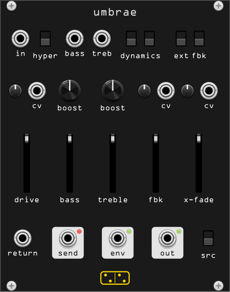

# umbrae



**An audio feedback instrument. A loop runs around a saturating two-band tone
section, and past unity it stops colouring what you put in and starts singing
on its own.**

*umbrae* is Latin for shadows, and for *of shadow*. The name is the
designer's: in the hardware's manual Casper Electronics describes audio
feedback as "the negative space around a sound, like a sonic shadow. A dark
counterpart." The module is after Bastl Instruments and Casper Electronics'
**Dark Matter** (2019), a 13 HP analogue feedback processor built out of the
behaviour of a no-input mixer.

The manual prints a complete block diagram and almost no numbers, and there
is no schematic in the public domain. What is modelled here is that diagram,
stage for stage. Read [fidelity](#fidelity) before assuming any particular
frequency matches the hardware — this is a reconstruction from a description,
not a measured emulation, and it is the only module in this collection built
that way.

## What it does

```
in ─┬─► DRIVE VCA (x3, soft clip) ─┬─► [HYPER x7] ─► TONE ──┬─► X-FADE B
    │                              │                  ▲     │
    ├─► envelope follower ─► ENV ──┤              FBK VCA ◄──┘
    │   (normalled to the CV ins)  │                  │
    └─► X-FADE A (clean) ──────────┴──────────────────┴─► X-FADE ─► out
```

**The loop is the module.** Below unity it is an overdrive with a resonance;
above unity it howls, and the two band faders decide the register — bass for
a hundred-hertz grind, treble for a squeal around three kilohertz, both for
something in the middle that changes its mind as the gain rises.

Everything else exists to shape what goes round the loop, or to let something
else into it. The **envelope follower** watches the input and is normalled to
the feedback and crossfade CV inputs, so a signal played into the module gates
and ducks the feedback it is causing. The **send** and **return** jacks open
the loop so a delay, a reverb or a filter can sit inside the howl.

## Controls

| fader | function |
|-------|----------|
| **drive** | input VCA. ×3 gain wide open, soft clipping at ±5 V |
| **bass** | level of the low band (below ~300 Hz) |
| **treble** | level of the high band (above ~1.8 kHz) |
| **fbk** | how much goes round the loop. Unity is around a third of the travel with the boosts down; everything above that is feedback |
| **x-fade** | clean signal at the bottom, the fed-back one at the top |

| knob | function |
|------|----------|
| **boost** (bass) | gain into the low band's saturator, ×1 to ×13 |
| **boost** (treble) | the same for the high band |

| trimpot | function |
|---------|----------|
| **cv** (drive) | attenuator for the drive CV |
| **cv** (fbk) | attenuverter for the feedback CV |
| **cv** (x-fade) | attenuverter for the crossfade CV |

| switch | function |
|--------|----------|
| **hyper** | ×7 on the drive signal as it enters the tone section |
| **dynamics** (left) | the envelope listens to the input, or after the drive stage |
| **dynamics** (right) | envelope decay: 60 ms or 600 ms |
| **ext fbk** (left) | send polarity, normal or inverted |
| **ext fbk** (right) | whether the feedback VCA sits on the send or on the return |
| **src** | the clean side of the crossfade: the input, or after the drive stage |

| jack | |
|------|--|
| **in** | signal in |
| **bass**, **treb** | boost CV, unattenuated, ±8 V |
| **cv** ×3 | drive, feedback and crossfade CV, ±5 V, through their trimpots. **Feedback and crossfade are normalled to the envelope** |
| **return** | patching it breaks the internal loop |
| **send** | the loop, on its way round |
| **env** | the envelope follower, 0 to +5 V |
| **out** | the crossfader, with a level LED |

The red LED over **send** is the hardware's HF warning: it watches the loop
for sustained high frequency content. Flashing and glowing is normal, bright
and steady means something wants turning down.

## Where it howls

Nothing patched, both boosts down, measured at the output:

| bass | treble | fbk at which it starts | pitch |
|------|--------|------------------------|-------|
| up | down | ~0.4 | 107 – 116 Hz |
| down | up | ~0.4 | 3.26 – 3.40 kHz |
| up | up | ~0.4 | 0.99 – 1.29 kHz |

With the boosts up the loop reaches unity far earlier — from about a tenth of
the **fbk** fader — and the pitch drops, because the saturating band that has
the most gain is the one that wins:

| bass | treble | boosts | pitch |
|------|--------|--------|-------|
| up | down | 0.5 | 77 Hz |
| down | up | 0.5 | 2.98 kHz |
| up | up | 0.5 | 360 Hz |
| up | up | 1.0 | 258 Hz |

Within one register the **fbk** fader is a pitch control as much as a level
control: more gain around the loop moves where the phase comes back round.
Sweeping it with both bands open and the boosts at a third takes the howl from
about 3.4 kHz down to 330 Hz, with the level flattening out at ~3.4 V RMS
almost immediately — the amplifier saturates, so past the onset the loop gets
lower and dirtier rather than louder.

## The pitch is the circuit's

In the hardware the loop is instantaneous, and it oscillates where the
accumulated phase of the tone section, the loop's band limits and the
amplifiers' bandwidth comes back round. Ported naively — a one-sample delay
in the loop — it screams near Nyquist at a pitch that moves with the host's
sample rate, which is a different instrument at 44.1 kHz and at 96 kHz.

So the loop here carries an explicit propagation delay of 16 µs, a few op-amp
stages' worth of group delay, read out of a fractional delay line. The pitch
then falls out of modelled time constants. Measured over an 8.7:1 range of
engine rates, 176.4 kHz to 1.536 MHz:

| patch | spread |
|-------|--------|
| bass | 75.6 – 75.7 Hz |
| treble | 2949 – 3028 Hz (0.5 %) |
| both bands, mid gain | 553 – 578 Hz (3 %) |

The mixed patch is the loosest because two modes are competing for the loop
and small differences tip which one wins; the single-band patches are exact.

That delay is why **the oversampling menu starts at 4× and offers nothing
lower**: the delay line needs two samples to interpolate between, and below
4× (176.4 kHz at a 44.1 kHz host) one sample is longer than the delay, at
which point the grid is setting the pitch again. At the module level, across
4×, 8× and 16×, the howl moves by 0.1 %.

## The rest of the map

**The tone section**, measured with the loop open. Two bands that do not
meet, so with both faders up there is still a dip between them, and that dip
is why the loop picks a register instead of howling in the middle:

| | 60 Hz | 250 Hz | 1 kHz | 4 kHz |
|---|---|---|---|---|
| bass alone | −0.1 dB | −1.8 dB | −21 dB | −45 dB |
| treble alone | −59 dB | −34 dB | −10.7 dB | −0.3 dB |

**The drive stage**, the one part the manual gives numbers for: ×3 wide open,
soft clipping at ±5 V. Measured 2.99× at 0.1 V in, 1.78× at 2.6 V, and 5.00 V
out for anything above about 9 V.

**The envelope follower**: attack 0.9 ms, decay 60 ms or 600 ms on the
switch. The detector has a lowpass in front of it, which is what the manual
means by being "more sensitive to low frequencies so it can pick the kick in
a drum beat"; the hardware has a jumper on the back to bypass it, and that
jumper is in the right-click menu here. Bypassed, attack drops to 0.87 ms.

**CPU**: 0.9 % of a core at 4×, 1.8 % at 8×, 3.7 % at 16×.

## Patches

- **Drums into the loop.** Drums into **in**, **drive** up until the envelope
  LED glows, **x-fade** at noon, then bring **fbk** up. The envelope is
  normalled to the feedback, so the loop ducks on every hit and blooms
  between them. Short decay for tight, long for a wash.
- **Tuned howl.** No input. **bass** up, **treble** down, **fbk** past unity,
  then play the **fbk** fader — inside a register it is a pitch control.
- **Feedback synced to a melody.** An oscillator into the feedback **cv**
  with the trimpot a little past centre: the loop tries to lock to it.
- **The loop taken outside.** **send** into a delay or a reverb, its output
  back into **return**. If the howl dies when you close the loop, flip the
  polarity switch — the module in your loop inverts.
- **Gated distortion.** **x-fade** fed by the envelope through its
  attenuverter, so quiet passages come through clean and loud ones tip into
  the loop.

## Fidelity

What is documented, and modelled from the documentation: the block diagram
and every routing decision in it (where the envelope listens, what the
crossfader's clean side is, that the send and return jacks break the loop by
switching, that the feedback VCA can sit on either side of the external
loop, that the boost CV inputs are unattenuated), the normalling of the
envelope to two CV inputs, ×3 drive gain, soft clipping at ±5 V, ×7 hyper
drive, the 0/+5 V envelope, the ±5 V and ±8 V CV ranges, and the HF warning.

What is inference:

- **Every frequency.** The band corners (300 Hz, 1.8 kHz), the loop's band
  limits (70 Hz, 7 kHz), the amplifier's bandwidth (40 kHz), the coupling
  capacitor (8 Hz), the envelope detector's lowpass (300 Hz) and its two
  decay times. The manual gives none of them, and they are what decides
  where the module howls.
- **The 16 µs loop delay**, which has no counterpart in the hardware beyond
  the group delay of the stages it stands in for. It exists so the pitch is
  a modelled quantity rather than an artifact of the sample grid.
- **That the feedback VCA has gain**, ×3 at the top of the fader. The quick
  start brings the loop up on **fbk** alone with the boosts at zero, so the
  VCA has to be able to push the loop past unity by itself.
- **That the amplifier saturates**, not only the two band boosts. Without it
  the howl pins to the output clamp instead of settling at 3–4 V.
- **The boost range**, ×1 to ×13 into the saturator.

There is no schematic. Every other hardware model in this collection was
built against one, or against a published analysis or paper — see
[raucus](raucus.md), [viginti](viginti.md), [vespae](vespae.md). This one has
a block diagram and a manual written in prose, so it is honest to call it
*after* Dark Matter rather than a clone of it, in the way
[bulla](bulla.md) is after the Blippoo Box. If someone traces the board, the
frequencies above are the numbers to replace.

`test/umbrae_probe` measures all of it: where the loop starts oscillating and
at what pitch, invariance across engine rates, the tone section, the drive
stage, the envelope follower, the crossfader, the loop taken outside, and
CPU. `test/smoke_umbrae` covers the module around it.

## Sources

- Bastl Instruments / Casper Electronics, *Dark Matter — feedback
  observatory* manual (2019) — the block diagram, the control descriptions,
  the quick-start patches and the quotations above
  <https://bastl-instruments.com/content/files/manual-dark-matter.pdf>
- Bastl Instruments, Dark Matter product page
  <https://bastl-instruments.com/eurorack/modules/dark-matter>
