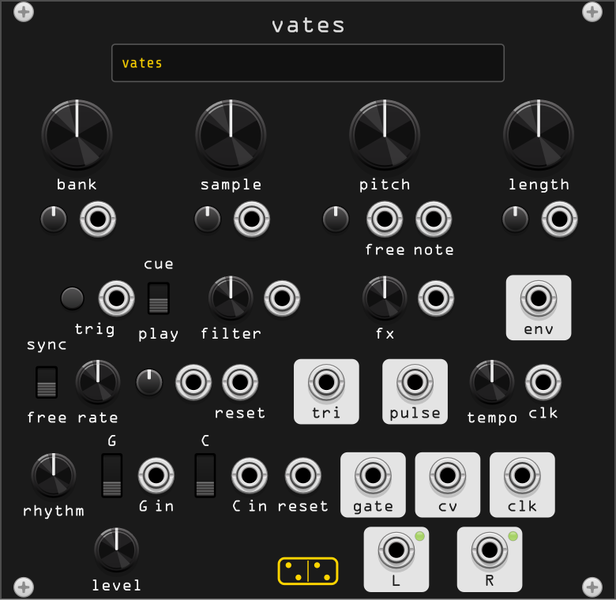

# vates

**A stereo sample player that finds the beat for you: banks of hits it
generates itself, a knob that plays them backwards, and a pattern generator
underneath the whole thing.**

*vates* is Latin for the bard — the poet-seer, the one who sings what he is
given. The module is built after the Bastl Instruments *Citadel Wave Bard*,
whose idea is that you do not program a rhythm: you modulate sample
selection and let the rhythm fall out. Everything here serves that idea,
with the hardware's two modifier buttons unpacked into real controls, since
holding one thing while turning another is a gesture a mouse does badly.

It shares its kit loader with [pellicula](pellicula.md) and its sample
generators with [sylla](sylla.md) and [imber](imber.md), but it is neither:
pellicula is eight voices with no sequencer, sylla is one voice with no
banks, and vates is one voice, in stereo, with a sequencer built in.

## Where the sound comes from

**Six generated banks, then your own.** vates ships no audio files. Its
first six banks are synthesized from a seed the moment you place the module,
eight samples each:

| bank | what it holds |
|------|---------------|
| **drums** | drum voices, hats down to kicks |
| **objects** | struck objects — woodblock, tine, glass, marimba, vibraphone, harp string, membrane, bell |
| **grains** | microsound: dust, crackle, glissons, click trains, bubbles |
| **micro** | clicks, data bursts, test blips, sub thumps |
| **tones** | sustained harmonic material: drones, pads, chord stabs |
| **air** | sustained spectral material: filtered noise, washes, vowels, combs |

The first four are struck or granular, the last two sustain — which under
the **length** knob (below) is the difference between a hit and a swell.
Every generated sample is rendered at C, so pitch tracking and the quantizer
are exact without you tuning anything.

Each bank holds one sample of each kind its generator knows: the drums bank
is a click, a hat, a tom, a snare, a kick and so on, one of each, at eight
independent pitches — never one drum in eight sizes. A knob position
therefore always means the same *kind* of sound, which is what makes the
sample knob playable, and pitch variety is left to the pitch knob and the
note input, where it belongs.

The whole set derives from one seed, saved with the patch. **reroll kit** in
the context menu draws a new one: the same six flavours and the same eight
roles per bank, forty-eight different sounds.

**Your kits** follow the generated banks. vates reads the same kits folder
as pellicula — set it once from either module's context menu — where each
subfolder is a kit of `.wav` files ordered by filename. Stereo files stay
stereo. Kits load on a background thread, so browsing them never interrupts
the audio.

A kit is cut into banks of eight, the size of a generated one: twenty files
are three banks, `mykit 1/3` to `mykit 3/3`. That is the hardware's own
organisation — eight samples to a bank, more banks for more sounds — and it
is also what keeps play mode usable. Crossings per LFO cycle are twice the
number of samples the CV spans, so a bank of 64 would fire 128 times a cycle
where the hardware fires 16. **samples per bank** in the context menu offers
16, 32 or the whole kit if you want that sweep on purpose.

Generated banks are always rendered at 44.1 kHz and resampled on playback,
exactly as your own files are — the alternative is regenerating forty-eight
samples every time the engine rate changes. Building a whole set takes about
a tenth of a second, on a worker thread; the display counts it up if you
happen to catch it.

## The panel

### sample

| control | what it does |
|---------|--------------|
| **bank** | two buttons, − and +, step through the banks: six generated, then your kits. CV in with attenuverter. |
| **sample** | selects one sample within the bank. CV in with attenuverter. |

The bank is stepped rather than swept, as on the hardware, where BANK is a
button and only the samples sit under a knob. Right-click either display to
see the whole list and jump straight to an entry.

Ten volts at full attenuverter is one bank, so a 0–10 V ramp sweeps the bank
exactly once and rests on its last sample; past that it wraps.

The sample knob spans its bank end to end — its top is the last sample, not
the first one again. Wrapping belongs to modulation: a CV that runs past the
last sample comes back to the first, which is what turns a slow ramp into a
sequence rather than a fade.
| **play / cue** | what modulation of *sample* does. See below. |
| **trig** | fires the selected sample. The button does the same by hand. |

**bank** and **sample** are the module's instrument. Nothing else needs
patching: a trigger and a moving CV on **sample** is already a part.

Turning the sample knob or stepping the bank is browsing, never playing: play
mode fires on *modulation* crossing into another sample, not on your hand
moving a control or on a bank change shifting the ground under it. To hear
what is selected, press **trig**.

**play** fires a sample the moment modulation crosses into it, so the
modulation source *is* the rhythm — a triangle LFO into **sample** in play
mode gives you off-grid triggers whose density follows the attenuverter.
**cue** does not fire: modulation aims at a sample and it waits for **trig**,
so the same LFO stays on the grid and only chooses what plays.

On the hardware these two modes are the sign of one attenuverter, which
means play mode can never be modulated downward. Splitting the mode onto its
own switch fixes that: in either mode the attenuverter runs the full range,
positive or negative.

### pitch

| control | what it does |
|---------|--------------|
| **pitch** | playback rate, ±2 octaves, unquantized. |
| **pitch mod** | attenuverter for both pitch inputs. Fully clockwise is exactly 1V/oct. |
| **free** | continuous pitch modulation, applied as it arrives. |
| **note** | quantized pitch, latched when a sample is triggered. |

Two inputs for one parameter because they are two different musical jobs.
**free** bends: patch an envelope or an LFO and hear it move under the
sample. **note** plays: it is quantized to the root and scale set in the
context menu and it only updates on a trigger, so a sequencer's CV lands as
a note rather than a glide.

Root and scale live in the menu, following [sylla](sylla.md), and they
affect the quantizer only — generated banks are always rendered at C.

### length

One knob for the envelope *and* the playback direction, exactly as on the
hardware, because sweeping through the middle is the point.

- **centre**: the shortest envelope, a click of the sample.
- **right**: decay grows, the sample plays forward.
- **left**: attack grows, and the sample plays **backwards**.

A fresh vates starts at about a third of the way clockwise, where a hit is a
few hundred milliseconds — centre is the shortest envelope there is, and a
module that clicked out of the browser would be telling you nothing.

The value is latched at the trigger, so modulation flips the direction
between hits and never mid-sample. **env** outputs the envelope, 0–10V.

**Reversed hits swell by default**, which is the mirror of the forward
envelope and what the hardware does. It is also the opposite of percussive:
the loudest moment arrives at the end. **Reversed hits decay instead of
swelling** in the context menu keeps the forward envelope on both sides of
centre and reverses only the sample, so a backwards hit still has its attack
on the beat. Retriggering works there too, since there is no swell to protect.

**A sample with a long tail, or with silence after the sound, may come out
inaudible when reversed.** Playback starts at the last frame, so that tail is
what you hear first, and a short envelope can be over before the sound itself
arrives. The generated banks are trimmed for this; kits of your own may not
be. Lengthen the envelope, or trim the file.

A hit that is interrupted does not vanish: it keeps playing for a couple of
milliseconds with its gain running out, and so does one that reaches the end
of its sample. A reversed hit holds at full level once it has swelled, and
stopping that dead is a step, not a silence.
During the attack of a reversed hit a new trigger is ignored, so reversed
swells are not cut short by the sequence that is playing them.

### tone

Two more knobs that do different things on each side of centre:

| knob | left | centre | right |
|------|------|--------|-------|
| **filter** | resonant lowpass, closing to 30 Hz | open | resonant highpass, opening to 14 kHz |
| **fx** | tempo-synced delay, wetter | dry | chorus/flanger with soft clipping, deeper |

Both take CV. Sweeping **fx** across centre is a musical move — a beat that
falls out of the delay and into the flanger.

**fx** is the hardware's pair, and the knob is an amount on each side rather
than a parameter. The delay is fixed at **three eighths of a note — a dotted
quarter, a beat and a half**, 750 ms at 120 BPM — with the right channel a
plain beat against it, so the two run a 3:2 cross rhythm and the feedback
throws it side to side. Turning the knob out raises the wet from nothing and
the feedback from 0.25 to 0.85 — and since the two lines feed *each other*,
that is a round trip of 0.72, which at the top leaves a tail running some ten
seconds. The write path saturates, so a long tail thickens instead of clipping
the output. At a tempo slow enough that a dotted quarter
would not fit the buffer, the division halves rather than the time being
clamped: it stays in tempo, just at a shorter one.

To the right, one knob crosses a chorus into a flanger. The swept delay
shortens from 8 ms to 1.5 ms and its depth from ±2.5 ms to ±0.7 ms — a chorus
range becoming a flanger range, with the first notch sweeping 227–625 Hz at
the top — while the feedback climbs to 0.7 and the output drive to twice, so
the further out you go the more the resonance rings and the more it clips. The
sweep itself is 0.35 Hz throughout, with the two channels in quadrature.

**filter** is a DJ filter, which is a specific thing: four poles, 24 dB per
octave, and a range that reaches past the material at both ends. Full left is
30 Hz, which is under the kick — at that end the sample is gone, not muffled.
Full right is 14 kHz, above the air, so the sweep takes the track away rather
than leaving the hats behind. Resonance is not a separate knob: it rises with
the travel, from flat near the centre to about +4 dB at the ends, enough to
sing on the way through and not enough to boom when it arrives.

### lfo

| control | what it does |
|---------|--------------|
| **sync / free** | whether the LFO follows the clock or runs on its own. |
| **rate** | in sync, the clock divider, from two bars a cycle to four cycles a step; in free, 0.01–20 Hz. Clockwise is faster in both, so the knob does not reverse its meaning when the switch flips. |
| **lfo mod** | attenuverter and input for the rate — in sync it moves the division, since a phase-locked LFO has nothing to detune. |
| **reset** | a rising edge restarts the triangle at its peak. |
| **pwm** | how much of the cycle the triangle spends rising, 2–98%, which is the pulse output's duty cycle. |
| **tri**, **saw**, **pulse** | triangle, the position in the cycle, and the rising-edge pulse, all 0–10V. |

**sync means phase-locked**, not merely a synced rate: the LFO takes its
phase from the step clock, so it cannot drift against the pattern and a
pattern reset puts it back to the top. That is what makes **saw** useful as
more than a shape — set the division to sixteen steps and it *is* the
position in the bar. Patch it to **sample** with the attenuverter fully up
and the bank sweeps exactly once a bar, since ten volts is one bank.

The hardware crams sync and free onto the two ends of one knob; its own
manual admits that modulation never crosses between them, only speeds the
LFO up or down. So the mode is a switch here and the knob means one thing at
a time.

**pwm** skews the triangle rather than gating a separate square: the pulse is
high exactly while the triangle rises, so one control moves both. At 50% it is
the symmetric triangle with a square beside it; wind it either way and the
triangle becomes a ramp or a saw while the pulse narrows or widens to match.
The **saw** output is unaffected — it stays the plain phasor, so it is still
the position in the bar.

The LFO is patch-programmable too, which survives intact: **pulse** into **lfo
mod** tilts the triangle into a ramp or a saw, **tri** into **lfo mod**
bends it exponential or logarithmic, **pulse** into **reset** turns it into
a saw outright. **pwm** is the same tilt as a knob.

### clock and pattern

| control | what it does |
|---------|--------------|
| **tempo** | internal clock, 30–300 BPM. |
| **clk in** | external clock. It takes over while it runs; two seconds of silence hands the tempo back to **tempo**. |
| **clk out** | the clock in use, internal or external. |
| **rhythm** | selects one of 32 built-in 16-step gate patterns, with a CV input beside it: ten volts is the whole list, and it wraps past the end. Selecting a rhythm reloads it, discarding what the switches have written into it. |
| **gate**, **cv** | the pattern's gate (75% of a step) and its stepped CV, 0–10V. |
| **reset** | restarts both sequences. Patch a slow LFO here to shorten the pattern. |
| **gate ptrn**, **cv ptrn** | a three-position switch and a jack each: live surgery on the gate and CV sequences. |

The two three-position switches are the hardware's best idea and they come
over unchanged. Middle leaves the sequence alone. Up randomizes the step the
sequence is on right now. Down inverts it — silent steps sound, sounding
steps go quiet, and CV flips around its own midpoint.

**They are pencils, not filters.** A switch writes into the pattern as it
plays, one step at a time, so returning it to the middle does not restore
what was there: it stops the editing and leaves the edits. That is the point
of it — flick one for a beat and only those steps change, "alter the sequence
partially until it fits your needs", as the hardware's manual puts it — and
it is also why holding invert down does not hold an inverted pattern. Each
pass inverts what the pass before it inverted, so a 16-step rhythm takes 32
steps to come round, which is the pseudo-32-step sequence the original
advertises.

To get the untouched rhythm back, select it again: turn the **rhythm** knob
away and back, and the pattern reloads from the table.

They are clicked *to* a position rather than stepped through one: click the
top of the switch for randomize, the middle for as-is, the bottom for invert.
Rack's own switches increment and wrap, which would mean passing through
randomize — and hearing it — on the way back from invert.

Each switch is normalled to the jack beside it, so a patched voltage does the
same job: **above +1V randomize, below −1V invert,
between them leave it alone**. A gate source resting at 0V therefore leaves
the pattern alone until it fires, and a bipolar LFO reaches both actions.

The hardware reads its own 0–5V logic there — above 3.2V randomize, below
1.6V invert — which in Rack would mean a gate idling at 0V inverts the
pattern on every step. **pattern input window** in the context menu switches
to it for anyone who wants the original's response.

The hardware's rhythms come from a web app that rebuilds the firmware. Here
they are 32 patterns on a knob, and the switches make them yours.

### the displays

Two of them under the title: the bank on the left, the sample on the right —
"drums" and "3 snare", or the name of your kit and the file that is selected.
Kits are yours and generated banks are new with every seed, so the panel
cannot label what a selection holds; the displays can.

**Right-click either one** for the list it selects from — every bank, or every
sample of the current bank by name — with the current entry checked. It is
the fastest way around a kit you do not know by heart.

### output

**level** sets the output, **L** and **R** carry it, each with a lamp. One
voice at a time: a new trigger chokes the one that is sounding, as on the
hardware, and that choking is half of what makes a fast sequence sound
tight.

## Context menu

- **root**, **scale** — the quantizer for the **note** input.
- **reroll kit** — a new seed for the six generated banks. The seed is saved
  with the patch, so a rerolled kit comes back exactly as you left it.
- **kits folder**, **rescan kits** — the folder is shared with pellicula; the
  rescan picks up kits added while Rack was running.
- **samples per bank** — how a kit of your own is cut into banks: 8 (the
  default, and a generated bank's size), 16, 32, or the whole kit in one.
- **reversed hits decay instead of swelling** — off by default. On, a negative
  **length** keeps the forward envelope and only reverses the sample, which is
  what a percussive backwards hit wants.
- **external clock takes over** — whether **clk in** may take the tempo from
  the **tempo** knob.
- **pattern input window** — the voltage window the two pattern jacks read:
  the Rack one (0V neutral) or the hardware's (1.6–3.2V neutral).

## What was left behind

The hardware is a standalone instrument as much as a module, and the parts
that make it standalone are the parts Rack already has. Gone: MIDI in every
form (TRS, USB, the CC map, clock priority, MIDI learn), the headphone
output, the audio input with its gain and routing — patch a mixer — the tap
tempo, the hidden settings mode, and the sample loader web app, replaced by
generated banks and a kits folder.

Kept, because nothing in Rack does it as well: the length knob that reverses,
play versus cue, the two pattern switches, and the rule that you find the
beat by modulating what plays rather than by drawing it.
