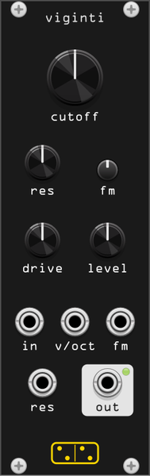

# viginti



**The MS-20's lowpass, with the diodes where they belong: inside the
resonance loop, not across the output.**

*viginti* is Latin for "twenty", after the MS-20. It models the KORG35
Rev. 2 filter (the OTA-based lowpass of the later MS-20 revisions) as the
nonlinear circuit it is, solved as a state-space system rather than
approximated by a filter with a waveshaper bolted on.

The circuit is two RC stages buffered by OTAs, wrapped in a resonance
feedback path that runs through a non-inverting amplifier of gain 4. That
amplifier is clamped by three series diodes in each direction, and those
diodes are the whole story: they sit **inside** the feedback loop, so what
distorts is the resonance rather than the signal. Quiet signals get a tall
clean peak. Loud ones squash it, and the squashing is what you hear as the
filter's grit. There is no setting at which viginti is a fixed linear filter
plus a fixed nonlinearity, because at every level it is a different filter.

This is the lowpass section only. The MS-20 also has a highpass, which is a
different circuit; it is not modelled here and no part of this module should
be taken as modelling it.

## Controls

| control | function |
|---------|----------|
| **cutoff** | 20 Hz – 20.5 kHz, ten octaves |
| **res** | resonance. Self-oscillation over the top 15 % of the travel |
| **drive** | input level, ±24 dB, unity at noon. This is the level control the nonlinearity listens to |
| **level** | output level, ±24 dB, unity at noon |

| trimpot | function |
|---------|----------|
| **fm** | attenuverter for the **fm** input |

| jack | |
|------|--|
| **in** | audio in, polyphonic |
| **v/oct** | 1 V/oct cutoff, polyphonic |
| **fm** | cutoff CV through the **fm** attenuverter |
| **res** | resonance CV, 10 V for the full knob range |
| **out** | the lowpass, with a level LED |

Polyphonic: the channel count follows **in** or **v/oct**, whichever has
more, and each channel keeps its own filter state, which matters here more
than usual: the state is what the nonlinearity reads. A poly **v/oct** with a
mono **in** gives you the same signal through sixteen differently tuned
filters.

The output is inverted, as the circuit is.

## drive is the resonance control

Everything interesting about this filter is a level effect, so **drive** and
**res** are one control surface with two knobs.

At unity, 10 V peak-to-peak in Rack is the ±1 V the MS-20's own signals sit
at. That is the level at which the diodes start conducting, which is exactly
where the circuit was designed to live. Measured at the cutoff frequency,
**res** a little past noon (Q = 10 at small signal), input in Rack volts:

| input | peak gain at the cutoff | THD |
|-------|------------------------|-----|
| 5 mV | ×9.95 | 0.0003 % |
| 50 mV | ×9.89 | 0.007 % |
| 0.5 V | ×4.95 | 2.0 % |
| 5 V | ×1.30 | 5.5 % |
| 25 V (drive up) | ×0.81 | 2.9 % |

The resonant peak falls by a factor of twelve across that range. A filter
followed by a saturator would hold the peak and only add harmonics; this one
loses the peak because the loop gain itself is being eaten. Turn **drive**
down and the filter opens up and rings; turn it up and it clamps, thickens
and goes flat. Nothing else in the module does that, and no amount of gain
staging outside it can fake it.

Note also what the last row says: past a certain point, driving harder makes
it *less* distorted, because the diodes are fully on and the feedback amp is
back to being a plain unity gain. The dirt lives in the middle.

## What the resonance knob is doing

The circuit's resonance parameter is `alpha = K·G`: the feedback amplifier's
gain of 4.03 times whatever the resonance pot passes, at most 10/(8.2+10).
So the real circuit's alpha runs from 0 to 2.21, self-oscillates above
2.0005, and that is that.

Mapped linearly onto a knob it would be useless: the small-signal pole Q is
`1/(2 − alpha)`, so nothing much happens until the last tenth and then
everything happens at once. Instead the knob is exponential **in Q**, from
0.5 to 50, over its first 85 %, and covers 2.0 to 2.21 over the rest:

| knob | alpha | Q | peak |
|------|-------|---|------|
| 0.00 | 0.00 | 0.5 | −6 dB |
| 0.25 | 1.48 | 1.9 | +5.7 dB |
| 0.50 | 1.87 | 7.5 | +17.5 dB |
| 0.75 | 1.97 | 29 | +29.1 dB |
| 0.85 | 1.98 | 50 | +33.6 dB |
| 0.90-1.00 | 2.06-2.21 | inf | self-oscillating |

The mapping lives in one function, `alphaFromKnob` in
`src/viginti_dsp.hpp`; the DSP itself only ever sees alpha.

Self-oscillation starts from silence (the model would sit at zero forever,
so the module adds a noise floor of about 8 µV at the circuit's input, which
is what the real thing has and cannot help having). It tracks 1 V/oct, is
bounded by the diodes at about 2.5 V peak, and is not a sine: it is the limit
cycle of a nonlinear system, and it looks like one.

## Oversampling

Right-click for **Oversampling**, 1×–16×, default 2×. Measured on a hard
resonant patch, the worst alias product sits at −40 dB at 1× and −73 dB at
2×; 4× and beyond gain nothing measurable, so the default is where the curve
flattens. 2× also halves the discretization error against the reference
integrator, which matters most with the cutoff up near 10 kHz.

One channel at 2× costs about 1.3 % of one core at 48 kHz.

## Notes on the emulation

The model is not a fit to the sound of a filter. It is the published
state-space system of the circuit:

> M. Danish, S. Bilbao and M. Ducceschi, "Applications of Port Hamiltonian
> Methods to Non-Iterative Stable Simulations of the KORG35 and MOOG 4-Pole
> VCF", Proc. 24th Int. Conf. on Digital Audio Effects (DAFx20in21), Vienna,
> September 2021, section 3.1.

In normalised variables (`x = v/Vref`, `Vref = 3nV_T = 77.55 mV`, three diode
drops' worth of thermal voltage) the circuit is

```
dx1/dt = w*(-x1 - alpha*x2 + eta(x2) - u)
dx2/dt = w*( x1 + (alpha-1)*x2 - eta(x2))
```

with the diode nonlinearity solved in closed form through the Lambert W
function,

```
eta(x2) = sgn(x2)*W(beta*exp(3*sgn(x2)*alpha*x2/4 + beta)) - sgn(x2)*beta
```

and `beta = Isat·R2/Vref`. The ratio `eta(x)/x`, which is the gain the diodes
leave in the feedback path, runs from `3*alpha*beta/(4+4beta)` when they are off to
`3*alpha/4` when they are hard on, and it is that ratio moving with the
signal that produces every level effect described above.

**The component values.** The paper leaves alpha and beta as symbols, so
they come from its own reference for the circuit:

> T. E. Stinchcombe, "A Study of the Korg MS10 & MS20 Filters", Aug. 2006.

The feedback amplifier is `1 + 10k/3.3k` = 4.03 (the 3.3k being a 2.2k
resistor plus a 2.2k preset at its midpoint), the resonance pot divides by at
most `10/(8.2+10)`, and the diodes are 1N4148s with `Isat` = 2.52 nA, the
figure fitted in Esqueda et al. and already used by *vespae*. Nothing here
was tuned by ear; the constants are all at the top of `src/viginti_dsp.hpp`
with their provenance.

**The integrator.** The real-time path is the paper's first-order discrete
gradient scheme, equation (31): `dx = h[I − (h/2)A(x)]⁻¹(A(x)x − Gu)`, with
the 2×2 system solved in scalars. It needs no iteration, no convergence
tolerance and no variable amount of work per sample, and its determinant is
`1 + h(2−gamma)/2 + h²/4`, which is provably positive for any step size as
long as gamma < 4. Over the resonance knob's own range it never drops below
0.99.

**The reference.** `src/viginti_dsp.hpp` also contains an RK4 integration of
the same continuous equations. It is not used by the module; it exists to be
the oracle. `test/viginti_probe` measures one against the other across
sample rates, cutoffs and resonances, and `test/viginti_invariants` asserts
that the real-time scheme stays within 4.1e-3 normalised RMS of it at
44.1 kHz and converges towards it as the rate rises.

**Cross-checked against the authors' own renders.** The paper's repository
publishes the audio it produced, and running the same input through this
implementation at the same settings correlates at 0.9994 in the linear
regime (alpha = 0.2) and 0.9987 in the nonlinear one (alpha = 1.9). Those
renders are not redistributable, so the comparison is not in the test suite;
it is reproducible from `github.com/danmohd/moog-korg-danish-dafx20in21`.

**What is deliberately not the circuit.**

- **The noise floor.** The ideal model at rest sits exactly at zero and stays
  there, so a self-oscillating patch would be silent. About 8 µV of noise at
  the input gets it started, which is less than the real circuit has.
- **The drive and level knobs**, and the one scale factor behind them: 5 V in
  Rack is 1 V at the circuit, and the same factor is undone on the way out.
  Since the model's DC gain is exactly −1, that makes the module unity gain
  at unity settings. Beyond that nothing is normalised: the amplitude
  behaviour is the model's own, which is the point.
- **A hard alpha guard** at 3.5, well above what the pot can reach. The
  paper's analysis fails at alpha = 8 and shows ill-conditioning from 7.7;
  the guard exists so that no CV path can walk the solve anywhere near it.
- **Polyphony and oversampling**, neither of which the hardware has an
  opinion about.

## Tips

- The classic MS-20 sound wants **drive** past noon and **res** high, with
  the cutoff swept by hand or by an envelope. It should choke a little as
  loud notes hit.
- For the clean, tall resonance, back **drive** off to 9 o'clock and make up
  the loss with **level**. The same patch at the same knob positions is a
  completely different filter.
- An envelope into **fm** with the attenuverter at about a quarter, and
  **res** just below self-oscillation, is the acid-adjacent patch.
- With nothing in **in**, the top of **res** gives a 1 V/oct sine-ish
  oscillator whose waveform sharpens as you go further up the knob.
- Its own output driven back into **in** through an attenuator is a way to
  get at the level dependence without touching **drive**.

`test/viginti_probe` prints everything cited above: the Lambert-W residuals,
the limits of the nonlinearity, the production scheme against RK4, the
frequency response against the analytic two-pole, the level table, the
self-oscillation threshold, the knob map, the alias floor and the CPU cost.
