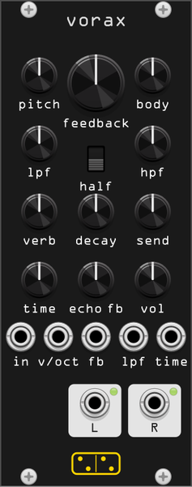

# vorax



**Feedback drone synthesizer: a string that only sounds when you feed it.**

*vorax* is Latin for "voracious, all-devouring". The module is a port of
**Audrey II**, the feedback "horrorscape" synthesizer by Synthux Academy
(design: Roey Tsemah, firmware: Nick Donadson / Infrasonic Audio), named
after the ever-hungry plant of Little Shop of Horrors. It is ported from
the MIT-licensed firmware
([FedeRepic/audrey-daisy](https://github.com/FedeRepic/audrey-daisy)).

No oscillator generates sound. A Karplus-Strong string model is fed a
constant, inaudible (-90 dBFS) stream of white noise inside a feedback
loop:

```
noise + fb ─> KS string ─> overdrive ─> LPF ─> HPF ─> reverb ─┬─> out
     ^                                                        │
     └── "body" delay (1..100 ms, R offset −4 samples) <─ gain┘
                                                              │
                           echo send ─> tape echo (degrades) ─┘
```

Nothing happens until the **feedback** knob rises past the loop's losses;
then the loop self-excites and a tone builds out of nowhere. The string
length sets the fundamental, and everything else inside the loop - the
overdrive, the two filters, the reverb, the short "body" delay - shapes
which overtones survive and how the drone breathes. The right channel's
body delay is offset by 4 samples, which decorrelates the loop into a
wide stereo image.

After the loop, the signal can be sent to a tape-style **echo** with up
to 5 s of delay time. Every repeat is bandpassed at 800 Hz and
soft-clipped, so long feedback settings degrade towards telephone-like
saturated warbles; the feedback goes up to 1.5 for endlessly growing
(but always soft-limited) swells.

## Controls

| knob | function |
|------|----------|
| **pitch** | string pitch, semitones (MIDI note 16–72) |
| **feedback** | the big one: loop feedback gain, −60 to +12 dB. The drone wakes around unity |
| **body** | loop delay time, 1–100 ms. Short = comb-colored resonance, long = a slow pulsing swell |
| **lpf / hpf** | filters inside the loop (100 Hz–18 kHz / 10 Hz–4 kHz). They steer which partials the feedback favors |
| **verb / decay** | reverb mix and decay, inside the loop: wet reverb feeds back too |
| **send** | echo send amount |
| **time / echo fb** | echo delay time (50 ms–5 s) and feedback (0–1.5, past 1 it grows until the soft clip catches it) |
| **vol** | output level |
| **half** | switch: instantly halves the echo time for a doppler warp, flip back to double it |

## Inputs and outputs

| jack | function |
|------|----------|
| **in** | audio injected into the feedback loop: hum, talk or play into the plant and it chews on it |
| **v/oct** | string pitch CV, added to the pitch knob |
| **fb** | feedback gain CV, 7.2 dB/V |
| **lpf** | loop lowpass cutoff CV, 1V/oct |
| **time** | echo time CV, 1V/oct (positive voltage shortens) |
| **body** | body delay CV (bottom left), added to the body knob a tenth of a turn per volt: 0–10 V spans it |
| **l / r** | stereo output |

## Tips

- Start with everything down, pitch somewhere low, and *slowly* raise
  **feedback**. The point where the drone blooms depends on every other
  knob in the loop.
- Sweeping **body** while the loop oscillates bends the pitch like tape
  wow; parking it very short adds a metallic comb color. The **body** CV
  input does the same with no hand on the knob, and by default at the
  same speed: the delay time keeps the two glides the hardware puts on
  it, which together pass modulation under about half a hertz nearly
  whole, half of it at 1 Hz, and none of it by 5 Hz. **Fast body CV** in
  the right-click menu is the other character.
- Narrow the loop filters (**lpf** down, **hpf** up) to choke the drone
  to a whistle, then open them to let it roar back.
- **echo fb** past 1.0 with a long **time** builds a saturating canon
  that never quite explodes - ride the **half** switch for octave-ish
  doppler jumps.
- Patch a slow LFO into **fb** and the plant breathes on its own.

## Right-click menu

**Fast body CV** (off by default). The body delay is smoothed twice on
its way to the delay line: the parameter glides with a 1 s t60, and the
delay length itself with a 0.2 s time constant. That is the hardware's
behaviour and it is why **body** always sweeps rather than jumps. With
this option on *and* a cable in the **body** CV input, both drop to about
a millisecond and the delay length is computed every sample instead of
every sixteenth, so modulation arrives at full depth up to about 50 Hz
and is still two thirds there at 200 Hz.

It is a different instrument rather than a faster one. Under the
faithful glide an LFO on **body** bends the drone like tape wow; past a
few hertz it does nothing at all. With the short glide the same LFO
frequency-modulates the loop's delay, throwing sidebands off the drone
and turning the feedback into a rough, metallic warble. Audio-rate
modulation is where it stops being an effect and becomes the sound.

Pull the cable and the glide comes back, so the option costs nothing
when the jack is empty and old patches sound as they always did.

## Attribution

Audrey II by Synthux Academy: design Roey Tsemah, firmware Nick Donadson
(Infrasonic Audio), MIT license. The reverb inside the loop is a port of
ReverbSc (Sean Costello / Istvan Varga / Paul Batchelor) from
DaisySP-LGPL. This module is an independent port, not affiliated with
Synthux Academy.
