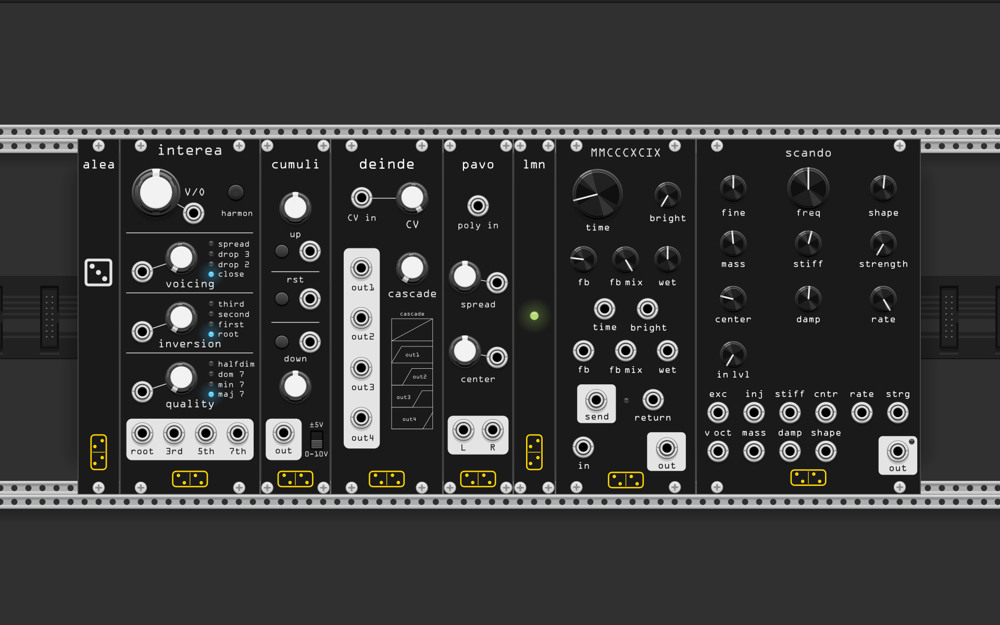

# forsitan modulare

A collection of VCV Rack modules.

## Modules

| module | description | doc |
|--------|-------------|-----|
| [alea](doc/alea.md) | Add a random module to your rack | [doc/alea.md](doc/alea.md) |
| [interea](doc/interea.md) | Chord generator from a V/Oct input, with quality, voicing and inversion | [doc/interea.md](doc/interea.md) |
| [cumuli](doc/cumuli.md) | Accumulator with up/down gates and rates | [doc/cumuli.md](doc/cumuli.md) |
| [deinde](doc/deinde.md) | Quad cascading addressable attack-hold envelope | [doc/deinde.md](doc/deinde.md) |
| [pavo](doc/pavo.md) | Polyphonic stereo spreader (Splay UGen) | [doc/pavo.md](doc/pavo.md) |
| [limen](doc/limen.md) | TCP+JSON control interface for VCV Rack | [doc/limen.md](doc/limen.md) |
| [MMCCCXCIX](doc/mmcccxcix.md) | PT2399 delay chip emulation with feedback send/return loop | [doc/mmcccxcix.md](doc/mmcccxcix.md) |
| [scando](doc/scando.md) | Scanned-synthesis oscillator (vibrating mass-spring string, scanned into a wavetable) | [doc/scando.md](doc/scando.md) |
| [pellicula](doc/pellicula.md) | Exploded 8-voice drum sampler: a knob + CV per voice for sample, pitch, decay and level | [doc/pellicula.md](doc/pellicula.md) |
| [dræn](doc/draen.md) | Drone synthesizer: two banks of 37 drones (the dronecaster set and an original hyf set), played from hz + amp | [doc/draen.md](doc/draen.md) |
| [rete](doc/rete.md) | Feedback integrator network: 8 nodes in a random mixing matrix, self-oscillating chaos | [doc/rete.md](doc/rete.md) |
| [ululo](doc/ululo.md) | Feedback guitar: six comb strings against a saturating amp in a howling loop | [doc/ululo.md](doc/ululo.md) |
| [tabes](doc/tabes.md) | Disintegration looper: the tape loop degrades a little more on every pass | [doc/tabes.md](doc/tabes.md) |
| [lustro](doc/lustro.md) | Scanned filter: scando's mass-spring string plays the band gains of a 16-band resonant filterbank | [doc/lustro.md](doc/lustro.md) |
| [bulla](doc/bulla.md) | Inspired by Rob Hordijk's Blippoo Box: cross-modulating oscillators, runglers and a twin-peak filter | [doc/bulla.md](doc/bulla.md) |
| [perge](doc/perge.md) | Stereo dynamic sampler and multi-effect: dynamics-driven repeats, freeze, glitch and layered dimension (AC noises CONTINUA homage) | [doc/perge.md](doc/perge.md) |
| [vorax](doc/vorax.md) | Feedback drone synthesizer: a Karplus-Strong string self-excited by a feedback loop, with degrading tape echo (Audrey II port) | [doc/vorax.md](doc/vorax.md) |
| [textor](doc/textor.md) | One-knob loop weaver: two seconds of sound rewoven into ever-new loops (Fieldtone Weaver clone) | [doc/textor.md](doc/textor.md) |
| [imber](doc/imber.md) | Generative rain: 8 sample players on a 2D field where position is routing, everything synthesized from nothing (Haiku-inspired) | [doc/imber.md](doc/imber.md) |
| [sylla](doc/sylla.md) | Random sample generator/player: ever-new procedural samples from 27 selectable engines, in any root and scale (imber's little voice) | [doc/sylla.md](doc/sylla.md) |
| [guttur](doc/guttur.md) | Chaotic resonator drone: a Duffing oscillator coupled through two banks of 24 resonant filters (Gutter Synthesis port) | [doc/guttur.md](doc/guttur.md) |
| [vespae](doc/vespae.md) | Wasp filter: the EDP Wasp / Doepfer A-124, dirty because its state-variable core is built from CMOS inverters on one unipolar supply | [doc/vespae.md](doc/vespae.md) |
| [quadrare](doc/quadrare.md) | Walsh-Hadamard codec: sixteen sliders and thirty-two jacks onto the transform domain itself, with the lossy stages of a real codec | [doc/quadrare.md](doc/quadrare.md) |
| [vestigia](doc/vestigia.md) | Stereo memory effect: an endless tape loop under three memory modes, with fragments that degrade each time they return | [doc/vestigia.md](doc/vestigia.md) |
| [antrum](doc/antrum.md) | Feedback delay network reverb: a space that runs from a coffin to the heavens, every parameter voltage-controlled (Erbe-Verb clone) | [doc/antrum.md](doc/antrum.md) |
| [caligo](doc/caligo.md) | Greyhole: a long modulated echo inside a nested allpass diffuser, so every repeat comes back smeared further than the last, with the feedback loop broken out to jacks (Julian Parker's Greyhole) | [doc/caligo.md](doc/caligo.md) |
| [raucus](doc/raucus.md) | Big Muff Pi: four transistor stages, feedback diode clipping solved rather than limited, and the passive tone stack's notch where it belongs | [doc/raucus.md](doc/raucus.md) |
| [tundo](doc/tundo.md) | Parameterized digital drum voice: six additive oscillators, morphing waves, prime-series spread and an infinite folder (Basimilus Iteritas Alter clone) | [doc/tundo.md](doc/tundo.md) |
| [cartilago](doc/cartilago.md) | Gristleizer: one LFO into a FET attenuator that never quite closes, or into a swept filter; ticks like the hardware and ring-modulates at audio rate | [doc/cartilago.md](doc/cartilago.md) |
| [scrupea](doc/scrupea.md) | Sixteen oscillators into tuned feedback combs, each modulated by whichever of them you point it at; one knob decides whether it drones or shatters (inspired by Reaktor's Skrewell) | [doc/scrupea.md](doc/scrupea.md) |

## Tools

| tool | description |
|------|-------------|
| [limen-tools](https://github.com/gosub/limen-tools) | limen clients (separate repo) — Go CLI and MCP server, plus a Python library; prebuilt binaries on releases |
| [tools/panel-editor/](tools/panel-editor/) | Browser-based drag-and-drop panel layout editor |

## Controlling Rack externally (limen)

The [limen](doc/limen.md) module runs a small TCP server speaking newline-delimited JSON, so external tools can drive Rack: list/add/remove modules and cables, get/set parameters, and control the window (fullscreen, zoom-to-fit, quit). It is built for **automation and scripting**, **LLM tools** that build patches programmatically, and **alternative interfaces** (such as a planned Emacs mode).

Quickstart:

1. Launch Rack straight into a controllable state with the bundled patch — it contains a single limen module with the server already enabled: `./Rack patches/limen.vcv`. (Or add a **limen** module to any patch and enable its server from the right-click menu.)
2. Talk to it with the [limen-cli client](https://github.com/gosub/limen-tools): `limen-cli hello` (or `list_modules`, `set 0 0 0.5`, …).
3. Or from anything that opens a socket: `echo '{"cmd":"hello"}' | nc localhost 7000`.

**Security:** the server binds loopback only (`127.0.0.1`) and has no authentication by design, so it is reachable only from your own machine. Do not expose the port to untrusted networks. See [doc/limen.md](doc/limen.md) for the full protocol and command reference.

## Changelog

See [CHANGELOG.md](CHANGELOG.md). Releases follow [RELEASING.md](RELEASING.md).

## About the names

Being Italian, giving the modules English names felt off, but Italian names would have been less accessible to most users. Latin seemed like a natural middle ground: familiar enough, international, and with a certain character.

| module | Latin meaning |
|--------|--------------|
| **alea** | dice, chance (as in *alea iacta est*, the die is cast) |
| **interea** | meanwhile, in the meantime |
| **cumuli** | heaps, piles (plural of *cumulus*) |
| **deinde** | then, next, afterwards |
| **pavo** | peacock (whose spreading tail mirrors the stereo spread) |
| **limen** | threshold, doorway |
| **MMCCCXCIX** | 2399 in Roman numerals — the PT2399 chip this module emulates |
| **scando** | I climb / I scan — *scandere* is also the Latin for scanning verse, the root of "scan" |
| **pellicula** | little skin, thin membrane (diminutive of *pellis*, skin/hide) — the drumhead, and an echo of "pico" (small) |
| **dræn** | *not Latin* — Old English for *bee*, the etymological root of "drone" (a port of the dronecaster norns instrument) |
| **rete** | net, network (the 8×8 feedback web at the module's heart) |
| **ululo** | I howl (guitar feedback, the Larsen effect as an instrument) |
| **tabes** | wasting away, decay, consumption (the tape loop dying pass by pass) |
| **lustro** | I traverse, I survey (the string surveyed into a filterbank; scando's sibling) |
| **bulla** | bubble, blip — also the amulet worn by Roman children (Hordijk's Blippoo Box) |
| **perge** | carry on!, keep going! (imperative of *pergere*) — a nod to the AC noises CONTINUA pedal it pays homage to, whose name is the Italian for the same exhortation |
| **vorax** | voracious, all-devouring — the ever-hungry feedback plant (Synthux Academy's Audrey II) |
| **textor** | weaver — reweaves two seconds of sound into ever-new cloth (the Fieldtone Weaver) |
| **imber** | rain shower, downpour (a generative rain of samples, inspired by Giorgio Sancristoforo's Haiku) |
| **sylla** | *almost Latin* — a clipped *syllaba*, syllable: haiku are counted in syllables, and sylla speaks one small sound at a time |
| **guttur** | throat — the guttural voice, punning on Tom Mudd's Gutter Synthesis it ports |
| **vespae** | of the wasp (genitive of *vespa*) — Chris Huggett's EDP Wasp filter |
| **quadrare** | *to square, to make fit*: Walsh functions are square waves, and the transform squares the signal into them |
| **vestigia** | traces, footprints — what sound leaves behind, recalled from an endless tape loop |
| **antrum** | cave, grotto — the resonant space, real or imagined (Tom Erbe's Erbe-Verb) |
| **caligo** | mist, gloom, murk — the grey fog an echo dissolves into (Julian Parker's Greyhole) |
| **raucus** | hoarse, harsh — the root of "raucous" (Electro-Harmonix's Big Muff Pi) |
| **tundo** | I beat, I pound — *tundere*, to strike repeatedly, whose repetition winks at the *iteritas* of the Basimilus Iteritas Alter it is built after |
| **cartilago** | gristle, cartilage — Roy Gwinn's Gristleizer, by way of Throbbing Gristle |
| **scrupea** | jagged, made of sharp stones (Virgil's *scrupea saxa*); the root *scrupus* is also the stone in the shoe. Chosen to sound like Skrewell, which it is after |

## Author

Giampaolo Guiducci <giampaolo.guiducci@gmail.com>

## License

[GPL-3.0-or-later](LICENSE)
