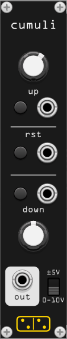

# forsitan modulare

A collection of VCV Rack modules

- [alea](#alea) - Add a random module to your rack
- [interea](#interea) - Make a chord from a V/Oct input, with quality, voicing and inversion. Harmonize option.
- [cumuli](#cumuli) - Accumulator with up and down gates and rates.
- [deinde](#deinde) - Quad cascading addressable attack-hold envelope.
- [pavo](#pavo) - Spreader of polyphonic mono signals across the stereo field (Splay Ugen)

## alea

*alea* adds a single random module to your rack, chosen from your entire library. Inspired by [WhatTheRack from korfuri](https://github.com/korfuri/WhatTheRack).

### how to use

Click on the ⚂ (die)

## interea

*interea* transform a V/Oct signal into a chord. It has four chord qualities (Maj7, Min7, Dom7, Half Dim), four inversions (root, first, second, third) and four voicings (close, drop 2, drop 3, spread). When the *harmonize* button is pressed, the frequency input is treated as a bassline and the chord is harmonized with the major scale. This module is inspired by [Strum's Mental Chord](https://github.com/Strum/Strums_Mental_VCV_Modules/wiki/Chord) and the physical module [Chord v1 by Qu-Bit Electronix](https://www.modulargrid.net/e/qu-bit-electronix-chord).

### how to use

Connect the four outputs to the V/O input of four oscillators. You shoud now be listening to the classic C4 Major7 chord. Play with the *frequency*, *quality*, *inversion* and *voicing* knobs and inputs to play different chord. The *frequency* input is bipolar (+/- 5V), the range of the other inputs is unipolar (0-10V). When the *harmonize* button is on, the chord *quality* is chosen automatically and the *quality* knob and input are disabled. In this state the notes of the chord will be harmonized with diatonic and modal interchange chords of the Major scale. See the [manual](https://www.qubitelectronix.com/s/Chord_Manual.pdf) for Qu-Bit Electronix Chord for addition explanations.

### bypass behaviour

The root pitch input is copied to all the chord outputs (root, 3rd, 5th, 7th).

## cumuli

*cumuli* is an accumulator. The value accumulated grows when the *up* gate is open and grows to the rate indicated by the *up* knob. Symmetrically, the value decrease when the *down* gate is open, with a velocity specified by the *down* knob. When the *reset* gate is open, the output value goes immediately to zero. The output value is clamped between 0V and 10V when the polarity selector is on "0-10V", and between -5V and +5V when the selector is on "±5V". The output holds its value when neither the *up* or *down* gates are open. The *up* and *down* knobs are exponential, and their values range between 0.01 V/sec and 100 V/sec (1 V/sec default). Each gate has a corresponding button.

### how to use

Connect two gate signals to the *up* and *down* input, select the *up* and *down* rate with the respective knobs and watch the output go up, down or hold. This module was imagined as a companion to midi controllers like the [Korg nanoPAD2](https://www.korg.com/us/products/computergear/nanopad2/), which has no faders, only buttons.

## deinde

*deinde* is a quad cascading addressable attack-hold envelope.

- quad: because it outputs 4 envelopes
- cascading: because the 4 envelopes open one after the other
- addressable: because the envelopes can be scanned with the *cascade* knob and CV
- attack-hold envelope: because every envelope has a linear attack and then stays open

This module is inspired by [A-144 by Doepfer](http://www.doepfer.de/a144.htm), with a significative difference: the four envelopes of the A-144 are attack-decay, while in this module they are attack-hold. One of the initial ideas behind this module was opening four send effects with only one control signal, for example: volume ramp, then saturation, then distortion, then fuzz.

### how to use

Connect the four output as you would for four envelopes, for example to the vca of four oscillators tuned to a chord. Turn the *cascade* knob to open the four envelope in sequence. When there is a signal in the *CV in* input, the signal scan the envelopes like the *cascade* knob, and in that case the *CV* knob acts like an attenuator and the *cascade* knob like an offset. All inputs and outputs are 0V-10V.

## pavo

*pavo* spreads a polyphonic signal across the stereo field. It is heavily inspired by the [Splay Ugen](https://doc.sccode.org/Classes/Splay.html) available in the SuperCollider language. It works like this:

- If the input has 1 channel: `L-----------o-----------R`
- If the input has 2 channel: `o-----------------------o`
- If the input has 3 channel: `o-----------o-----------o`
- If the input has 4 channel: `o-------o-------o-------o`
- If the input has 5 channel: `o-----o-----o-----o-----o`
- and so on...

*pavo* uses the [square root method to approximate constant power panning](https://www.cs.cmu.edu/~music/icm-online/readings/panlaws/index.html). It also adjust the level of the input channels when mixing down (level compensation). Right now these behaviours are hard coded, future version of the module will present options to disable them.

### how to use

Connect a polyphonic cable to the *poly in* input. Adjust the *spread* knob to select the maximum spread across the stereo field: a value of 0% means that all the channels are at the center, a value of of 100% means that the first and last signal are panned hard left and hard right. Additionally, the center knob determines the midpoint of the stereo image: -100% means the center is on the left side, 100% on the right. With this parameter, it could happen that channels could fall outside the stereo field. This is prevented by clipping their final position. So, when the center is 100% left, all the channels that would fall on the left side are "squished" at 100% left.
The *spread CV* input accepts 0V-10V, while the *center CV* input is ±5V. When these inputs are plugged, the respective knobs act like offsets.

## Author

Giampaolo Guiducci <giampaolo.guiducci@gmail.com>

## License

GPL-3
